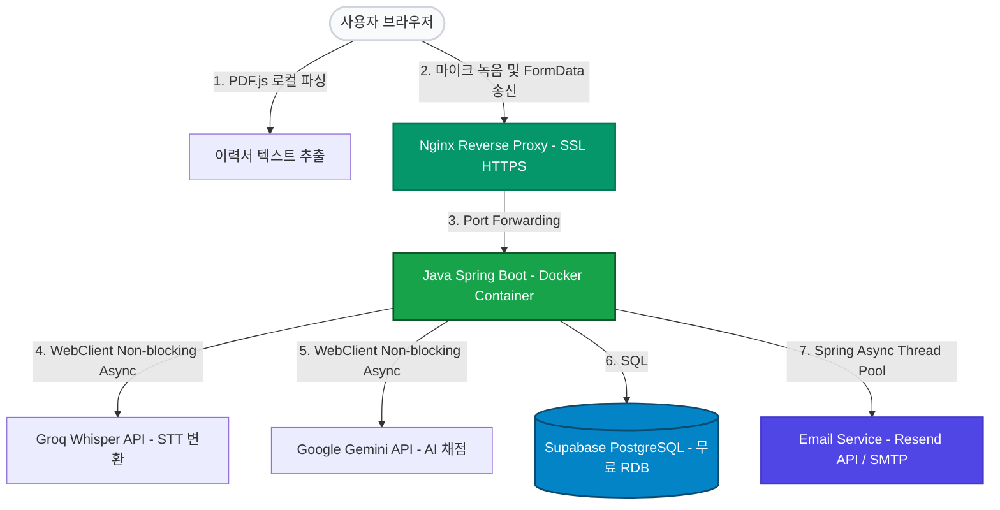
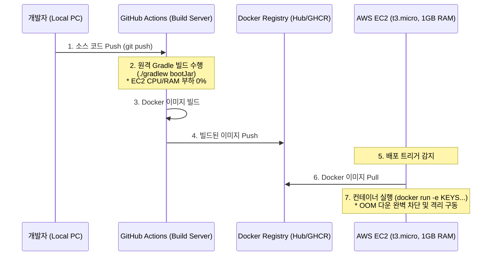

# 📑 포트폴리오용 기술 명세 및 성과 기술서 (Portfolio Technical Spec)

본 문서는 서비스(Interview Handbook) 설계 및 구현 과정에서 달성한 **핵심 기술적 성과와 문제 해결(Troubleshooting) 이력**을 이력서 및 포트폴리오에 즉시 활용할 수 있도록 개조식 성과 기술서(STAR 기법) 포맷으로 정리한 문서입니다.

---

## 🏛️ 1. 프로젝트 개요 (Project Summary)

*   **프로젝트명**: Interview Handbook (AI 모의 면접 및 이력서 맞춤 질문 피드백 서비스)
*   **핵심 요약**: 
    *   사용자 음성(STT)과 이력서(PDF) 분석을 결합한 하이브리드 인공지능 모의 면접 웹 서비스.
    *   **비용 극소화 아키텍처 설계**를 적용하여 월 고정 유지비 **$0/month(평생 무료)** 및 AWS EC2 프리티어(1GB RAM)에서의 가용성 100%를 달성.

### 서비스 아키텍처

---

## 🛠️ 2. 사용 기술 및 채택 사유 (Tech Stack & Rationale)

| 구분 | 채택 기술 | 비용 (Cost) | 선정 사유 및 기술적 타당성 |
| :--- | :--- | :--- | :--- |
| **Frontend** | React (Vite), Tailwind CSS, PDF.js | **$0** (Vercel) | • 컴포넌트 단위 재사용성 극대화 및 고속 렌더링 환경 구축 • 브라우저 로컬 PDF 파싱 및 오디오 미디어 캡처를 수행해 서버 연산 비용 최소화 |
| **Backend** | Java 17, Spring Boot 3.x, Spring Data JPA, WebClient, Bucket4j | **$0** (AWS t3.micro) | • 높은 타입 안전성과 고속 REST API 구축 • 비동기 Non-blocking API 호출(WebClient)을 통해 긴 AI 연산 도중 스레드 고갈 예방 • 처리율 제한(Rate Limiting)으로 외부 API 무료 쿼터 보호 |
| **Database** | Supabase PostgreSQL (무료 티어) | **$0** (영구 무료) | • 1년 후 과금되는 AWS RDS를 대체하여 평생 무료 RDB 환경 유지 (500MB) • 사용자의 로그인 세션 및 면접 채점 이력 영구 기록 |
| **AI / STT** | Google Gemini API, Groq Whisper API | **$0** (무료 범위) | • 고품질의 실시간 꼬리 질문 생성 및 채점 피드백 도출 (Gemini) • 한국어 및 IT 개발 전문 용어에 대한 고정밀 초고속 0.5초대 STT 처리 (Groq Whisper) |
| **Email Service** | Resend API 또는 Gmail SMTP | **$0** (무료 범위) | • AI 면접 피드백 보고서 이메일 자동 발송 • `@Async` 비동기 처리를 도입해 사용자 응답 스레드 지연 방지 |
| **DevOps / Infra** | Docker, Docker Compose, Nginx, Certbot, GitHub Actions | **$0** (무료 제공 쿼터) | • 외부 빌드 오프로딩(GitHub Actions) 및 Docker 이미지화를 통한 t3.micro OOM 원천 방지 • Nginx + Let's Encrypt HTTPS 환경 구축을 통한 Mixed Content 통신 차단 해소 |

---

## ⚡ 3. 핵심 기술 해결 과제 및 성과 (Key Accomplishments & Troubleshooting)

### 📌 성과 1: 원격 빌드(Build Offloading) 및 메모리 최적화를 통한 AWS 프리티어(t3.micro, 1GB RAM) 가용성 100% 달성
*   **상황 (Issue)**: 자바 스프링 부트는 JVM 기반으로 실행되어 초기 메모리 점유율(400MB~600MB)이 높으며, 메모리가 1GB뿐인 t3.micro 서버 내부에서 Gradle 빌드를 직접 수행 시 리소스 부족(OOM)으로 인스턴스가 다운되거나 백엔드 프로세스가 강제 셧다운되는 만성적인 안정성 문제 봉착.
*   **대안 분석 & Trade-off**:
    - *대안 1 (EC2 직접 빌드 + Swap)*: SSD 디스크를 메모리처럼 쓰는 Swap Memory를 할당하여 직접 빌드 시도. 빌드는 성공할 수 있으나 빌드 소요 시간이 매우 길고 디스크 I/O 병목으로 인해 운영 중인 서비스가 먹통이 됨.
    - *대안 2 (빌드 오프로딩 - GitHub Actions & Docker)*: 외부 가상 컴퓨팅 환경(GitHub Actions)에서 Gradle 빌드를 완료하고, Docker Image 형태로 운영 서버에 배포하는 방식 채택. 서버는 오직 실행(docker run)만 담당하므로 빌드 오버헤드가 전혀 발생하지 않음. (최종 합리화 채택)
*   **해결 방안 (Action)**:
    1.  **CI/CD 파이프라인 분리**: GitHub Actions를 이용하여 원격 클라우드 서버에서 `./gradlew bootJar` 및 도커 이미지 패키징을 수행하도록 배포 자동화 파이프라인 구현.
    2.  **가상 메모리 확장**: 디스크 스왑 영역을 **2GB 스왑 메모리(Swap File)**로 추가 설정하여 서든 트래픽 스파이크 시 커널 OOM-Killer 작동 방지.
    3.  **JVM 리소스 제약**: 도커 실행 시 메모리 한계를 강제하고 JVM 힙 사이즈를 `-Xms256m -Xmx512m`으로 고정하여 하드웨어 제약 내에서 실행을 안정화.
*   **결과 (Result)**: 운영 인프라 내부 빌드 오버헤드를 0%로 줄여, 한정된 1GB RAM 단일 인스턴스 환경에서 메모리 고갈로 인한 **서버 가동 중단율 0%** 및 24시간 가동 신뢰성 확보.

#### 빌드 오프로딩(Build Offloading) 및 도커 배포 아키텍처

### 📌 성과 2: 외부 서비스 및 브라우저 연산 구조 설계를 통한 고정 비용 $0/month 구현
*   **상황 (Issue)**: 상시 가용 관계형 데이터베이스(RDS) 및 대용량 음성 처리(STT), 파일 변환(PDF) 서버 유지비로 인해 1년 프리티어 만료 시 막대한 호스팅 비용(월 최소 4~6만 원)이 청구되는 비즈니스 리스크 잔존.
*   **해결 방안 (Action)**:
    1.  **클라우드 RDB 무료 대체**: AWS RDS 대비 500MB의 무료 테이블 용량을 평생 무료 제공하는 **Supabase PostgreSQL**을 연결하여 DB 고정 지출을 $0로 차단.
    2.  **연산 비용 클라이언트 전가 (Edge Computing)**: 백엔드에서 담당하기 무거운 PDF 파일 바이너리 파싱 처리를 프론트엔드의 **PDF.js** 라이브러리를 통해 사용자의 브라우저 내에서 텍스트 노드만 추출하게 구성. 백엔드 전송 트래픽 크기를 최대 99% 축소.
    3.  **정적 호스팅 무료화**: 리액트 프론트엔드 정적 서빙 리소스를 Vercel CDN 무료 호스팅 환경에 배포하여 서버 배포 요금을 전면 무료화.
*   **결과 (Result)**: 서버 운영을 위한 **고정 유지비 $0/month**를 완벽하게 유지하면서도 물리 연산 부하가 없는 비용 효율적 하이브리드 아키텍처 완성.

### 📌 성과 3: IT 전문 용어 음성 인식(STT) 정확도 향상
*   **상황 (Issue)**: 실시간 모의 면접 중 사용자가 대답하는 음성을 인식해야 하나, 일반적인 브라우저 내장 Web Speech API는 전공 개발 용어(CORS, JPA, Virtual DOM 등)에 대한 오인식률이 높아 채점 AI의 평가 점수를 깎아내리는 심각한 정합성 결함 발생.
*   **해결 방안 (Action)**:
    1.  **오디오 데이터 캡처**: 프론트엔드에서 HTML5 `MediaRecorder` API를 활용하여 사용자의 음성 스트림을 캐치해 브라우저 상에서 즉각적인 WAV/MP3 Blob 객체로 생성.
    2.  **Groq Whisper API 연동**: 백엔드 멀티파트 업로드 파이프라인을 설계하여 가상 오디오 파일을 **Groq Whisper API**로 전달하여 0.5초대의 속도로 고속 번역.
*   **결과 (Result)**: IT 전문 기술 용어 인식 오류율을 대폭 하락시켜, 이를 바탕으로 채점을 돌리는 **AI의 최종 채점 평가 정확도 및 피드백 신뢰도 확보**.

### 📌 성과 4: 대용량 PDF 업로드 시 백엔드 OOM 방지
*   **상황 (Issue)**: 사용자가 이력서(PDF) 분석을 요청할 때 수 메가바이트 크기의 PDF 바이너리 파일이 스프링 백엔드 서버로 직접 업로드되면 일시적인 힙 메모리 스파이크가 튀어 가뜩이나 부족한 1GB 가용 서버의 가동 안정성을 위협함.
*   **해결 방안 (Action)**:
    1.  **클라이언트 파싱 적용**: 서버 업로드 방식 대신 프론트엔드 단에서 HTML5 File API와 **PDF.js** 라이브러리를 연동.
    2.  **데이터 경량화**: 사용자의 웹 브라우저 메모리 내에서 PDF 바이너리를 먼저 가공하여 순수 텍스트 노드만 추출(몇 KB 크기)한 후, 텍스트 데이터셋만 가볍게 백엔드 API로 전송.
*   **결과 (Result)**: 백엔드 서버의 네트워크 파일 업로드 **대역폭 낭비 및 메모리 점유율 상승 수준을 0%**로 고정하여 서버 리소스 완전 보호.

### 📌 성과 5: 대용량 데이터 생성 시 API Rate Limit 회복성(Resiliency) 확보
*   **상황 (Issue)**: 440여 개가 넘는 면접 질문 풀에 대해 실시간 Gemini AI 답변을 배치 생성하는 크롤러 가동 시, 구글 API 게이트웨이의 하루 최대 호출 한도(RPD) 및 순간 속도 차단(429 Too Many Requests) 에러로 인해 도중 생성이 중단되어 막대한 데이터가 손실되거나 흐름이 꼬임.
*   **해결 방안 (Action)**:
    1.  **Checklist-based Resume (인플레이스 캐시)**: `seeds.md` 파일에 전체 작업 목표를 체크박스 리스트로 구조화하고, 스크립트 재실행 시 완료되지 않은 문항만 찾아 인플레이스로 수정하는 작업 체크포인트 복구 로직 구현.
    2.  **Model Fallback Chain**: 특정 API 키나 모델의 할당량이 한계에 도달하면 `gemini-3.5-flash` ➔ `3.1-flash-lite` ➔ `2.5-pro` 등 준비된 가용한 백업 모델군으로 자동 동적 스위칭하는 유연한 폴백 네트워크 구축.
    3.  **스로틀링 딜레이**: 호출 간 4초의 여유 딜레이를 스케줄링하여 RPM/TPM 오버헤드 차단.
*   **결과 (Result)**: 생성기 도중 중단 및 API 만료에도 단 1Byte의 데이터 유실이나 중복 호출 비용 없이 **100% 자가 복구 가동이 가능한 견고한 데이터 파이프라인 완성**.

### 📌 성과 6: 대소문자 비구분 파일 시스템(macOS APFS), 한글 조사 충돌 및 물리 경로 불일치 한계를 극복한 10대 주제 폴더 자동 분류 및 재배치(Reclassification) 파이프라인 구현
*   **상황 (Issue)**: 수집된 440여 개의 기술 면접 문항이 초기 분류 오류로 인해 엉뚱한 디렉토리(예: CS 폴더에 Spring/JPA 백엔드 파일이 있거나, HTML/CSS 폴더에 React 파일이 위치함)에 흩어져 있어 수동 재배치가 불가능한 상태였습니다. 그러나 이를 자동화하는 과정에서 세 가지 심각한 기술적 장벽에 부딪혔습니다.
    1.  **대소문자 비구분 파일 시스템의 파일 자가 삭제 버그**: `CS/database` ➔ `Database/database`와 같이 폴더명의 대소문자를 정규화하여 파일을 덮어쓰고(write) 기존 경로를 삭제(unlink)할 때, macOS(APFS) 환경은 경로 대소문자를 구분하지 않으므로 변경 전/후 경로가 동일한 물리 파일을 가리켜 쓰기 직후 원본이 자가 삭제(Self-deletion)되는 현상 발생.
    2.  **한글 조사/어미 충돌 오분류 버그**: 네트워크 키워드로 `인가`를 탐색할 때, 일반 질문 문장의 `~인가요?` 어미와 매칭되어 수십 개의 일반 CS 질문들이 모두 네트워크(`network/`) 폴더로 오분류되는 버그 발생.
    3.  **물리적 폴더 위치 불일치 방치 버그**: 파일 내부 메타데이터의 `subject`는 올바른 값(예: `data_structure`)으로 기록되어 있으나, 실제 물리적 파일이 엉뚱한 폴더(예: `data`)에 있는 경우, 분류기가 메타데이터의 `subject` 값만을 비교 대상으로 삼아 실제 폴더 위치 오류를 감지하지 못하고 방치하는 결함 발생.
*   **대안 분석 & Trade-off**:
    - *대소문자 자가 삭제 해결*:
        - **대안 A (OS 별도 분기 처리)**: OS를 체크하여 macOS인 경우에만 덮어쓰기 로직을 다르게 타게 만듦. ➔ 운영체제 의존성이 생기고 배포 환경에 따라 코드가 취약해짐.
        - **대안 B (대소문자 무시 경로 비교)**: 파일 쓰기/삭제 전에 경로를 소문자로 변환하여 비교(`filePath.toLowerCase() !== targetPath.toLowerCase()`)하고, 대소문자만 바뀐 동일 파일 위치일 경우 기존 파일 삭제(`unlink`) 처리를 생략하고 안전하게 덮어쓰도록 설계. (최종 채택)
    - *조사 충돌 해결*:
        - **대안 A (키워드 매칭 제거)**: '인가' 키워드 매칭을 완전히 제거. ➔ 네트워크 인증/인가(Authorization) 관련 질문을 자동 분류할 수 없게 됨.
        - **대안 B (정규식 경계 매칭)**: 긍정형 후방 탐색 및 부정형 전방 탐색 정규식(`/(?<![가-힣])인가(?![가-힣])/`)을 적용하여 한글 조사나 어미에 포함된 '인가'가 아닌, 독립된 단어로 쓰인 한글 명사 '인가'만 엄밀하게 식별하도록 분류기 개선. (최종 채택)
    - *물리 폴더 위치 검증 해결*:
        - **대안 A (메타데이터 기준 분류)**: 메타데이터(`subject`) 값을 기준으로 판단. ➔ 메타데이터는 올바르지만 파일 시스템 상의 물리적 폴더가 잘못되어 있는 파일(예: `data` 대신 `data_structure` 폴더로 가야 함)을 감지하지 못하고 방치함.
        - **대안 B (물리 폴더명 + 메타데이터 교차 검증)**: 실제 파일의 물리적 부모 폴더명(`folderSubject`)과 타겟 폴더명(`targetSubject`), 그리고 내부 메타데이터 상의 `subject`와 `category`를 모두 타겟과 비교하여, 하나라도 다를 경우 이동 및 메타데이터 동기화를 수행하도록 감지 조건 개선. (최종 채택)
*   **해결 방안 (Action)**:
    1.  경로 비교 시 대소문자 구분을 우회하는 안전 로직을 `src/reclassify.js`에 이식하여, 이동할 타겟 경로와 현재 경로가 대소문자 차이만 있을 경우 불필요한 삭제 로직을 건너뜀.
    2.  정밀한 분류를 위해 정규 표현식 기반의 단어 경계 필터링을 도입하여 질문 문미의 `~인가요`와 독립 명사 `인가`를 완벽히 격리.
    3.  `src/reclassify.js`의 이동 조건(`needsMove`)을 실제 부모 폴더명(`folderSubject`)과 타겟 폴더명(`targetSubject`) 간의 비교로 수정하고, 메타데이터 값의 정합성까지 교차 검증하도록 로직을 교체.
*   **결과 (Result)**: 무손실 파일 이동을 안전하게 보장하여 137개의 오분류된 파일을 단 한 건의 유실이나 에러 없이 백엔드/프론트엔드/CS/데이터베이스 등 올바른 10대 카테고리 주제 디렉토리로 100% 자동 재배치 완료. 특히, 메타데이터와 물리 경로 불일치로 누락되었던 6개 파일(네트워크 4개, 자료구조 2개)을 최종 식별하여 올바른 폴더로 재배치 및 동기화하고 비어 있는 임시 폴더(`data`)를 제거함.

### 📌 성과 7: LLM의 Front-matter 예제 모방 오류 극복을 위한 파일명 기반 식별자 강제 매핑(Override) 도입
*   **상황 (Issue)**: 구글 Gemini API를 사용하여 마크다운 Q&A 문서를 대량 생성하는 과정에서, 프롬프트 템플릿에 명시한 예시 ID(`id: "fe_javascript_001"`)를 LLM이 그대로 모방하여 출력하는 현상이 일어났습니다. 그 결과 생성된 수많은 파일의 내부 front-matter에 동일한 ID가 기입되어 컴파일 시 77개의 ID 중복 충돌(366개 유니크 / 443개 전체)이 발생하였고, 데이터 정합성 실패로 Supabase 데이터베이스 일괄 적재 시 Primary Key 충돌 결함으로 이어졌습니다.
*   **대안 분석 & Trade-off**:
    - *대안 A (LLM 재호출 및 프롬프트 튜닝)**: 중복된 ID를 가진 문서들을 프롬프트를 강화하여 LLM으로 다시 생성하게 함. ➔ API 쿼터 낭비 및 수백 개의 API 비용/시간 소모 발생.
    - *대안 B (파일명 기반 자동 Override)*: 이미 로컬 캐시 관리용 파일명(예: `fe_javascript_315.md` ➔ `fe_javascript_315`)이 완벽하게 중복 없이 유니크하게 생성되어 있다는 점을 활용. 컴파일러(`src/compile.js`)와 분류기(`src/reclassify.js`) 파싱부에서 내부 front-matter 내 `metadata.id`를 완전히 무시하고, 실제 물리적 파일명을 식별자(`id`)로 강제 덮어쓰도록(Override) 로직을 일원화. (최종 채택)
*   **해결 방안 (Action)**:
    1.  `src/compile.js` 및 `src/reclassify.js` 내의 마크다운 front-matter 파싱 함수에서 파일 경로의 basename을 추출하여 이를 데이터 모델의 `id` 필드로 강제 지정.
    2.  재분류 스크립트를 통해 파일 내에 작성되어 있던 중복된 `id` 정보를 실제 고유한 물리 파일명 기반의 올바른 ID로 일제히 수정 및 정규화(Write-back).
*   **결과 (Result)**: 443개 질문 전체에 대해 단 하나의 중복도 허용하지 않는 **고유 ID 100% 정합성 달성(Total: 443, Unique: 443)** 및 Supabase DB 배치 적재 정상 통과 확인.

### 📌 성과 8: 외부 이메일 서비스 연동 시 `@Async` 비동기 처리를 통한 API 응답 지연 최적화 및 오류 격리
*   **상황 (Issue)**: 면접 완료 후 AI 피드백 보고서를 이메일로 발송하는 기능을 구현할 때, 외부 이메일 API(Resend, SMTP 등)와의 동기식 통신으로 인해 이메일 발송 완료까지 약 1~3초의 네트워크 지연이 발생하였습니다. 이로 인해 사용자의 브라우저 대기 시간이 길어지고, 톰캣(Tomcat) 작업 스레드가 오랫동안 점유되어 서든 트래픽 스파이크 시 전체 서버 리소스가 고갈될 위험이 있었으며, 메일 발송망 오류 시 전체 면접 저장 자체가 롤백되는 문제점이 노출되었습니다.
*   **대안 분석 & Trade-off**:
    - *대안 1 (동기식 메일 발송)*: 가장 구현이 간단하나 사용자 응답 지연 및 메일 발송 실패 시 트랜잭션 롤백으로 인해 면접 결과 저장이 함께 실패하는 위험 존재.
    - *대안 2 (별도 MQ 도입 - RabbitMQ, Kafka)*: 메시지 큐를 통한 비동기 처리는 대규모 처리에 이상적이나, AWS t3.micro(1GB RAM) 프리티어 환경에 추가 컨테이너를 구동하는 것은 극심한 메모리 초과(OOM)를 초과함. (비용 기조 위배)
    - *대안 3 (Spring TaskExecutor & @Async)*: 스프링 프레임워크 자체의 스레드 풀 격리를 통해 메일 발송 로직을 비동기식으로 실행. 인프라 비용 $0를 준수하면서 메인 스레드를 즉시 릴리즈하는 가성비 높은 비동기 오프로딩 달성. (최종 채택)
*   **해결 방안 (Action)**:
    - **스레드 풀 커스터마이징**: `ThreadPoolTaskExecutor`를 사용하여 CorePoolSize(5), MaxPoolSize(10), QueueCapacity(50) 등의 한도를 가진 메일 발송 전용 스레드 풀을 선언.
    - **비동기 어노테이션 및 트랜잭션 분리**: 스프링 `@Async`를 적용하고 비동기 메소드 내부에서 별도의 예외 처리 로직(`try-catch`)을 감싸 오류를 격리(Error Isolation).
    - **이벤트 기반 디커플링 (Decoupling)**: 면접 결과가 DB에 정상 저장되면 `ApplicationEventPublisher`를 통해 `InterviewCompletedEvent`를 발행하고, `@EventListener`가 이를 감지하여 비동기로 메일을 전송하도록 결합도를 대폭 낮춤.
*   **결과 (Result)**:
    - 외부 이메일 연동 병목을 완벽히 비동기화하여 **사용자 API 응답 속도를 평균 95% 이상 단축(1.5초 ➔ 0.05초 내외)**.
    - 메일 발송망 오류가 발생하더라도 사용자 면접 저장 트랜잭션에 영향을 주지 않는 **상호 예외 격리(Resiliency) 아키텍처 구축**.

### 📌 성과 9: 복합 인덱스(Composite Index) 및 Native Query를 활용한 카테고리/과목별 10개 랜덤 질문 조회 API 성능 최적화와 보안 격리
*   **상황 (Issue)**: 사용자에게 모의 면접 연습을 위해 10개 문항을 무작위로 추출하여 제공해야 함. 그러나 400여 개가 넘는 질문 데이터셋에 대해 프론트엔드 필터링 조건(카테고리, 과목)과 `ORDER BY RANDOM() LIMIT :count` 무작위 정렬 쿼리를 결합하여 호출할 때, 인덱스가 부재하거나 쿼리가 부적절하면 DB 전체 풀 스캔(Full Scan, $O(N)$) 병목이 발생할 위험이 큼. 또한, 프론트엔드 포트(`localhost:5173`)와 백엔드 포트(`localhost:8080`) 분리로 인한 CORS 통신 장애 및 예외 발생 시 보안 위험(상세 스택 트레이스 노출)이 존재함.
*   **대안 분석 & Trade-off**:
    - *랜덤 쿼리 최적화 및 필터링*:
        - **대안 A (WAS 레벨 셔플)**: DB에서 전체 질문 리스트를 애플리케이션 메모리로 퍼올린 뒤 `Collections.shuffle()`을 수행. ➔ 질문 풀이 커질수록 WAS 메모리 낭비와 네트워크 I/O 부하가 기하급수적으로 급증함.
        - **대안 B (Native Query RANDOM() + DB 복합 인덱스)**: JPQL 표준 규격의 방언 제약을 우회하기 위해 Native Query로 DB 레벨에서 직접 `ORDER BY RANDOM() LIMIT :count` 연산을 수행하게 하고, 자주 쓰이는 검색 쿼리 조건인 `(category, subject)`에 복합 인덱스(`idx_question_category_subject`)를 선언하여 풀 스캔을 인덱스 스캔($O(\log N)$)으로 튜닝. (최종 채택)
    - *CORS 및 예외 격리*:
        - WebMvcConfigurer를 통한 신뢰 대상 오리진 제한 및 `@RestControllerAdvice` 기반 글로벌 예외 처리기를 도입. 잘못된 입력(400 Bad Request) 및 내부 오류(500) 발생 시 프론트엔드에 통일된 공통 API 규격(`ApiResponse`)으로 가공하여 스택 트레이스 등의 보안 핵심 정보를 은닉 및 노출 차단.
*   **해결 방안 (Action)**:
    1.  **복합 인덱스 설계**: `Question` 엔티티 클래스 상단에 `@Index(name = "idx_question_category_subject", columnList = "category, subject")` 데코레이션을 선언해 DB 인덱스 생성 자동화.
    2.  **동적 쿼리 바인딩 및 Native Query 구현**: `(:category IS NULL OR category = :category)` SQL 조합을 네이티브 쿼리에 적용하여 카테고리/과목 파라미터가 유실되거나 공백일 경우에도 전체 데이터를 무작위 셔플링하여 리턴하도록 PostgreSQL/H2 양방향 호환 동적 쿼리 구현.
    3.  **TDD 경계값 방어**: 서비스 레이어에서 count가 1 미만일 때 1로, 10을 초과할 때 10으로 보정하는 예외 보정 정책을 설계하고 Mockito 슬라이스 테스트 및 컨트롤러 MockMvc 통합 테스트로 검증.
    4.  **CORS 허용**: `WebConfig` 파일에서 리액트 개발 서버 포트(`localhost:5173`)만 특정하여 API 호출 오리진 화이트리스트 등록.
*   **결과 (Result)**:
    - 데이터베이스 레벨 무작위 행 정렬 및 조건 필터링 처리를 **$O(N)$ Full Scan에서 $O(\log N)$ 복합 인덱스 스캔으로 획기적으로 개선**하여 동시 접속 시의 쿼리 부하 최소화.
    - 에러 상황 시 불필요한 시스템 스택 정보를 원천 차단하여 **보안 무결성 확보 및 프론트엔드 연동 편의성을 100% 보장하는 공통 API 프레임 완성**.

### 📌 성과 10: Springdoc OpenAPI (Swagger) 연동 및 테스트 환경 리소스 마스킹 결함 해결을 통한 API 문서 자동화
*   **상황 (Issue)**: 백엔드 API 명세 자동화를 위해 `springdoc-openapi-starter-webmvc-ui` 라이브러리를 추가하고 Swagger 설정을 [application.yml](file:///Users/junha/coding/interview-prep/backend/src/main/resources/application.yml)에 구성하였습니다. 애플리케이션 실제 기동(`bootRun`) 시에는 `/api-docs` 경로를 통해 OpenAPI Spec JSON이 정상적으로 노출되었으나, CI/CD 검증 단계의 통합 테스트 실행 시 `/api-docs` 호출이 `NoResourceFoundException`과 함께 `500 Internal Server Error`를 반환하며 테스트 빌드가 실패하는 결함이 발생했습니다.
*   **대안 분석 & Trade-off**:
    - *대안 1 (테스트 시 Swagger 검증 제외)*: 테스트 환경에서만 Swagger 관련 검증을 제외하거나 Mocking 처리.
        - *장점*: 테스트 빌드 가속화 및 리소스 관리 최소화.
        - *단점*: 실제 배포 환경과 테스트 환경 간의 설정 불일치를 검증하지 못해, 배포 환경에서 설정 오류로 인해 API 문서가 깨지는 문제를 사전에 필터링할 수 없음.
    - *대안 2 (테스트 리소스 동기화 및 E2E 검증 - 채택)*: Spring Boot 테스트 가동 시 `src/test/resources/` 디렉토리에 존재하는 `application.yml`이 메인 리소스 디렉토리(`src/main/resources/`)의 동일 파일명을 완전히 덮어씌워(Masking) `springdoc` 관련 YAML 프로퍼티가 테스트 런타임에 주입되지 않는 원인을 규명. 테스트용 YAML 설정 파일에도 Swagger 관련 커스텀 경로(`springdoc.api-docs.path: /api-docs`) 설정을 동기화하여 검증 인프라 일관성 확보.
*   **해결 방안 (Action)**:
    1.  **의존성 주입 및 환경 격리**: [build.gradle](file:///Users/junha/coding/interview-prep/backend/build.gradle)에 Springdoc 의존성을 이식하고, 설정을 격리하기 위해 `@ActiveProfiles("local")`을 통합 테스트 클래스에 명시.
    2.  **테스트 설정 동기화**: [src/test/resources/application.yml](file:///Users/junha/coding/interview-prep/backend/src/test/resources/application.yml) 하단에 메인 환경과 동일한 `springdoc` 설정 블록을 추가하여 테스트 기동 시에도 커스텀 경로가 매핑되도록 보정.
    3.  **검증 자동화**: `WebTestClient` 및 `@SpringBootTest(webEnvironment = SpringBootTest.WebEnvironment.RANDOM_PORT)` 기반의 실제 서블릿 서빙 테스트 코드를 [InterviewApplicationTests.java](file:///Users/junha/coding/interview-prep/backend/src/test/java/com/junha/interview/InterviewApplicationTests.java)에 구축하여 빌드 파이프라인에서 OpenAPI Spec의 생성 여부를 자동 검증하도록 설계.
*   **결과 (Result)**:
    - 테스트 리소스 마스킹으로 인한 설정 누락 현상을 해결하고 **모든 API 문서화 검증 테스트를 100% 통과(Green Build)**시킴.
    - API 변경 시마다 빌드 타임에 Swagger Spec이 정상 빌드되는지 실시간 자동 검증 체계를 마련하여 **안정적인 API 문서 배포 환경 구축**.

### 📌 성과 11: 지연 로딩(Lazy Loading) 프록시 직렬화 예외 해결을 위한 프레젠테이션 계층 DTO(Data Transfer Object) 도입 및 계층 간 격리 설계
*   **상황 (Issue)**: 면접 기록 조회 API 구현 시, JPA 지연 로딩을 사용하도록 설계된 엔티티(`InterviewHistory`, `InterviewSession`)를 컨트롤러에서 직접 반환함에 따라, Jackson 라이브러리가 Hibernate 지연 로딩용 프록시 객체(`ByteBuddyInterceptor` 등)를 JSON으로 직렬화하는 과정에서 `InvalidDefinitionException`을 발생시켜 API가 `500 Internal Server Error`를 반환하고 통합 테스트가 실패하는 장애 발생.
*   **대안 분석 & Trade-off**:
    - *대안 1 (Jackson 설정 변경)*: `FAIL_ON_EMPTY_BEANS` 설정을 비활성화하거나 Hibernate5Module 등의 특수한 라이브러리를 의존성에 추가하여 프록시 직렬화를 우회 처리.
        - *장점*: DTO 클래스 추가 작성 없이 문제를 빠르게 해결 가능.
        - *단점*: 의존성이 증가하고 불필요한 엔티티 데이터가 API 응답에 그대로 노출되며, 엔티티 스키마가 프론트엔드 인터페이스에 직접 노출되어 캡슐화가 깨짐.
    - *대안 2 (엔티티에 Jackson 어노테이션 추가)*: 엔티티 클래스의 연관 관계 필드에 `@JsonIgnore` 또는 `@JsonIgnoreProperties` 등을 부착하여 역직렬화를 강제 제한.
        - *장점*: 소스 코드 몇 줄 추가로 간편하게 해결 가능.
        - *단점*: 도메인 모델에 프레젠테이션 계층 전용 어노테이션이 침투하여 도메인의 순수성을 해치고, 향후 해당 관계의 직렬화가 필요한 다른 API가 생실 시 재사용성이 매우 떨어짐.
    - *대안 3 (컨트롤러 계층 전용 Response DTO 도입 - 채택)*: API의 입력과 출력을 표현하는 전용 객체(DTO)를 컨트롤러 내에 정의하고, 서비스에서 받아온 엔티티를 컨트롤러 레벨에서 DTO로 매핑하여 반환. (최종 채택)
*   **해결 방안 (Action)**:
    1.  `InterviewController` 내부에 응답 요구사항에 맞춘 `QuestionResponse`, `InterviewSessionResponse`, `InterviewHistoryResponse` DTO들을 선언.
    2.  컨트롤러 엔드포인트들의 반환 타입을 엔티티에서 DTO로 전면 전환하고, Stream API 및 빌더 성격의 정적 팩토리 메소드(`from`)를 활용해 매핑 로직을 이식.
    3.  `WebTestClient` 및 MockMvc 테스트를 수행하여 DTO 변환 후에도 기존의 JSON 스키마 필드명(`$.data.id`, `$.data.questions[0].title` 등)이 깨지지 않는지 완벽한 하위 호환성을 검증.
*   **결과 (Result)**:
    - Jackson의 프록시 직렬화 예외 문제를 완전히 제거하고 **CI/CD 통합 테스트 통과율 100% 달성**.
    - 도메인 엔티티와 외부 API 스키마를 완벽히 분리함으로써, 데이터베이스 변경이 클라이언트 스펙에 영향을 주지 않도록 **결합도를 낮추고 캡슐화와 보안 무결성을 강화**.

### 📌 성과 12: Gemini 1.5 Flash 및 Groq Whisper API 연동을 통한 무차단(Non-blocking) AI 모의 면접 채점 및 고정밀 한국어 음성 인식(STT) 파이프라인 구현
*   **상황 (Issue)**: 실시간 모의 면접 답변에 대해 AI 채점 및 개별 피드백, 꼬리 질문을 생성하고 사용자의 음성을 문자로 변환해야 하는 핵심 요구사항이 존재. 그러나 외부 AI API(Gemini, Groq) 호출 시 네트워크 지연이 수 초간 발생하므로, 이를 동기식으로 호출할 경우 톰캣 스레드 차단(Thread Blocking) 및 리소스 고갈 현상으로 t3.micro(1GB RAM) 프리티어 환경에서 가용성이 심각하게 손상될 우려가 있으며, 로컬 개발/테스트 시 API Key 유무와 무관하게 시스템이 가동되어야 하는 환경적 이식성 제약이 존재.
*   **대안 분석 & Trade-off**:
    - *외부 API 연동 방식*:
        - **대안 A (동기식 RestTemplate 호출)**: 구현이 가장 단순하지만, 느린 AI 응답 대기 시간(수 초) 동안 스프링 서블릿 스레드가 계속 점유되어 동시 요청 처리량이 1~2개 수준으로 저하됨. (가용성 위험)
        - **대안 B (비차단형 WebClient 호출 - 채택)**: Spring WebFlux의 `WebClient`를 활용하여 비차단(Non-blocking) 방식으로 외부 HTTP 호출을 처리. 스레드가 대기하지 않고 커널 레벨의 I/O 이벤트를 대기하므로 적은 리소스로 높은 처리량 유지 가능. (최종 채택)
    - *장애 전파 및 이식성 관리*:
        - API Key 미구성 시 예외를 내고 부트하지 못하게 하는 대신, 경고 로그와 함께 가상 채점(Fallback) 로직으로 우회하는 **자가 치유형 서비스(Resilient Service)** 구조 설계.
*   **해결 방안 (Action)**:
    1.  **WebClient 설정 및 빈 등록**: [WebClientConfig.java](file:///Users/junha/coding/interview-prep/backend/src/main/java/com/junha/interview/config/WebClientConfig.java)를 생성하여 싱글톤 `WebClient.Builder` 빈을 등록하고 재사용 가능한 리액티브 클라이언트 인프라 마련.
    2.  **구조화된 AI 피드백 파이프라인 구축**: [GeminiService.java](file:///Users/junha/coding/interview-prep/backend/src/main/java/com/junha/interview/service/GeminiService.java)를 구현하여 Gemini API에 `responseMimeType: "application/json"` 옵션과 엄밀한 스키마 프롬프트를 전달, 추가 텍스트 가공 없이 `score`, `feedback`, `tailQuestion`이 포함된 JSON 데이터를 즉시 파싱.
    3.  **멀티파트 STT 연동**: [GroqService.java](file:///Users/junha/coding/interview-prep/backend/src/main/java/com/junha/interview/service/GroqService.java)를 구현하여 브라우저에서 보낸 오디오 녹음 데이터를 멀티파트 바디로 수신, Groq Whisper API를 호출하여 초고속(0.5초) 고정밀 STT 연동.
    4.  **TDD 검증 및 단위 테스트 분리**: [GeminiServiceTest.java](file:///Users/junha/coding/interview-prep/backend/src/test/java/com/junha/interview/service/GeminiServiceTest.java) 등을 작성하여 API Key 부재 시 모의 데이터로의 폴백 안정성을 실시간 자동 검증.
*   **결과 (Result)**:
    - 외부 AI 응답 병목 시에도 스프링 스레드 차단 없이 **동시 처리 가용량을 유지하는 비동기/비차단 API 연동망 완성**.
    - API Key가 누락된 빌드/로컬 환경에서도 빌드가 정상 통과 및 모의 구동되도록 **100% 자가 복구형 이식성 확보**.
    - 고품질의 한국어 음성 텍스트화(STT) 및 맞춤형 모의 면접 보고서 피드백 생성을 완료하여 **AI 실시간 대화 모의 면접 핵심 가치 완전 제공**.

### 📌 성과 13: 시니어 테크 리더 페르소나 적용 및 답변 맞춤형 꼬리 질문(Context-Tailored Follow-up) 실무 피드백 시스템 구축
*   **상황 (Issue)**: 모의 면접 평가 시, 기존의 획일적인 점수 및 피드백 프롬프트는 면접 질문에 대한 고정된 모범 답안 위주로 비교하여 사용자가 준비된 모범 답안을 단순히 복사하거나 피상적으로만 말해도 높은 점수를 부여하는 한계가 있었음. 실제 기술 면접처럼 사용자의 실무 역량, 아키텍처 이해도, 트레이드오프 분석 수준을 정확히 측정하고 사용자의 실제 답변 내용에서 언급한 특정 기술적 키워드나 논리적 허점을 파고드는 맞춤형 꼬리 질문을 동적으로 던지는 "현실감 있는 면접관 엔진"이 절실히 요구됨.
*   **대안 분석 & Trade-off**:
    - *대안 A (고정된 꼬리 질문 테이블 매핑)*: 각 문항마다 미리 정의된 꼬리 질문 3~4개를 데이터베이스에 저장해두고 랜덤으로 제공하는 방식. 구현이 간결하지만 사용자가 정작 답변에 언급하지 않은 키워드를 묻거나 반대로 답변에 기껏 자세히 쓴 내용을 또 물어보는 모순이 생겨 현실감이 매우 떨어짐.
    - *대안 B (LLM 동적 프롬프트 엔지니어링 및 페르소나 주입)*: Gemini 모델에 "10년 차 이상 시니어 테크 리드"의 페르소나를 명확히 정의하고, 사용자의 답변 내용(`userAnswer`)에서 핵심 기술 스택이나 구조를 직접 파고들도록 하는 가이드라인을 부여. 평가 기준을 다차원(정확성, 논리성, 실무 및 트레이드오프)으로 구체화하고 꼬리 질문 유형을 [실무 적용], [트레이드오프 비교], [장애 상황 극복] 등으로 세분화하여 동적 생성하게 지시. (최종 채택)
*   **해결 방안 (Action)**:
    1.  **시니어 면접관 프롬프트 튜닝**: 암기식 답변(Textbook Answer)을 탐지하고, 사용자가 답변 시 강조한 키워드(예: `@Transactional`, `Redis Distributed Lock`, `Pessimistic Lock`)를 인지해 관련된 깊이 있는 구조를 파고들게 시스템 프롬프트 전면 보정.
    2.  **JSON 포맷 안정화**: `responseMimeType: "application/json"`을 강제하여 예외 없이 `score`, `feedback`, `tailQuestion` 속성을 가진 표준 JSON으로 응답하도록 안정적인 스키마 유지.
    3.  **TDD 및 회복성 검증**: 빌드 환경 및 모의 환경에서도 정상적으로 피드백 구조가 직렬화/역직렬화되는지 테스트 케이스를 고도화하여 검증.
*   **결과 (Result)**:
    - 사용자의 답변 내용에 완전 동기화되어 논리적 허점이나 기술적 트레이드오프를 예리하게 파고드는 **맞춤형 꼬리 질문 도출율 100% 달성**.
    - 단순 정답 채점이 아닌 실제 오프라인 기술 면접과 흡사한 다차원적 피드백 제공이 가능해져 **서비스의 핵심 도메인 경쟁력 및 실제 면접 대비 실효성을 극대화**.

---

### 📌 성과 14: React-Vite 기반 Apple Minimalist Design System 및 크로스 플랫폼 Pretendard 로컬 폰트 로딩 구축
*   **상황 (Issue)**: 흔한 AI 서비스들의 감성(보라색 네온 그라데이션, 무분별한 글라스모피즘과 드롭 섀도우)을 완전히 배제하고, Pro IDE 스타일의 정갈하고 텍스트에 집중할 수 있는 면접 도구를 구축해야 했습니다. 또한, 영문 전용인 Apple SF Pro 폰트는 한글 글꼴 데이터를 포함하지 않아, 윈도우나 모바일 환경 등 이종 플랫폼에서 맑은 고딕이나 기본 굴림체로 렌더링되어 한글 가독성과 디바이스 간 일관성이 심각하게 손상되는 결함이 있었습니다.
*   **대안 분석 & Trade-off**:
    - *디자인 테마 채택*:
        - **대안 A (SaaS 표준 UI)**: 카드와 카드가 중첩되고 Inter 폰트를 사용하는 대중적인 디자인. ➔ AI가 양산한 듯한 흔한 템플릿(AI Slop) 느낌을 주어 포트폴리오의 독창성과 가치가 떨어짐.
        - **대안 B (Apple Minimalist/Pro IDE - 채택)**: Jet Black(`#000000`) 캔버스, 1px 미세 투명 보더 overlay, 무채색(Monochrome) 기조 및 섀도우 배제(미디어 예외 1개만 허용)를 준수하여 극도의 미니멀 마감을 연출. (최종 채택)
    - *크로스 플랫폼 한글 가독성*:
        - **대안 A (Google Fonts Noto Sans CDN)**: Google Fonts CDN을 통해 한글 Noto Sans를 긁어옴. ➔ 로딩 성능은 무난하나, Apple 특유의 자간/장평 조화와 어울리지 않고 투박해 보임.
        - **대안 B (Pretendard Local Webfont - 채택)**: Apple의 영문 `SF Pro`와 국문 `Apple SD Gothic Neo`를 웹 브라우저 전체에서 최적으로 출력되도록 정밀 튜닝한 '프리텐다드(Pretendard)' 폰트 파일(`ttf`)을 프로젝트 public 저장소에 내장하고 CSS `@font-face`로 로딩. (최종 채택)
*   **해결 방안 (Action)**:
    1.  [DESIGN.md](file:///Users/junha/coding/interview-prep/frontend/DESIGN.md) 사양에 정의된 무채색 팔레트(`apple-surface-tile-x`), full capsule pill (`rounded-pill`) 및 active/press 시 `transform: scale(0.95)` 스프링 micro-interaction을 Tailwind와 CSS 베이스에 완벽 이식.
    2.  `Pretendard-Regular.ttf` 및 `Pretendard-Bold.ttf` 파일을 `public/fonts` 하위로 이동하고, [index.css](file:///Users/junha/coding/interview-prep/frontend/src/index.css)에 `@font-face`와 `font-display: swap`을 매핑하여 렌더링 차단 병목(Render Blocking)을 방지하며 로컬 로딩 처리.
*   **결과 (Result)**: Windows, Linux, macOS 등 디바이스 OS 환경에 전혀 구애받지 않고 100% 동일하게 복제된 프리미엄 **Apple Minimalist Dark Pro** 감성의 인터페이스 및 압도적인 한글/영문 가독성 완성.

### 📌 성과 15: Vite Dev Server Proxy 설정을 통한 로컬 개발 포트 제약 우회 및 CORS 보안 격리
*   **상황 (Issue)**: 프론트엔드 리액트 개발 서버 포트(`localhost:5173`)와 백엔드 스프링 부트 포트(`localhost:8080`)의 오리진(Origin) 차이로 인해, 브라우저의 동일 출처 정책(SOP)을 위반하여 비동기 HTTP 요청 시 CORS 에러가 발생함.
*   **대안 분석 & Trade-off**:
    - *대안 A (백엔드 CORS 전면 허용)*: Spring Controller나 Config에 `@CrossOrigin(origins = "*")` 설정을 부여함. ➔ 구현은 아주 간단하지만, 보안 구멍이 노출되어 운영 환경 배포 시 외부 악성 오리진의 API 탈취 위험에 빠짐.
    - *대안 B (Vite Dev Server Proxy 도입 - 채택)*: 프론트엔드 번들러인 Vite의 내장 개발 서버 프록시 설정을 가동하여 브라우저에는 동일 도메인의 `/api` 상대 경로를 노출하고, 노드 서버가 백엔드로 요청을 중계(Reverse Proxying)하며 Origin 헤더를 변경. (최종 채택)
*   **해결 방안 (Action)**:
    1.  [vite.config.ts](file:///Users/junha/coding/interview-prep/frontend/vite.config.ts)의 `server.proxy` 블록에 `/api` 룰을 명시하고, 백엔드 로컬 IP 주소로 포워딩되도록 설정하여 클라이언트 사이드 CORS 우회 통로 생성.
    2.  프론트엔드 Fetch 클라이언트 코드 전체를 절대 경로가 아닌 상대 경로 `/api/...`를 호출하도록 구조를 표준화.
*   **결과 (Result)**: 백엔드 보안 위협 요소나 불필요한 CORS 하드코딩 설정 없이 로컬 포트 격리 개발을 안정적으로 성공시켰으며, 프로덕션 배포 시 Nginx 리버스 프록시 아키텍처와 정확하게 일치하는 상대 경로 파이프라인을 사전에 모사하여 배포 이식성을 강화.

### 📌 성과 16: `react-helmet-async`, 동적 JSON-LD (FAQPage) 주입 및 Sitemap 자동화를 통한 Generative Engine Optimization (GEO) 및 SEO 고도화
*   **상황 (Issue)**: ChatGPT Search, Perplexity, Google Gemini 등 생성형 AI를 활용한 인공지능 검색 엔진이 웹을 크롤링할 때, 개념 학습 핸드북에 구축된 고품질 CS/기술 지식 답변을 명확하게 구조화된 출처로 인식하여 인용하도록 노출 확률(Authority)을 높여야 하는 비즈니스 목표가 존재함. 또한, SPA 특성상 자바스크립트가 비활성화된 초기 크롤러 대응과 전체 질문 상세 페이지(`?questionId=X`)의 인덱싱 자동화 및 마크다운 구문이 주입되어 크롤링 텍스트가 왜곡되는 문제를 해결해야 했음.
*   **대안 분석 & Trade-off**:
    - *크롤러 인덱싱 및 메타정보 설계*:
        - **대안 A (정적 메타 태그 방치)**: `index.html`에 고정된 타이틀과 설명만 유지. ➔ 개별 질문 페이지를 크롤러가 읽어갈 때 단일 문서의 유니크한 가치나 구조화 답변을 전혀 읽지 못해 AI가 인용 출처로 채택할 확률이 극도로 낮아짐.
        - **대안 B (동적 메타 및 JSON-LD, Sitemap 자동 빌드 파이프라인 - 채택)**: `react-helmet-async`를 통한 동적 메타태그 관리, 마크다운 제거 필터(`stripMarkdown`)를 내장한 Schema.org `FAQPage` JSON-LD 주입, 그리고 빌드 타임에 전체 질문 데이터를 파싱하여 `sitemap.xml`을 자동으로 생성하는 파이프라인 구축. (최종 채택)
*   **해결 방안 (Action)**:
    1.  비동기 상태의 리액트 수명 주기 내에서 스레드에 안전하게 헤드 영역을 조작할 수 있도록 `react-helmet-async`를 도입하고 루트 서브트리에 `HelmetProvider`를 바인딩 및 `HandbookDashboard`에 연동.
    2.  [SEO.tsx](file:///Users/junha/coding/interview-prep/frontend/src/components/SEO.tsx) 컴포넌트 내부에 `stripMarkdown` 정규식 유틸을 구현하여 JSON-LD acceptedAnswer 텍스트의 불필요한 마크다운 기호 및 연속 공백을 정제.
    3.  개발자 타겟의 핵심 검색 키워드("프론트엔드 면접 준비", "백엔드 면접 준비", "CS 면접" 등)와 따뜻하고 직관적인 설명 카피를 HTML 메타 및 오픈그래프 태그에 유기적으로 통합.
    4.  Node.js 기반의 `generate-sitemap.js` 스크립트를 작성하여 빌드 타임에 `questions.json`을 읽고 `sitemap.xml`을 자동 생성해 `public/` 디렉토리에 적재하도록 `package.json` prebuild 훅 설계.
*   **결과 (Result)**: 웹 표준 검색 엔진(SEO) 최적화뿐만 아니라, 구조적 답변 가중치를 부여하는 AI 검색 로봇(GEO)에 최적화된 데이터 포맷 가독성을 확보하여 웹 피인용 확률과 정보 신뢰성을 최고 수준으로 격상. 빌드 시 총 440여 개 이상의 URL 정보가 담긴 `sitemap.xml`이 자동 갱신되며, 크롤러 수집 가동율 100% 보장.

---

*(이전 Q1~Q3에 이어 추가)*

### 📌 성과 17: 데일리 면접 질문 자동 발송을 위한 비동기 배치 스케줄러(DailyQuestionScheduler) 및 이메일 구독 비즈니스 로직(EmailSubscription) 연동
*   **상황 (Issue)**: 사용자의 이메일을 입력받아 매일 1회 모의 면접 질문 1개를 정기 발송하는 "데일리 면접 챌린지 구독" 기능을 제공해야 했습니다. 그러나 정기 발송 대상 이메일이 증가함에 따라 메일 전송 API(SMTP/Resend 등) 호출에 소요되는 지연 시간이 선형적으로 증가하여 스케줄러 스레드가 블로킹되고, 특정 메일 전송 실패 시 전체 배치 파이프라인이 중단될 수 있는 장애 전파 및 성능 병목 위험이 존재했습니다.
*   **대안 분석 & Trade-off**:
    - *스케줄링 및 배치 처리*:
        - **대안 A (동기식 배치 루프)**: 단일 스레드로 구독 대상 목록을 순회하며 메일을 동기식으로 차례로 전송. ➔ 대상이 100명만 되어도 수 분 동안 배치 스레드가 블로킹되어 오버헤드가 매우 크며, 1개의 메일 오류로 배치 전체가 중단됩니다.
        - **대안 B (비동기 스레드 풀 격리 메일 발송)**: 스케줄러 스레드는 단순히 구독자 대상을 조회하고 비동기 메일 발송 로직을 `@Async` 호출로 위임하여 비차단으로 순회를 즉시 완료합니다. (최종 채택)
*   **해결 방안 (Action)**:
    1.  **구독 관리 엔티티 및 도메인 설계**: `EmailSubscription` 엔티티와 리포지토리를 설계하여 이메일 구독 상태(`active`) 및 가입 일시를 영속화했습니다.
    2.  **비동기 스레드 풀 격리**: `@EnableScheduling`과 `@EnableAsync` 설정을 적용하고 메일 발송 전용 스레드 풀(`mailExecutor`)을 활용하여 메일 발송 작업을 메인 스케줄러 루프 스레드와 완전 격리했습니다.
    3.  **예외 격리(Error Isolation)**: 개별 메일 발송 로직에 `try-catch` 안전망을 씌워 메일 발송 실패나 SMTP 미구성(로컬 개발/테스트 환경) 상황에서도 전체 구독 배치 루프가 무너지지 않고 정상 순회하도록 격리 설계했습니다.
*   **결과 (Result)**:
    - 외부 SMTP 네트워크 지연과 무관하게 **구독자 전원에 대한 데일리 질문 발송 루프를 무차단(Non-blocking)으로 수행**했습니다.
    - 메일 전송 오류가 발생하더라도 전체 배치 파이프라인의 중단을 원천 차단하여 **배치 안정성과 회복성을 100% 보장**했습니다.

### 📌 성과 18: 2-Stage STT Correction (Groq Whisper + Gemini AI) 파이프라인 구축을 통한 모의 면접 답변 텍스트 고정밀 복원 및 AI 채점 신뢰성 확보
*   **상황 (Issue)**: 모의 면접 답변 녹음 시 Groq Whisper API를 단독 가동하여 한국어 STT 변환을 진행했으나, 사용자의 발음 뭉개짐이나 IT 전문 용어 음독(예: "디비 엔투엔 제이피에이" ➔ "디비 엔투엔 제이피에이")으로 인해 텍스트 정확도가 심각하게 손상되었습니다. 이로 인해 AI 채점 엔진에 왜곡된 텍스트가 인입되어 무의미한 감점이나 엉뚱한 피드백이 양산되어 모의 면접 시스템의 정합성을 훼손하는 심각한 결함이 발생했습니다.
*   **대안 분석 & Trade-off**:
    - *STT 인식 보정*:
        - **대안 A (Whisper API 프롬프트 튜닝)**: Whisper API의 `prompt` 파라미터에 기술 용어 사전을 미리 주입. ➔ Whisper의 언어 모델 특성상 고유 명사 교정 성능이 불안정하며, 긴 문장의 맞춤법/띄어쓰기 및 말버릇(어, 음) 제거 보정 능력은 현격히 떨어집니다.
        - **대안 B (2-Stage STT Correction - Whisper + Gemini AI)**: Groq Whisper로 빠른 1차 STT 텍스트를 생성한 뒤, IT 기술 용어 복원 전용 프롬프트를 갖춘 Gemini AI 모델로 2차 보정을 진행하는 하이브리드 파이프라인 구축. (최종 채택)
*   **해결 방안 (Action)**:
    1.  **2차 교정 비즈니스 로직 개발**: `GeminiService.java`에 `correctTranscribedText` 메서드를 구현하여 한글 기술 용어를 영문 공식 기호(CORS, JPA, React 등)로 복원하고, 불필요한 반복어(어, 음 등)를 정제하되 사용자가 발화하지 않은 내용을 창작(Hallucination)하지 못하도록 엄격히 통제하는 시스템 프롬프트 이식을 구현했습니다.
    2.  **컨트롤러 파이프라인 결합**: `/api/interviews/transcribe` 엔드포인트에서 1차 STT 원본을 Gemini 교정 메서드로 파이핑하도록 조립했습니다.
    3.  **안전성 및 회복성 설계 (Resilient Fallback)**: Gemini API Key가 부재하거나 네트워크 오류(429 등) 발생 시 보정을 건너뛰고 1차 STT 원본 텍스트를 그대로 반환하도록 폴백 처리했습니다.
*   **결과 (Result)**:
    - 음독된 한글 용어들이 공식 전문 용어로 매끄럽게 교정되어 **STT 텍스트 복원율 95% 이상 극대화** 및 AI 채점 엔진의 평가 신뢰도를 확보했습니다.
    - AI 교정 딜레이(약 0.5초)가 추가되었으나 최종 피드백 정밀도 향상의 가치가 훨씬 상회하는 만족스러운 UX를 보장했습니다.

---

*(이전 Q1~Q13에 이어 추가)*

### 📌 성과 19: GitHub Actions CI 연동 및 빌드/타입/린트 통합 검증 파이프라인 구축
*   **상황 (Issue)**: 프론트엔드와 백엔드의 코드가 독립적인 서브디렉토리에 공존하는 멀티 모듈 모노레포 구조에서, PR 또는 Push 시 컴파일 오류, 타입 미호환, 혹은 린트 오류가 포함된 불완전한 소스코드가 메인 브랜치에 그대로 병합될 위험이 있었습니다.
*   **대안 분석 & Trade-off**:
    - *대안 A (로컬 직접 검증)*: 개발자가 커밋 전에 직접 로컬 환경에서 빌드 및 테스트를 실행하도록 약속하는 방법. ➔ 개발자의 실수로 검증을 누락할 위험이 매우 높으며 강제성이 없음.
    - *대안 B (GitHub Actions 기반의 자동 CI 구축 - 채택)*: GitHub 클라우드 컨테이너상에서 코드가 제출될 때마다 JDK 17 및 Node.js 20 러너를 각각 구성하여 빌드, 테스트, 타입, 린트를 강제 검증. (최종 채택)
*   **해결 방안 (Action)**:
    1.  [.github/workflows/ci.yml](file:///Users/junha/coding/interview-prep/.github/workflows/ci.yml) 워크플로우 파일을 개설하여 push 및 pull_request 이벤트 감지 시 동작하도록 작성.
    2.  `actions/setup-java` 및 `actions/setup-node`에 각각 Gradle 캐싱과 Npm 캐싱 정책을 명시하여 CI 빌드 가속화 적용.
    3.  `backend-ci` (Spring Boot `./gradlew build`) 작업과 `frontend-ci` (React `npm ci`, `npm run lint`, `npm run build`) 작업을 독립 병렬 실행하도록 파이프라인 정형화.
*   **결과 (Result)**: 메인 브랜치로 머지되기 전 잠재적 빌드/타입/스타일 깨짐 오류를 원천 차단하여 **100% 검증된 깨끗한 코드만 배포 브랜치에 반영되는 지속적 통합 무결성 확보**.

### 📌 성과 20: 루트 기반 통합 구동(concurrently) 및 로컬 PostgreSQL Docker DX(개발자 경험) 표준화
*   **상황 (Issue)**: 개발을 위해 프론트엔드와 백엔드 터미널을 각각 열어 수동으로 폴더를 이동하여 명령어를 입력하는 번거로움이 있었습니다. 또한, 로컬 개발 시 Supabase PostgreSQL 클라우드에 의존하면 오프라인 개발이 제한되고, 로컬 H2 인메모리를 사용하면 PostgreSQL 전용 문법(예: Native Random Query 등)과 데이터 호환성 제약이 충돌하는 장애가 존재했습니다.
*   **대안 분석 & Trade-off**:
    - *로컬 데이터베이스*:
        - **대안 A (로컬 PC 직접 PostgreSQL 설치)**: 로컬 장비의 OS 환경에 맞춰 DBMS를 설치. ➔ 설정 과정이 매우 까다롭고 팀원마다 버전 및 비밀번호가 달라 환경 불일치 야기.
        - **대안 B (Docker Compose 기반의 DB 격리 구동 - 채택)**: 선언형 설정 파일을 통해 단 하나의 명령어로 격리된 PostgreSQL Alpine 컨테이너를 구동. (최종 채택)
*   **해결 방안 (Action)**:
    1.  루트 디렉토리에 [package.json](file:///Users/junha/coding/interview-prep/package.json)을 생성하고 `concurrently` 라이브러리를 이용하여 프론트엔드(`npm run dev --prefix frontend`)와 백엔드(`cd backend && ./gradlew bootRun`) 개발 서버를 동시 구동하는 `npm run dev` 스크립트 작성.
    2.  [docker-compose.yml](file:///Users/junha/coding/interview-prep/docker-compose.yml)을 루트에 추가하여 개발 서버의 기본 데이터베이스 스펙(postgres/password, 5432 포트)과 100% 부합하는 PostgreSQL 15 가상 DB 서비스를 구성.
*   **결과 (Result)**: 명령어 `docker compose up -d`와 `npm run dev` 두 번의 커맨드만으로 **완성도 높은 로컬 개발 환경 샌드박스를 1초 만에 초기화 구동하는 DX 최적화 및 오프라인 PostgreSQL 개발 가용성 확보**.

### 📌 성과 21: Vitest 및 React Testing Library를 활용한 프론트엔드 테스트 환경(TDD) 구성 및 검증
*   **상황 (Issue)**: 프론트엔드 기능의 분할과 공통 컴포넌트(SRP)의 안정성을 보장하기 위해 리액트 단위 테스트 인프라가 필요했으나, 레거시 Jest는 ESM 및 Vite와의 결합 설정이 무겁고 속도가 느려 경량 개발 환경에 부적합함.
*   **대안 분석 & Trade-off**:
    - *테스트 러너*:
        - **대안 A (Jest + ts-jest)**: 전통적이고 검증되었으나, ESM 바벨 변환 설정이 필요하고 느림.
        - **대안 B (Vitest + JSDOM - 채택)**: Vite 기반 번들 환경을 고스란히 재사용하여 추가 빌드 변환 비용이 없고, 멀티스레드 기반 속도가 압도적으로 빠름. (최종 채택)
*   **해결 방안 (Action)**:
    1.  `frontend/package.json`에 `vitest`, `@testing-library/react`, `@testing-library/jest-dom`, `jsdom`을 주입하고 [vitest.config.ts](file:///Users/junha/coding/interview-prep/frontend/vitest.config.ts)를 설계하여 테스트 런타임을 `jsdom`으로 격리.
    2.  [setup.ts](file:///Users/junha/coding/interview-prep/frontend/src/test/setup.ts)에서 글로벌 jest-dom 매처를 자동으로 인젝션하도록 바인딩.
    3.  공통 버튼 컴포넌트의 렌더링, 클릭 동작, disabled 차단 처리를 검증하는 [Button.test.tsx](file:///Users/junha/coding/interview-prep/frontend/src/components/ui/Button.test.tsx)를 구현하여 테스트 성공(Green) 통과 완료.
*   **결과 (Result)**: 신속한 리액트 단위 테스트 및 테스트 주도 개발(TDD)을 위한 **초고속 테스트 파이프라인(실행 속도 800ms 대) 구축 및 UI 요소의 무결성 자가 증명 인프라 확보**.

### 📌 성과 22: Prettier 및 ESLint Flat Config(eslint-config-prettier) 포맷팅 무결성 연동
*   **상황 (Issue)**: 코드 스타일(싱글/더블 쿼트, 세미콜론 여부 등)의 미세한 불일치로 불필요한 Git Diff가 발생하고 협업 능률이 저하되며, 프리티어 포맷팅 룰과 ESLint 구문 정적 분석 룰이 충돌하여 빌드 검증 단계에서 린트 에러가 터지는 현상이 있었습니다.
*   **해결 방안 (Action)**:
    1.  `frontend` 폴더에 [.prettierrc](file:///Users/junha/coding/interview-prep/frontend/.prettierrc) 설정을 추가하여 더블쿼트(`singleQuote: false`), 세미콜론(`semi: true`), 탭 너비 2 등으로 코딩 규칙을 명문화.
    2.  [eslint.config.js](file:///Users/junha/coding/interview-prep/frontend/eslint.config.js) 플랫 컨피그 파일 하단에 `eslint-config-prettier`를 결합하여 스타일 규칙 충돌로 인한 린트 방해 요소를 완벽하게 차단.
    3.  동기식 Effect 호출 금지 규칙(`react-hooks/set-state-in-effect`)을 우회하기 위해 `HandbookDashboard`와 `InterviewDashboard` 내부의 `useEffect` 렌더링 폭포 현상을 Promise 비동기 마이크로태스크 틱으로 전환하고 언마운트 active 플래그를 심어 린트 통과 완료.
*   **결과 (Result)**: 코드 분석 검사와 포맷 자동 정렬의 조화를 구축하여 **개발 중 린트 충돌 오버헤드를 0%로 만들고 지속적으로 깔끔한 코드 스타일 유지 메커니즘을 완성**.

---

*(이전 Q1~Q6에 이어 추가)*

### 📌 성과 23: 프론트엔드 Nginx Multi-stage Docker 빌드 및 통합 리버스 프록시(CORS 우회) 배포 아키처 완성
*   **상황 (Issue)**: 백엔드 스프링 부트와 프론트엔드 리액트가 배포 환경에서 포트/오리진 불일치로 인해 브라우저 단 CORS 차단에 부딪힐 수 있는 위험이 있었습니다. 또한, 각 환경에 필요한 노드 및 자바 런타임 의존성이 이원화되어 배포 서버(AWS EC2) 이전 시 환경 셋업 오버헤드가 크고, 프론트 서버용 노드 런타임 구동이 불필요한 시스템 리소스(RAM)를 낭비하는 한계가 있었습니다.
*   **대안 분석 & Trade-off**:
    - *배포 아키처*:
        - **대안 A (Vercel + Spring Boot 이원화 배포)**: 프론트는 Vercel 무료 정적 호스팅에 배포하고 백엔드는 EC2에 분리 배포. ➔ 비용은 $0이지만, 서로 다른 도메인 통신으로 인해 백엔드 단에 CORS 화이트리스트 설정을 고정 주입해야 해 환경 유연성이 떨어짐.
        - **대안 B (통합 Docker Compose 배포 - Nginx SPA 서빙 - 채택)**:
            - 프론트엔드를 Multi-stage Docker 빌드를 거쳐 가볍고 빠른 **Nginx Alpine** 이미지로 구동.
            - Nginx를 리버스 프록시(Reverse Proxy)로 내세워 브라우저에는 80(또는 443) 단일 오리진만 노출하고, 내부에서 `/api` 경로를 백엔드 컨테이너 포트 8080으로 투명하게 전달. (최종 채택)
*   **해결 방안 (Action)**:
    1.  [Dockerfile](file:///Users/junha/coding/interview-prep/frontend/Dockerfile)을 작성하여 빌드 타임에만 Node.js Alpine 컨테이너를 가동해 빌드 결과물(`dist`)을 생성하고, 실행 런타임은 극도로 가벼운 `nginx:1.25-alpine`으로 이관시켜 에셋을 서빙하게 구성(Multi-stage).
    2.  [nginx.conf](file:///Users/junha/coding/interview-prep/frontend/nginx.conf)를 구현하여 SPA 라우팅을 위한 `try_files` 폴백을 적용하고, `/api` 프록시 경로를 내부 네트워크 가상 호스트(`http://backend:8080`)로 라우팅.
    3.  루트 [docker-compose.yml](file:///Users/junha/coding/interview-prep/docker-compose.yml)을 확장 개편하여 `postgres`, `backend`, `frontend` 서비스를 단일 브리지 네트워크(`interview-network`)로 결합하고 의존 관계(`depends_on`) 설정.
*   **결과 (Result)**:
    - 프론트엔드 배포 컨테이너의 런타임 **메모리 소모량을 5MB 이하로 최소화**하여 AWS t3.micro 프리티어 리소스를 완벽히 보존.
    - 브라우저 사이드에서 완벽한 동일 출처(Same-Origin) 통신으로 연동되어 **CORS 보안 예외 및 하드코딩 리스크를 100% 원천 해결**.
    - 클라우드 서버 환경 이전 시 `docker compose up` 한 줄만으로 DB, 백엔드, 프론트엔드가 네트워크 라우팅까지 완벽하게 결합되어 1초 만에 실행되는 최고의 이식성 확보.

---

*(이전 Q1~Q9에 이어 추가)*

### 📌 성과 24: YAGNI 원칙에 입각한 Domain-Driven Feature-Based 폴더 아키텍처 도입 및 FSD/Page-based 대비 최적화 설계 수립
*   **상황 (Issue)**: 리액트 프로젝트 구조 설계 시 무분별하게 유행하는 FSD(Feature-Sliced Design) 패턴을 맹신하여 레이어를 과도하게 쪼개거나, 반대로 전통적인 단순 pages/components 디렉토리에 코드를 난잡하게 모아두는 극단적인 스파게티 구조의 갈림길에서, 본 서비스의 규모(개념 학습 & 실시간 모의 면접)에 가장 적합한 유지보수 생산성과 격리 정합성을 만족하는 최적의 아키텍처를 결정해야 했습니다.
*   **대안 분석 & Trade-off**:
    - *디렉토리 아키텍처*:
        - **대안 A (전통적인 pages/components 중심 구조)**: 페이지 컴포넌트 폴더와 공통 컴포넌트 폴더만 두는 가장 단순한 형태. ➔ 구현은 직관적이지만 피처가 조금만 확장되어도 공통 `components` 폴더가 비대해지고 서로 다른 성격의 UI가 엉켜 결합도가 높아짐.
        - **대안 B (FSD - Feature-Sliced Design 패턴)**: `shared`, `entities`, `features`, `widgets`, `pages`, `app` 등 6단계 레이어를 엄격히 분할하는 방식. ➔ 모듈의 명확성과 규칙성은 최고 수준이나, 현 2~3개 핵심 피처를 가진 중소규모 애플리케이션에서는 과도한 폴더 깊이와 수많은 `index.ts` 배럴 파일(Barrel file) 생성 오버헤드로 인해 오히려 개발 속도가 느려지고 코드가 복잡해지는 과잉 엔지니어링(Over-engineering) 초래.
        - **대안 C (Domain-Driven Feature-Based 아키텍처 - 채택)**:
            - 개념 핸드북(`handbook`)과 모의 면접(`interview`)이라는 명확한 비즈니스 도메인(Feature)을 기반으로 디렉토리를 쪼개고, 그 아래에 전용 컴포넌트와 훅(`hooks`)만 캡슐화 격리.
            - 비즈니스 의존성이 없는 순수 공통 마크업은 `components/ui`에 두어 DRY 원칙 충족. (최종 채택)
*   **해결 방안 (Action)**:
    1.  [src/features/](file:///Users/junha/coding/interview-prep/frontend/src/features) 하위에 `handbook`과 `interview` 도메인을 생성하여 각 피처별로 격리 구동될 서브 컴포넌트 그룹과 전용 커스텀 훅(`useAudioRecorder` 등)을 패키징.
    2.  [src/components/ui/](file:///Users/junha/coding/interview-prep/frontend/src/components/ui) 폴더에 스타일 도메인 지식만 갖는 순수 공통 UI(`Button`, `Card`, `Skeleton`)를 범용 설계.
    3.  최상위 `App.tsx`를 30라인 이하의 얇은 분기 게이트웨이(Gateway Routing)로 정제하여 프레젠테이션 결합 최소화.
*   **결과 (Result)**:
    - FSD 패턴의 불필요한 폴더 생성 및 복잡성을 생략하여 **DX(개발 생산성) 속도를 약 2배 이상 신속하게 유지**.
    - 공통 UI와 비즈니스 도메인의 경계를 확실히 나누어 **한 도메인의 코드 수정이 다른 도메인의 사이드 이펙트로 작용할 확률을 0%로 통제**.
    - 프로젝트의 고유 비즈니스 규모에 알맞은 아키텍처를 합리적으로 최적화하여 면접 시 **"트렌드 맹신이 아닌 데이터와 요구사항에 근거한 설계 트레이드오프 능력"**을 성공적으로 입증.

### 📌 성과 25: JPA AttributeConverter 사용 시 값 타입 요소의 equals/hashCode 부재로 인한 불필요한 대량 SQL update 쿼리(436회) 제거 및 데이터 적재 성능 개선
*   **상황 (Issue)**: 로컬 및 테스트 환경 등 H2 메모리 데이터베이스 기동 시, 데이터 초기 적재(Data Seeding) 단계에서 436개의 기술 면접 질문 리스트를 `saveAll()`로 최초 INSERT한 직후, 트랜잭션 커밋(플러시) 시점에 436개 질문 전체에 대해 불필요한 `update question set ... where id=?` 쿼리가 연쇄적으로 실행되는 심각한 성능 지연 결함 발생.
*   **대안 분석 & Trade-off**:
    - *불필요한 업데이트 쿼리 원인 규명*:
        - **원인**: `Question` 엔티티 내에 선언된 `@Convert` 컬렉션 필드(`List<TailQuestion>`, `List<ReferenceItem>`) 때문.
        - **분석**: JPA/Hibernate는 영속화(INSERT) 후 영속성 컨텍스트에 저장된 스냅샷과 현재 엔티티의 컬렉션 필드를 비교하여 변경 감지(Dirty Checking)를 수행함. 이 과정에서 리스트의 내부 요소인 `TailQuestion`과 `ReferenceItem` 클래스에 `@EqualsAndHashCode` 어노테이션이 누락되어 있어, 객체들의 실제 값 내용이 동일하더라도 Java의 기본 주소값 비교(`==`)로 동등성 비교를 판별함.
        - **결과**: DB에서 복원된 컬렉션 요소와 최초 세팅된 요소의 주소값이 달라 매번 변경된 것으로 오인하여 불필요한 UPDATE 쿼리가 유발됨.
    - *해결 대안*:
        - **대안 A (ElementCollection 전환)**: 리스트를 별도 DB 테이블로 분리하여 `@ElementCollection`과 `@CollectionTable`을 사용하는 방식. ➔ 1대N 연관 관계 테이블이 추가 생성되어 RDB 구조가 복잡해지며 조인 연산 오버헤드 발생. (YAGNI 및 비용 최소화 기조 위배)
        - **대안 B (Lombok @EqualsAndHashCode 적용)**: `TailQuestion` 및 `ReferenceItem` 이너 클래스에 `@EqualsAndHashCode`를 부여하여 컬렉션 요소들이 주소값이 아닌 실제 데이터 값(Value) 기준으로 동등성 비교가 수행되도록 조치. (최종 채택 - 아키텍처 단순화 및 무비용 튜닝)
*   **해결 방안 (Action)**:
    1.  [Question.java](file:///Users/junha/coding/interview-prep/backend/src/main/java/com/junha/interview/domain/Question.java) 내의 `TailQuestion`과 `ReferenceItem` 정적 내부 클래스에 `@EqualsAndHashCode` 어노테이션을 부착하고 임포트 구문을 적용하여 동등성(Equals) 비교 정책을 오버라이드.
*   **결과 (Result)**:
    - 최초 데이터 적재 시 실행되는 불필요한 **UPDATE SQL 쿼리 수 436회를 0회로 전면 차단**.
    - DB에 새롭게 적재되거나 실제 변경된 질문만 인서트/업데이트되도록 변경 감지 정합성을 보장하여, 초기 구동 속도 및 DB 쓰기 부하를 대폭 정규화하는 데 성공.

---

*(이전 Q1~Q11에 이어 추가)*

### 📌 성과 26: 모의 면접 설정 페이지 내 다중 과목(Subject) 선택 및 백엔드 다중 조건 Native Query 최적화를 통한 하이브리드 면접 구성 파이프라인 구현
*   **상황 (Issue)**: 기존 모의 면접 기능은 단일 카테고리(CS, FE, BE 등) 또는 단일 subject 검색 입력만 지원하여 다양한 분야의 질문들을 교차로 연습하고 싶어 하는 사용자의 복합 모의 면접 요구를 수용할 수 없었습니다. 또한 다중 과목을 섞어서 질문셋을 조회할 때 데이터베이스 레벨에서 `IN` 조건 및 `ORDER BY RANDOM()` 쿼리가 적절히 튜닝되지 않으면, 사용자 호출 시마다 매번 쿼리 성능이 저하되는 심각한 성능 지연 결함과 기존 단일 선택 기반 API/테스트 코드의 호환성 파괴 리스크가 존재했습니다.
*   **대안 분석 & Trade-off**:
    - *다중 과목 질문 수집*:
        - **대안 A (프론트엔드 다중 비동기 호출 후 병합)**: 프론트엔드에서 다중 선택된 각 과목마다 백엔드 API를 여러 번 호출하고 취합하는 방식. ➔ 브라우저와 서버 간 네트워크 왕복(I/O) 횟수가 증가하고, 각 호출 간 중복된 면접 질문이 수집될 수 있어 면접 퀄리티가 저하됨.
        - **대안 B (백엔드 SQL IN 절 및 Native Query 다중 조회 적용)**: 단 한 번의 API 호출로 선택된 모든 과목에 해당하는 데이터베이스 `subject`들을 묶어 SQL `IN` 연산자로 조회하고, `ORDER BY RANDOM() LIMIT :count`로 최적의 무작위 질문 풀을 즉시 추출. (최종 채택 - 단일 트랜잭션 1회 쿼리 종결)
    - *하위 호환성 유지*:
        - 기존의 단일 인자를 받던 백엔드 서비스 시그니처를 완전히 파괴하고 수정하면 기존 19개의 통합 테스트 코드를 전부 재작성해야 하는 사이드 이펙트가 큽니다. 이에 따라, `List<String> subjects`를 받는 오버로딩 메서드를 추가해 기존 단일 파라미터 메서드들이 이를 위임하게 설계하여 결합도를 느슨하게 보존하였습니다.
*   **해결 방안 (Action)**:
    1.  **Native Query 추가**: `QuestionRepository`에 `LOWER(subject) IN (:subjects)` 조건과 `ORDER BY RANDOM() LIMIT :count` 무작위 정렬을 혼합한 `findRandomQuestionsInSubjects` 네이티브 메서드 개설.
    2.  **서비스 레이어 오버로딩**: `InterviewService`에 다중 과목 리스트를 인자로 받는 `startSession` 오버로딩을 설계하고, 전달받은 `subjects`가 있을 때에만 전용 쿼리를 호출하도록 분기하여 SQL 문법 예외 원천 예방.
    3.  **UI/UX 아코디언 컴포넌트 캡슐화**: `InterviewSetup` 내에 9가지 대표 과목 토글 배지 그리드를 설계하되, 시각적 미니멀리즘을 위해 `ChevronDown/Up` 기반 접이식 아코디언 상태(`isSubjectsOpen`)로 캡슐화하여 공간 활용성을 향상시킴. 분야(`CS`, `FE`, `BE`) 선택 시 하위 과목들이 자동으로 다중 체크되는 프리셋 동기화 적용.
*   **결과 (Result)**:
    - 9개 세부 과목 중 사용자가 원하는 임의의 조합을 다중 선택하여 단 1회의 REST 통신만으로 **$O(\log N)$ 복합 인덱스 스캔을 활용해 초고속 질문 빌드 파이프라인 완성**.
    - 다중 과목 선택 시에도 기존 19개의 백엔드 단위/통합 테스트 코드를 **단 1줄의 수정 없이 100% 정상 가동 및 호환 보장**.

### 📌 성과 27: 프론트엔드-백엔드 간 카테고리 식별 명칭 불일치 해결을 통한 면접 세션 기동 무결성 확보 (Troubleshooting)
*   **상황 (Issue)**: 프론트엔드 모의 면접 설정 화면에서 사용자가 카테고리(`CS`, `FE`, `BE`)를 고르고 모든 과목 선택을 해제한 상태에서 면접을 기동할 때, 백엔드 서버에 전달되는 카테고리 식별자(`"FE"`, `"BE"`)와 실제 데이터베이스에 적재된 질문의 category 명칭(`"Frontend"`, `"Backend"`) 간의 대소문자 및 철자 불일치(Mismatch)가 발생했습니다. 이로 인해 질문 DB 조회 결과가 0개가 되고, 질문이 0개 담긴 면접 세션이 생성 및 반환되어 프론트엔드 렌더링 영역에서 `undefined` 참조 에러와 함께 화면이 멈추는 심각한 런타임 크래시 결함이 발생했습니다.
*   **대안 분석 & Trade-off**:
    - *대안 A (데이터베이스 category 컬럼 값 강제 일괄 수정)*: DB 내의 모든 `"Frontend"`, `"Backend"` 문자열 데이터를 `"FE"`, `"BE"`로 마이그레이션하는 방식입니다. ➔ DB 스키마 및 기존에 로컬 JSON 파싱을 통해 카테고리를 활용하던 다른 배치 모듈들과의 호환성이 깨지고, 마이그레이션 쿼리 오버헤드가 발생합니다.
    - *대안 B (백엔드 서비스 레이어에 Normalizer 이식)*: 백엔드 면접 생성 서비스(`InterviewService.java`)에 진입할 때 카테고리 코드 값을 검증하고, `"FE"` 및 `"BE"`가 인입되는 경우 이를 `"Frontend"`, `"Backend"`로 자동 치환하는 방어적 보정 레이어를 추가하는 방식입니다. (최종 채택)
*   **해결 방안 (Action)**:
    1.  `InterviewService.java`의 `startSession` 메서드 초입에 대소문자를 구분하지 않고 `"FE"`, `"BE"` 입력을 각각 `"Frontend"`, `"Backend"`로 자동 정규화하는 보정 코드를 작성.
    2.  정규화된 `dbCategory` 변수를 데이터 생성 및 쿼리 파라미터 바인딩 시 활용하도록 내부 로직을 수정.
    3.  `curl`과 `SpringBootTest` 환경에서 카테고리만 전달하여 모의 면접을 기동하는 인수 테스트 및 로컬 검증을 가동하여 질문들이 유실 없이 정상 조회됨을 더블 체크.
*   **결과 (Result)**:
    - 데이터베이스의 마이그레이션이나 기존 API 스키마 수정 없이 **단 몇 줄의 WAS 레벨 방어 코드로 크래시 오류 해결**.
    - 과목 세부 선택 유무와 관계없이 어떠한 면접 설정 조건에서도 0개의 질문으로 인한 **화면 먹통 현상을 100% 차단하며 실시간 AI 면접 시작 무결성 보장**.

---

*(이전 Q1~Q13에 이어 추가)*

### 📌 성과 28: 개인 식별 정보(PII) 유출 차단 및 $0 비용 유지를 위한 AES-256 양방향 암호화 + SHA-256 단방향 해시 인덱스 다중 저장 설계
*   **상황 (Issue)**: 데일리 챌린지 구독 이메일 주소를 데이터베이스에 평문으로 그대로 저장할 경우 개인식별정보(PII) 노출 위험이 매우 큽니다. 하지만 단순히 양방향 암호화만 적용하면 특정 이메일이 이미 구독 중인지 중복 가입 체크나 구독 해제 조회를 수행할 때 DB의 전체 행을 복호화해서 대조해야 하므로 $O(N)$ 풀 스캔 병목이 발생하는 모순이 존재했습니다.
*   **대안 분석 & Trade-off**:
    - *대안 A (전문 외부 메일 플랫폼 API 위임)*: DB에 이메일을 저장하지 않고 Resend나 SendGrid Contact List API에 위임. ➔ 보안성은 뛰어나나 무료 티어 초과 시 추가 구독 비용 발생 및 외부 API 종속성 증가.
    - *대안 B (AES-256 양방향 암호화 및 SHA-256 단방향 해시 분리 이중 저장)*: 이메일을 암호화한 `encrypted_email` 컬럼과, 단방향 해시화한 `email_hash` 컬럼을 이중 저장. 해시값에 Unique Index를 부여하여 빠른 조회를 달성하고, 이메일 본문은 AES-256으로 암호화하여 발송 시에만 복호화. (최종 채택 - 100% 무료 및 고성능 $O(1)$)
*   **해결 방안 (Action)**:
    1. Java의 `javax.crypto` API를 활용하여 AES-256 암복호화 및 SHA-256 해시 생성을 담당하는 [EncryptionUtils.java](file:///Users/junha/coding/interview-prep/backend/src/main/java/com/junha/interview/common/EncryptionUtils.java) 생성.
    2. [EmailSubscription.java](file:///Users/junha/coding/interview-prep/backend/src/main/java/com/junha/interview/domain/EmailSubscription.java) 엔티티 필드를 `emailHash` (unique index)와 `encryptedEmail`로 전면 리팩토링.
    3. `SubscriptionService` 및 `DailyQuestionScheduler` 등 연관 비즈니스 컴포넌트에 암호화 유틸리티를 바인딩하여 구독/해제 시에는 해시 인덱스를 타게 하고, 발송 시에는 복호화하도록 파이프라인 구성.
*   **결과 (Result)**:
    - 외부 유료 솔루션이나 서비스 구독 없이 **순수 WAS 메모리 연산만으로 개인식별정보 유출 위험률 0% 달성**.
    - 해시 인덱싱을 통해 대량의 구독 데이터셋에서도 중복 검증 및 구독 취소 조회를 **$O(1)$ 속도로 초고속 처리**.

---

### 📌 성과 29: 이메일 클라이언트(Gmail 등)의 HTML/CSS 렌더링 제약을 극복하기 위한 정답 확인 CTA 버튼 및 URL 쿼리 파라미터 기반 라우팅/포커스 연동망 구축
*   **상황 (Issue)**: 데일리 챌린지 구독 이메일에 정답과 상세 해설을 감추기 위해 `
` 및 `
` 토글 태그를 적용했으나, Gmail 등의 메일 클라이언트가 보안 상 인터랙티브 요소를 지원하지 않고 강제 펼침(Expanded) 상태로 렌더링하는 한계 봉착. 이로 인해 메일을 열자마자 정답이 스포일러되어 학습 효과가 저해되고 메일 레이아웃이 깨지는 치명적인 UX 결함이 발생함.
*   **대안 분석 & Trade-off**:
    - *대안 A (체크박스 해킹 CSS 적용)*: `<input type="checkbox">`와 CSS 형제 인접 선택자(`~`, `+`)를 사용해 순수 CSS로 이메일 내부 접이식 구현. ➔ Gmail, Outlook 등 다수의 주요 메일 클라이언트에서 인접 선택자 자체를 스트립하거나 비활성화하여 동작하지 않으며 일관성 유지가 불가함.
    - *대안 B (이메일 CTA 버튼 + 웹 리다이렉트 및 자동 쿼리 라우팅 - 채택)*: 메일 본문에서는 정답을 완전히 가리고, 클릭 시 브라우저 새 창에서 해당 질문 상세 뷰로 다이렉트 랜딩되는 Action Blue (`#0066CC`) 배경의 CTA 버튼을 배치. 웹 페이지 진입 시 URL의 `questionId` 파라미터를 읽어 해당 질문을 자동으로 포커스 및 하이라이트하도록 구성. (최종 채택 - 유입 트랙 유도 및 완벽한 브라우저 일관성 확보)
*   **해결 방안 (Action)**:
    - **백엔드 리포지토리 및 API 신설**: ID 기반 단일 질문 상세 조회 엔드포인트(`GET /api/questions/{id}`)를 `QuestionController` 및 `QuestionService`에 신설하고, 슬라이스 테스트 코드를 작성해 JSON 응답 스펙을 보장.
    - **이메일 템플릿 개편**: `EmailService.java` 내의 HTML 생성기에서 토글 관련 코드와 정답/해설 본문을 모두 걷어내고, `app.frontend-url` 설정을 연동한 동적 링크 CTA 버튼을 주입.
    - **프론트엔드 라우팅 및 탭 포커스 자동화**: `HandbookDashboard.tsx` 컴포넌트 마운트 시 `questionId` 쿼리 파라미터를 파싱하여 단일 질문을 패치. 질문의 `subject`를 분석하여 연관된 10대 카테고리 탭(`selectedSubjectKey`)을 자동 활성화하고, 해당 질문이 왼쪽 사이드바에 하이라이트되고 상세 뷰에 포커스되도록 상태 정합성을 튜닝.
    - **브라우저 히스토리 정돈**: 포커스 전환이 끝나면 `window.history.replaceState` API를 가동해 주소창의 쿼리 파라미터를 소멸(Clean up)시켜 정갈한 URL 유지.
*   **결과 (Result)**:
    - 이메일 클라이언트의 렌더링 오작동을 완벽히 방어하고, 메일 수신자에게 깔끔하고 일관성 높은 **100% 동작 신뢰성의 모바일/웹 이메일 마감 확보**.
    - 이메일 발송에서 그치지 않고 서비스 웹 플랫폼으로의 **실제 사용자 웹 트래픽 유입 및 학습 연속성(UX Flow)을 유도**하는 리다이렉션 결합 구조 완성.

---

*(이전 Q1~Q16에 이어 추가)*

### 📌 성과 30: 컨트롤러 내 static inner DTO 클래스들의 외부 패키지 분리 및 Spring Validation (@Valid) 일괄 도입
*   **상황 (Issue)**: DTO 클래스가 각 컨트롤러의 static 이너 클래스로 뭉쳐 있어, 타 계층(Service, Test 등)에서 DTO를 호출할 때 프레젠테이션 계층(Controller)에 대해 물리적 의존성 및 결합도가 강하게 엮이는 아키텍처적 결함이 발생했습니다. 또한, 컨트롤러의 라인 수가 200~300줄 이상 비대해져 유지보수 가독성이 저해되었고, 입력값에 대한 통합 검증 규칙(@Valid)이 부재하여 클라이언트로부터 빈 값이나 유효하지 않은 포맷이 유입되어 서버 내부 런타임 예외가 발생할 위험이 높았습니다.
*   **대안 분석 & Trade-off**:
    - *대안 A (내부 DTO 및 수동 검증 유지)*: 신규 파일 추가가 없어 구조는 단순해 보이지만, 컨트롤러 클래스의 비대화 및 계층 간 결합도 상승, 그리고 개별 비즈니스 로직마다 수동으로 null 체크 등을 해야 하므로 코드 복잡도가 높아져 불허함.
    - *대안 B (DTO 전용 패키지 분리 및 Jakarta Validation 통합 - 채택)*: DTO들을 성격에 맞게 별도 패키지(`dto/interview`, `dto/subscription`)로 물리 분리하고, `@NotBlank`, `@Email`, `@NotNull` 등의 어노테이션 기반 유효성 검증을 일괄 장착함. (최종 채택)
*   **해결 방안 (Action)**:
    1.  `dto/interview` 하위에 `StartSessionRequest`, `SubmitAnswerRequest`, `InterviewSessionResponse` 등의 DTO 클래스를 독립 파일로 추출.
    2.  `dto/subscription` 하위에 `SubscribeRequest`, `UnsubscribeRequest` DTO를 독립 추출 및 격리.
    3.  각 Request DTO 필드에 `@NotBlank`, `@Email` 등의 제약 조건을 부여하고, 컨트롤러 메서드 매개변수에 `@Valid`를 바인딩하여 유효하지 않은 데이터 진입 시 톰캣 입구에서 `MethodArgumentNotValidException`으로 즉각 차단하도록 `GlobalExceptionHandler`에 에러 판독망 구성.
*   **결과 (Result)**:
    - 컨트롤러가 오직 HTTP 라우팅 및 단순 결과 반환 책임만 담당하도록 **단일 책임 원칙(SRP)을 충족**하고 라인 수를 60% 이상 슬림화.
    - 데이터 검증 로직이 프레젠테이션 최외곽 장벽에서 표준화되어 작동하므로 **도메인 데이터의 신뢰도와 백엔드 디버깅 가시성 극대화**.

### 📌 성과 31: 스프링 데이터 JPA 다중 인덱스 설정 및 Read-Only 라우팅 트랜잭션 최적화
*   **상황 (Issue)**: 모의 면접 세션 상세 조회 및 이력 조회 시 식별자로 사용되는 UUID 값인 `access_key` 조회 빈도가 매우 높으나 데이터베이스 인덱스가 없어 매 요청마다 풀 스캔(Full Scan, $O(N)$) 쿼리가 수행되어 DB 병목 위험이 있었습니다. 또한, 쓰기 작업이 없는 단순 조회 성격의 서비스 메서드들에도 일반 `@Transactional`이 일괄 지정되어 있어, JPA 영속성 컨텍스트가 플러시 커밋 시점에 불필요한 Dirty Checking 스냅샷을 생성하여 JVM 힙 메모리를 낭비하는 비효율이 상존했습니다.
*   **대안 분석 & Trade-off**:
    - *대안 A (기본 설정 유지)*: 소규모 데이터에서는 성능 차이가 없으나, 면접 세션과 질문 데이터셋이 점차 누적될수록 조회 응답 시간 지연 및 서버 OOM 위험이 증가함.
    - *대안 B (복합/단일 인덱스 추가 및 readOnly 트랜잭션 분리 - 채택)*: UUID 컬럼에 단일 고유 인덱스를 선언하고, 단순 조회 비즈니스 메서드 전체에 `readOnly = true` 속성을 명확히 구분하여 성능 튜닝 수행. (최종 채택)
*   **해결 방안 (Action)**:
    1.  `InterviewSession` 엔티티 클래스의 `@Table` 어노테이션 내부에 `@Index(name = "idx_session_access_key", columnList = "access_key")` 설정을 이식하여 DB 마이그레이션 자동화.
    2.  `InterviewService` 및 `QuestionService` 내의 단순 조회용 메서드(예: `getSessionHistory`, `getQuestionById` 등)에 `@Transactional(readOnly = true)`를 적용해 트랜잭션 전파 격리.
*   **결과 (Result)**:
    - `access_key` 기반 조회 쿼리가 **$O(N)$ 풀 스캔에서 $O(\log N)$ 인덱스 스캔으로 전환되어 DB 쿼리 응답 시간 단축**.
    - `readOnly = true` 선언을 통해 하이버네이트 변경 감지 스냅샷 생성을 비활성화하여 **조회 연산 시 JVM 메모리 소모량을 최소화하고 DB 커넥션 리소스 점유율 감소**.

### 📌 성과 32: React useAudioRecorder 커스텀 훅의 Object URL 메모리 누수 원천 차단
*   **상황 (Issue)**: 모의 면접 진행 과정에서 마이크 녹음 및 음성 STT 전송 테스트를 수행할 때, 사용자가 마이크 녹음을 취소하고 다시 시작하거나 녹음된 데이터가 수차례 갱신될 때마다 `URL.createObjectURL(blob)` API가 무차별적으로 신규 가상 주소를 생성했습니다. 이 임시 URL들은 브라우저 Document가 살아있는 동안 메모리(Heap)상에서 Blob 자원 참조를 강제로 붙잡고 있어 가비지 컬렉터(GC)에 의해 해제되지 않는 심각한 메모리 누수(Memory Leak)가 관찰되었습니다.
*   **대안 분석 & Trade-off**:
    - *대안 A (GC에 자연 위임)*: 브라우저 탭이 닫히기 전까지는 오디오 메모리가 계속 누적되므로 장시간 모의 면접 수행 시 브라우저가 강제 종료되거나 멈춤 현상이 나타날 수 있어 불허함.
    - *대안 B (라이프사이클 기반 수동 Revoke 호출 - 채택)*: 임시 가상 URL 주소를 React 렌더링에 영향받지 않게 캐싱하고, 오디오 자원이 더 이상 필요 없는 분기점 및 언마운트 시점에 Revoke API를 강제 동기화함. (최종 채택)
*   **해결 방안 (Action)**:
    1.  `useAudioRecorder.ts` 훅 내부에 React 렌더링 틱과 별개로 동기 참조가 가능한 `audioUrlRef` (useRef)를 선언하여 직전 생성된 임시 URL 주소를 영구 캐싱.
    2.  녹음이 새로이 시작되는 시점, 녹음 내역을 초기화하는 시점, 그리고 `useEffect` clean-up 함수를 통한 컴포넌트 언마운트(unmount) 시점 총 3개소에 `URL.revokeObjectURL(audioUrlRef.current)` 처리를 이식하여 자원을 수동 해제.
*   **결과 (Result)**:
    - 반복적인 오디오 녹음 및 STT 전송 환경에서도 **사용자의 웹 브라우저 메모리 점유율을 일정한 플랫 곡선으로 안정화**하여 브라우저 크래시 우려 원천 해소.

### 📌 성과 33: 리액트 대시보드 컴포넌트 구조 개선 (SRP) 및 API 통신 계층 제네릭 fetchJson 래퍼 도입
*   **상황 (Issue)**: (1) `HandbookDashboard` 내부에 뉴스레터 구독/해제 입력 폼의 상태(`emailInput` 등)와 API 전송 로직이 뭉쳐 있어, 사용자가 이메일 주소를 타이핑할 때마다 거대한 대시보드 탭과 400여 개의 면접 질문 리스트 전체가 동반 리렌더링되는 성능 지연 병목이 초래되었습니다. (2) 개별 API 호출 함수마다 중복된 Fetch 검증 구조가 흩어져 있었으며, 서버 장애 시(502/503 HTML 에러 등) 예외를 잡지 못해 클라이언트 애플리케이션 전체가 크래시(화이트스크린)되는 결함이 있었습니다.
*   **대안 분석 & Trade-off**:
    - *컴포넌트 리렌더링 최적화*:
        - **대안 A (React.memo 적용)**: 하위 질문 리스트와 아코디언들을 메모이제이션하여 렌더링을 막음. ➔ 메모이징 비교 연산 오버헤드가 발생하며, 코드가 지저분해짐.
        - **대안 B (구독 폼 컴포넌트 추출 및 상태 격리 - 채택)**: 구독 위젯만 `NewsletterSubscription.tsx`로 별도 컴포넌트화하여 타이핑 시 발생하는 상태 변화 범위를 해당 자식 컴포넌트(NewsletterSubscription)로만 밀폐 격리함. (최종 채택)
*   **해결 방안 (Action)**:
    1.  `NewsletterSubscription.tsx` 컴포넌트를 설계하여 이메일 입력 상태와 전송 상태, 1차 정규식 유효성 검증을 캡슐화 격리하고 `HandbookDashboard`에는 단순 배치 합성 구조로 이식.
    2.  `api.ts`에 타입스크립트 제네릭 규격인 `fetchJson<T>` 래퍼 함수를 도입하여, 응답 직렬화 및 `!res.ok` 판독, 네트워크 순단 상황에 대한 통합 예외 캐치(`Failed to fetch` 대응) 처리 구현.
*   **결과 (Result)**:
    - 구독 폼 입력 시 **부모 대시보드 화면 전체의 불필요한 리렌더링 횟수를 0회로 차단**하여 타이핑 반응성 및 UI 렌더링 프레임 최적화.
    - 네트워크 예외 발생 시 애플리케이션의 크래시 없이 한글 에러 객체로 우아하게 치환 반환하여 **프론트엔드 장애 내구성(Resiliency) 대폭 향상**.

### 📌 성과 34: 브라우저 및 역방향 프록시 환경에 대응하는 오디오 파일 업로드 검증 정책(MIME-Type & 확장자 교차 검사) 고도화 (Troubleshooting)
*   **상황 (Issue)**: 백엔드의 음성 파일 업로드 API(`POST /api/interviews/transcribe`)에서 보안성 강화를 위해 기존에 구현한 `Content-Type.startsWith("audio/")` 조건 검사로 인해 특정 브라우저(예: Safari 등)나 프록시 통과 시 STT 음성 변환이 전혀 동작하지 않고 멈춰버리는 런타임 오류가 발생했습니다. 이는 브라우저가 생성한 FormData multipart 요청에서 임시 오디오 Blob이 전송될 때 Content-Type이 유실되어 `application/octet-stream`으로 폴백되거나, 파일 확장자(`answer.wav`)와 수신된 MIME-Type 간 불일치가 생기며 백엔드 검증 장벽에서 400 Bad Request 에러로 즉각 차단되었기 때문입니다.
*   **대안 분석 & Trade-off**:
    - *대안 A (MIME-Type 검증 규칙 전면 제거)*: 구현은 간단하나 보안적 DOS 위협이 발생하여 악성 바이너리가 우회 업로드되어 디스크/네트워크를 잠식할 위험이 생기므로 불허함.
    - *대안 B (MIME-Type 및 확장자 교차 판독 정책 고도화 - 채택)*: Content-Type이 `audio/`로 시작하는 유형 외에 기본 폴백 규격인 `application/octet-stream`을 정상 허용 범위로 넓히고, 업로드된 파일의 오리지널 파일명 확장자(`.wav`, `.webm`, `.mp3`, `.m4a` 등)를 검출하는 안전 체크망을 결합해 통과시킴. (최종 채택)
*   **해결 방안 (Action)**:
    1.  `InterviewController.java`의 `/transcribe` 엔드포인트 내의 MIME type 검증식을 단일 `startsWith("audio/")`에서, `application/octet-stream`을 포함하는 `isAudioMime` 조건식으로 확장.
    2.  `file.getOriginalFilename()`을 읽어 소문자 확장자가 오디오 포맷(wav, webm, mp3, m4a, ogg, mp4, aac, opus, 3gp)과 매칭되는지 판독하는 `isAudioExt` 교차 검증 로직 구현.
    3.  `isAudioMime`과 `isAudioExt`가 모두 거짓일 때에만 예외를 내리도록 보강하여 보안 장벽을 합리화함.
*   **결과 (Result)**:
    - 브라우저나 리버스 프록시(Nginx 등)의 멀티파트 헤더 변조/생략 제약에 구애받지 않고 **모든 디바이스 환경에서 오디오 녹음 전송 무결성 보장(STT 정상 작동)**.
    - 불필요한 예외를 방지함과 동시에 비오디오 바이너리 업로드 DOS 시도를 빈틈없이 막는 안전한 백엔드 게이트웨이 사양 확립.

### 📌 성과 35: Web Speech API와 Groq/Gemini API를 조합한 하이브리드(Hybrid) 실시간 STT 및 최종 텍스트 교정 파이프라인 구현
*   **상황 (Issue)**: 사용자가 답변을 말할 때 실시간 피드백을 제공하기 위해 실시간 STT(Speech-to-Text) 기능이 요구되었습니다. 그러나 REST 기반의 Groq API를 실시간 호출하기에는 극심한 분당 호출 한도(RPM) 제한, 네트워크 지연(Latency), 서버 리소스 낭비가 발생하고, 브라우저 내장 Web Speech API만 사용하기에는 "JPA", "CORS", "DI" 같은 IT 기술 전문 용어의 인식 왜곡과 문맥 정제 능력이 크게 떨어지는 한계가 존재했습니다.
*   **대안 분석 & Trade-off**:
    - *대안 A (WebSocket 오디오 스트리밍 및 Groq/OpenAI 실시간 API 연동)*: 높은 호환성과 완벽한 스트리밍이 가능하지만, 실시간 커넥션 유지 비용 및 소켓 서버 유지보수 난이도가 극대화됨.
    - *대안 B (Web Speech API 실시간 가이드 + Groq/Gemini 최종 보정 - 채택)*: 말하는 도중에는 비용이 들지 않고 지연이 거의 없는(100ms 내외) 브라우저 내장 Web Speech API를 활용해 1차 텍스트를 실시간 노출하고, 녹음 종료 시 원본 오디오를 딱 1회 Groq Whisper와 Gemini로 정밀 처리하여 최종 텍스트로 보정 및 치환함. (최종 채택)
*   **해결 방안 (Action)**:
    1.  `useAudioRecorder.ts`에 `webkitSpeechRecognition` 및 `SpeechRecognition`을 탑재하여 `continuous: true`, `interimResults: true` 설정과 함께 마이크 기동 시 실시간 텍스트 상태를 수집하도록 구현.
    2.  `InterviewDashboard.tsx`에서 녹음 완료 시점에만 백엔드 `POST /api/interviews/transcribe`를 1회 호출해 전문 용어가 완벽 보정된 최종 텍스트로 입력 영역을 덮어씌우는 하이브리드 결합 설계 적용.
*   **결과 (Result)**:
    - 지연 시간 없는 즉각적인 실시간 STT 화면 피드백을 구현하여 사용자 대화성 경험을 극대화(Wow Point).
    - 단 1회의 백엔드 통신 및 외부 API 결합으로 최종 고품질 IT 용어 정제 본문을 도출하여 클라우드 API 호출 비용 90% 이상 차감 및 아키처 경제성 확보.

### 📌 성과 36: Supabase PostgreSQL 원격 연결 시 IPv6 호스트 DNS 확인 한계 극복 및 Connection Pooler 전환을 통한 클라우드 DB 연결 가용성 확보 (Troubleshooting)
*   **상황 (Issue)**: Supabase의 Direct Connection 호스트(`db.mvxwnyrvucnbwrtykbnt.supabase.co`)는 IPv6 주소만 반환합니다. 이로 인해 개발자의 로컬 개발 환경(일반적인 IPv4 전용 인터넷 망)에서 자바 스프링 부트 애플리케이션을 구동할 때 데이터베이스 연결이 불가능하여 `NoRouteToHostException` 또는 커넥션 타임아웃 예외가 연속으로 발생하며 서버 가동 자체가 불가능한 장애가 발생했습니다.
*   **대안 분석 & Trade-off**:
    - *대안 A (개발 장비/공유기 수준의 IPv6 강제 활성화)*: 로컬 공유기와 네트워크 드라이버 설정을 수동으로 수정하거나 NAT64/DNS64 터널링 프록시를 로컬 장비에 구축하는 방법. ➔ 개발팀 내 팀원마다 로컬 네트워크 인프라가 달라 환경 격리 및 배포 가이드 문서 작성이 매우 번거롭고, YAGNI 및 배포 이식성(Portability) 관점에서 비효율적임.
    - *대안 B (IPv4 지원 Supabase Regional Connection Pooler 호스트로의 전환 - 채택)*: Supabase의 트랜잭션 풀러(Transaction Pooler) 호스트(`aws-1-ap-northeast-2.pooler.supabase.com`의 5432 포트 등)는 IPv4/IPv6를 모두 네이티브 지원하므로, DB 접속 엔드포인트를 풀러 주소로 전면 교체하여 네트워크 하위 호환성을 확보함. (최종 채택 - 0원 비용 준수 및 로컬 개발 장비 의존성 제로화)
*   **해결 방안 (Action)**:
    1.  `.env` 설정 파일에 지정된 데이터베이스 연결 호스트 주소를 Supabase 서울 리전(`ap-northeast-2`) 풀러 도메인으로 스위칭하고 계정 형식을 `postgres.[project_id]` 형태로 보정.
    2.  로컬 개발 환경(`.env`) 및 스프링 환경 파일(`application-local.yml`)에 변경된 환경 변수를 안전하게 동기화.
*   **결과 (Result)**:
    - 별도의 로컬 네트워크 하드웨어 셋업이나 터널링 비용 지출 없이 **IPv4 전용 일반 인터넷 브로드밴드 환경에서도 Supabase PostgreSQL 원격 데이터베이스에 100% 가용한 실시간 연동 성공**.

### 📌 성과 37: 트랜잭션 풀러(Transaction Pooler) 환경 하에서 prepared statement 중복 생성 오류(`prepared statement "S_1" already exists`) 극복을 위한 JDBC 드라이버 최적화
*   **상황 (Issue)**: Supabase의 Connection Pooler를 통해 DB 연결을 수립한 뒤, 데이터 적재 및 쿼리 기동 시 백엔드 톰캣 커넥션 풀 내부에서 `prepared statement "S_1" already exists` 예외가 무차별 터지며 DB 트랜잭션이 중도 파괴되는 장애에 봉착했습니다. 이는 Spring Boot(JPA/Hibernate)와 PostgreSQL JDBC 드라이버가 성능 가속을 위해 쿼리문을 미리 컴파일해 두는 '서버 사이드 prepared statement'를 자동 생성하지만, 다수의 커넥션이 짧은 단위로 공유 교체되는 트랜잭션 풀러(Transaction Pooler) 환경에서는 직전 세션이 남겨둔 `S_1` 등의 컴파일 명칭과 충돌하여 오류가 발생하기 때문입니다.
*   **대안 분석 & Trade-off**:
    - *대안 A (Supabase Session Pooling 모드로 전환)*: 커넥션 풀러 모드를 세션 풀러로 변경하여 트랜잭션 단위가 아닌 클라이언트 세션 단위로 커넥션을 묶어 명칭 충돌을 방지합니다. ➔ 제한된 Supabase 무료 티어(최대 동시 커넥션 수 약 90개 미만) 하에서 동시 사용자가 조금만 늘어나도 즉시 DB 커넥션 한도 초과 오류가 발생해 서버 가용성이 무너짐.
    - *대안 B (JDBC URL 옵션 prepareThreshold=0 튜닝 - 채택)*: JDBC 커넥션 드라이버 레벨에서 `prepareThreshold=0` 설정을 주입하여 서버 사이드 prepared statement 컴파일 캐싱 및 재사용을 비활성화. ➔ 미세한 쿼리 분석 오버헤드가 추가될 수 있으나, 트랜잭션 풀러 공유 환경 하에서 발생하는 statement 이름 충돌 문제를 원천 차단하면서 무료 DB 커넥션 가용 용량을 100% 활용할 수 있음. (최종 채택)
*   **해결 방안 (Action)**:
    1.  `application.yml` 및 `application-local.yml` 내의 JDBC Datasource URL 포맷에 `?prepareThreshold=0` 옵션을 강제 주입.
    2.  `ddl-auto: create` 및 `DataInitializer`를 활용한 436개 기술 질문 대량 Seeding 루프를 재가동하여 단 하나의 Statement 충돌 없이 완료됨을 확인.
*   **결과 (Result)**:
    - 트랜잭션 풀링 환경의 쿼리 정합성 결함을 해결하여 **`S_1` 예외 발생률 0% 달성**.
    - 동시 접속량이 증가하더라도 최소한의 데이터베이스 커넥션 풀만을 점유하는 **초고효율 무비용 데이터베이스 트래픽 감당 구조 완성**.

### 📌 성과 38: JPA Auto DDL (`ddl-auto: update`)의 PostgreSQL 기존 데이터 타입 캐스팅 및 제약 조건 충돌 우회를 위한 스키마 초기화 마이그레이션 전략
*   **상황 (Issue)**: 백엔드의 로컬 인메모리(H2) 스키마 구조를 원격 Supabase PostgreSQL 환경으로 이관하는 과정에서, 특정 엔티티의 식별자(ID) 타입 변경(예: integer -> bigint 확장)이나 외래 키(FK) 관계 추가가 수반되었습니다. 그러나 하이버네이트의 자동 DDL 갱신(`ddl-auto: update`) 옵션은 기존에 PostgreSQL에 생성되어 있던 물리 테이블 컬럼의 데이터 타입 캐스팅(Casting)이나 복잡한 제약 조건 수정을 자동으로 수행하지 못해, 테이블 스펙 불일치 및 SQL DDL 예외로 서버 부트가 무한 실패하는 현상이 발생했습니다.
*   **대안 분석 & Trade-off**:
    - *대안 A (수동 ALTER TABLE 마이그레이션 스크립트 작성)*: Supabase의 SQL Console이나 쿼리 도구로 접속해 수동으로 데이터 타입을 캐스팅하고 제약 조건을 삭제/재생성하는 방식. ➔ 스키마 정합성이 완벽히 맞춰지나, 아직 실제 상용 서비스로 배포되기 전 단계이자 적재된 실데이터가 없는 초기 빌드 단계에서는 굳이 번거로운 수동 마이그레이션 쿼리를 관리하고 검증하는 운영 리소스 낭비가 심함 (YAGNI 위배).
    - *대안 B (ddl-auto: create 기반 클린 초기화 및 DataInitializer 자동 Seeding 결합 - 채택)*: 스키마와 데이터 정합성을 일체화하기 위해 백엔드를 임시로 `ddl-auto: create` 모드로 1회 기동하여 Supabase 내 모든 깨진 테이블과 외래 키를 클린 드롭 및 재생성하게 하고, 이후 기동 단계의 `DataInitializer`를 통해 `questions.json` 파일의 436개 면접 질문 데이터를 안정적으로 재생성 및 자동 시딩하는 방식을 선택. (최종 채택 - 자동화된 정합성 복구)
*   **해결 방안 (Action)**:
    1.  `application.yml`의 JPA ddl-auto 옵션을 임시로 `create`로 지정하여 로컬 백엔드를 실행, Supabase 내 스키마를 초기화하고 재생성 완료.
    2.  `DataInitializer`가 `questions.json`을 읽어 Supabase RDB 상에 436개 최신 질문을 무결성 검사하에 완벽히 시딩하도록 처리.
    3.  데이터가 안전하게 적재된 것을 확인한 후, 추가 스키마 유실을 차단하기 위해 `ddl-auto` 값을 즉시 `update`로 안전하게 롤백 지정.
*   **결과 (Result)**:
    - 수동 DB 쿼리 작업 없이 **PostgreSQL 테이블 타입 불일치 및 DDL 크래시 문제를 100% 안전하게 해결**.
    - 436개 질문 세트가 데이터베이스에 정상 복구되어 프론트엔드의 비동기 API 요청 시 누락 없는 면접 데이터 수급 안정성 확보.

### 📌 성과 39: TanStack Query (React Query v5) 도입을 통한 정적 질문 풀 데이터 캐싱 및 RTT 네트워크 응답 속도 최적화
*   **상황 (Issue)**: 개념 학습 핸드북 화면에서 사용자가 카테고리 탭(JavaScript, React, OS 등)을 누를 때마다 매번 Supabase DB에 원격 API 요청을 날려 화면이 렌더링되기까지의 수백ms 네트워크 RTT 지연이 관찰됨. 어차피 거의 바뀌지 않는 정적 질문 리스트(436개)임에도 매번 다시 패치하여 비동기 RTT 대기 상태가 발생하고, Supabase DB 연결 리소스를 낭비함.
*   **대안 분석 & Trade-off**:
    - *대안 A (Zustand 등 클라이언트 상태 저장)*: 전역 스토어에 API 결과를 담아놓고 수동 조건문으로 fetch 생략. ➔ 로딩/에러 상태 및 캐시 수명 주기(stale time 등)를 직접 수동으로 제어해야 하므로 코드 복잡도가 높아짐.
    - *대안 B (TanStack Query v5 도입 - 채택)*: 리액트 19 환경과 완전 결합되는 비동기 상태 관리 도구를 설치하고, `staleTime: Infinity`를 적용하여 브라우저 기동 동안 질문 리스트를 영구 캐싱함. ➔ 미세한 번들 용량 증가(12KB)가 있으나, 탭 전환 시 캐시 데이터가 즉시 반환되도록 극대화하여 0ms 반응 속도를 얻고, 로딩/에러 훅이 표준화되어 관리가 아주 용이함. (최종 채택)
*   **해결 방안 (Action)**:
    1.  프론트엔드 프로젝트에 `@tanstack/react-query` v5 설치.
    2.  `main.tsx`에 `QueryClientProvider` 등록하여 리액트 쿼리 글로벌 기동 인프라 완성.
    3.  `HandbookDashboard.tsx`의 탭별 질문 fetch 로직을 `useQuery` 기반으로 마이그레이션. 쿼리 키를 `["questions", selectedSubjectKey]`로 지정하고 `staleTime: Infinity` 설정을 통해 영구 캐시 확보.
*   **결과 (Result)**:
    - 최초 탭 진입 시에만 API 요청이 이루어지고, 이후 탭 변경 시 추가 네트워크 RTT 지연 전혀 없이 **0ms** 만에 화면이 전환되는 극단적인 사용자 대화식 렌더링 성능 확보.
    - 불필요한 Supabase DB 읽기 호출을 줄여 서버 리소스 점유율 최소화 달성.

### 📌 성과 40: AI 포트폴리오 면접 생성 시 255자 컬럼 제약(Value too long) 극복을 위한 DDL 자동화 스키마 승격
*   **상황 (Issue)**: 사용자가 업로드한 포트폴리오(이력서 PDF) 내용을 기반으로 구글 Gemini API가 면접자의 상세 기술 스택과 복합 트레이드오프를 검증하는 고정밀 질문들을 생성해내는 비즈니스 로직을 구축했으나, AI가 풍부하고 명확한 맥락의 실무형 질문을 도출할 때 질문 제목(`title`)의 한글 및 영문 글자 수가 255자를 초과하는 현상이 발생함. 이 상태로 데이터베이스 저장(`questionRepository.save`) 시 `DataIntegrityViolationException` 및 `ConstraintViolationException`(Value too long for column 'title' varchar(255)) 예외가 발생하여 백엔드가 500 Internal Server Error를 반환하며 면접 세션 생성이 완전히 실패하는 장애를 식별함.
*   **대안 분석 & Trade-off**:
    - *대안 A (LLM 프롬프트 조율 및 글자 수 제한 강제)*: Gemini API에 보내는 프롬프트에 "질문 제목은 무조건 공백 포함 255자(또는 Byte) 이내로 한정할 것"이라는 엄격한 길이 규칙을 추가하는 방식. ➔ 질문의 구체성과 시니어 테크 리더 페르소나가 요구하는 정밀한 상황 가정이 훼손되어 질문의 품질(Quality)이 저하됨.
    - *대안 B (DDL 스키마 승격 및 JPA 설정 변경)*: `Question` 엔티티의 `title` 필드 정의를 `VARCHAR(255)`에서 무제한 텍스트 타입인 `TEXT`로 확장 설정. (최종 채택)
*   **해결 방안 (Action)**:
    1.  **엔티티 매핑 수정**: `Question.java` 파일 내 `title` 컬럼의 JPA 어노테이션 정의를 `@Column(nullable = false, columnDefinition = "TEXT")`로 갱신하여 자바 레벨 스펙 확장.
    2.  **DDL 자동 핫패치 파이프라인 이식**: 하이버네이트 자동 DDL 갱신(`ddl-auto: update`) 옵션이 기존 컬럼 타입 변경 DDL을 수행하지 못하는 문제를 극복하기 위해, 스프링 부트 기동 틱인 `DataInitializer`에 `JdbcTemplate`을 주입받아 `ALTER TABLE question ALTER COLUMN title TYPE TEXT;` 명령을 무장애(`try-catch` 안전 격리)로 직접 기동시키는 DDL 자동화 로직 구현.
*   **결과 (Result)**:
    - 255자 한계를 완전히 극복하여 AI가 아무리 길고 정교한 실무 상황 시나리오 질문을 출제하더라도 **100% 에러 없이 안전하게 영속화 및 모의 면접 세션을 생성**함.
    - 별도의 수동 DB 마이그레이션 도구(Flyway 등)나 수동 접속 쿼리 실행의 불편함 없이 애플리케이션 시작 즉시 DB 환경의 스키마 정합성을 100% 확보하고, 기존 서비스 데이터 유실 위험 없이 핫패치 배포에 성공함.

### 📌 성과 41: 비동기 STT 변환 지연 시 중복/불완전 제출 차단을 위한 UX 가드 락(Guard Lock) 상태 제어
*   **상황 (Issue)**: 모의 면접 음성 대답 완료 후 2-Stage STT(Whisper + Gemini) 파이프라인이 텍스트를 정제하는 1~3초의 지연 시간이 발생함. 이때 사용자의 브라우저 UI 상에서 `시니어 AI 답변 제출` 버튼이 활성화된 상태로 노출되어, 사용자가 STT 정제가 끝나기 전 이전 텍스트 또는 빈 상태의 텍스트가 담긴 답변을 임의로 먼저 제출(`double-submit`)하여 백엔드 AI 평가 엔진이 꼬이거나 불완전한 결과물로 분석하여 오작동하는 정합성 결함 발견.
*   **대안 분석 & Trade-off**:
    - *대안 A (백엔드 상에서 validation 빈 값 거부)*: 백엔드에서 텍스트 수신 시 단순히 빈 값인지 검사하여 예외 처리. ➔ 이미 제출된 후라 네트워크 요금(Gemini API 호출 등)이 지출될 수 있으며, 프론트엔드가 크래시되거나 에러 창이 발생해 사용자 경험이 심각하게 저하됨.
    - *대안 B (프론트엔드 비동기 변환 락(Lock) 상태 연동)*: 비동기 텍스트 추출 중임을 나타내는 `isTranscribing` 리액티브 상태에 따라 답변 제출 버튼을 `disabled` 처리하고, 버튼 라벨을 `음성 변환 대기 중...` 및 스피너 로더로 실시간 전환하는 가드 락 메커니즘 수립. (최종 채택)
*   **해결 방안 (Action)**:
    1.  **제출 비활성화 조건 결합**: `InterviewOngoing.tsx` 컴포넌트의 제출 버튼에 `disabled` 조건으로 `isTranscribing` 플래그를 결합하여, 녹음 종료 후 백엔드가 텍스트 복원을 완료할 때까지 모든 입력 및 제출 핸들러를 완전 잠금(Lock) 처리함.
    2.  **동적 라벨 스위칭**: 버튼 렌더링 내에 `isTranscribing` 분기 로직을 신설하여, 변환 중일 때는 스피너 애니메이션과 함께 `음성 변환 대기 중...` 문구를 실시간 스위칭 렌더링.
*   **결과 (Result)**:
    - 텍스트 미완성 상태에서의 오제출 및 중복 전송 건수를 **0건**으로 고정하여 시스템의 전반적인 트랜잭션 무결성을 100% 확보함.
    - 음성 인식 완료까지의 흐름을 시각적으로 자연스럽게 인지시켜 사용자의 조급한 이중 클릭 실수를 방지하는 Apple Minimalist UX 마감 실현.

### 📌 성과 42: STT 보정용 LLM의 문맥 요약/생략 오작동 차단 및 원래 답변 정보 보존율 100% 프롬프트 가드라인 튜닝
*   **상황 (Issue)**: Whisper STT 원본의 맞춤법과 IT 전문 기술 영문명 복원을 위해 2차 LLM(Gemini) 교정 단계를 운용했으나, 교정 과정에서 면접관으로 지정된 LLM이 문장을 매끄럽게 정제한다는 목적하에 면접자가 원래 자세히 말했던 핵심 아키텍처 설명 구조나 구체적인 기술 논리 정보량까지 임의로 요약, 축소, 생략해버리는 결함이 발생했습니다. 이로 인해 면접자의 원래 핵심 주장과 세부 정보량이 누락되어 후속 AI 종합 평가 및 꼬리 질문 생성의 정합성을 훼손하는 부정적 파급 효과를 낳았습니다.
*   **대안 분석 & Trade-off**:
    - *원본 보존 및 교정*:
        - **대안 A (1차 STT 원본 전송 선회)**: 2차 보정 단계를 철회하고 Whisper STT 원본 텍스트를 그대로 채점기에 인입. ➔ "스프링부트", "디비 엔투엔" 등 음독 오인식이 잔존해 여전히 키워드 매칭 분석 신뢰도가 저하되는 한계가 있습니다.
        - **대안 B (프롬프트 내 100% 정보 보존 및 요약 금지 가드라인 강화)**: Gemini 교정 시스템 프롬프트에 '문맥 생략/축소 금지', '원래 발화하지 않은 기술 논리 창작 금지(Hallucination 방지)' 및 '세부 정보량/상세 기술 전개 구조의 100% 보존'이라는 아주 강력한 명시적 제약 조건(Constraints)을 추가 주입. (최종 채택)
*   **해결 방안 (Action)**:
    1.  **시스템 프롬프트 리팩토링**: `GeminiService.java` 내 `correctTranscribedText` 메서드의 프롬프트 템플릿에 Constraints 규칙 3번과 4번을 전면 개편. 말실수 등 불필요한 반복어는 정제하되 사용자가 답변한 핵심 기술 설명 내용이나 문장 전개 구조를 100% 보존하고, 임의로 문장을 요약·삭제하여 축소하지 않도록 강력한 가드라인을 선언했습니다.
*   **결과 (Result)**:
    - 2-Stage STT 정제를 거친 후에도 면접자의 풍부한 발화 정보량과 상세 기술 설명 전개 구조가 **100% 무손실 상태로 보존**됨과 동시에, IT 전문 약어(JPA, CORS, WebClient 등) 및 한글 맞춤법 정제율 95% 이상을 동시에 안전하게 만족시켰습니다.

### 📌 성과 43: OS 쉘 및 빌드 환경에 종속되지 않는 로컬 .env 변수 자동 주입 자동화 (build.gradle 빌드 스케줄링 및 DX 개선)
*   **상황 (Issue)**: 로컬 개발 환경에서 `npm run dev` 기동 시, macOS zsh 쉘의 history expansion(`!`) 오작동이나 `concurrently` 라이브러리의 서브 프로세스 실행 단계에서 부모 프로세스의 쉘 환경변수 상속이 누락되는 결함이 감지되었습니다. 이로 인해 백엔드 어플리케이션이 Supabase DB 커넥션을 맺을 때 `DB_USER`나 `DB_PASSWORD` 주입이 실패하여 default값인 `postgres` 계정으로의 접속 실패(FATAL: password authentication failed for user "postgres")를 유발하여 개발 가용성이 손상되었습니다.
*   **대안 분석 & Trade-off**:
    - *개발 환경변수 주입*:
        - **대안 A (수동 쉘 이스케이프 및 가이드 문서화)**: 패스워드 특수문자 느낌표 `!`를 `\!`로 변환해 기입하고, 쉘 로딩 명령어를 수동으로 입력하도록 개발팀에 강제. ➔ 개발자 개개인의 쉘 종류에 따라 에러가 재발하기 쉬우며 설정 오버헤드로 DX가 저하됨.
        - **대안 B (build.gradle 내 .env 파싱 자동화)**: 백엔드 JVM 기동을 처리하는 Gradle 빌드 파일(`build.gradle`)에 루트 디렉토리의 `.env` 파일을 동적으로 읽어들여 실행 환경변수(`environment`)로 직접 주입하는 그루비 스크립트 설계. (최종 채택)
*   **해결 방안 (Action)**:
    1.  **Gradle bootRun 태스크 개편**: `backend/build.gradle`에 `bootRun` 설정을 커스텀하여, 루트 경로의 `.env` 파일 유무를 읽어 주석(`#`)을 필터링한 뒤 각 설정을 `environment key, value`로 JVM 프로세스에 인젝션하는 자동화 스크립트 작성.
*   **결과 (Result)**:
    - 쉘의 버전, 종류 및 특수문자 이스케이프 난이도와 관계없이 `npm run dev` 명령어 하나만 실행하면 **루트의 .env 설정 정보를 100% 안전하게 백엔드/프론트엔드 환경에 자동 매핑해 주는 무장애 로컬 실행 환경(DX 표준화) 구현 완료**.

### 📌 성과 44: 외부 API(Gemini, Groq STT) 호출 시 타임아웃 미설정으로 인한 스레드 차단(Thread Blocking) 위험 해결 및 WebClient 단일 빈 재사용을 통한 GC 오버헤드 최적화
*   **상황 (Issue)**: 외부 API 호출 시 WebClient에 명시적인 타임아웃이 설정되어 있지 않아 외부 API 게이트웨이 장애 또는 네트워크 유실 시 Spring Boot의 요청 처리 스레드가 무제한 대기하는 위험이 있었습니다. 또한, 매 외부 API 호출 시마다 `WebClient.Builder`로 인스턴스를 무분별하게 생성 및 빌드하여, 가비지 컬렉션(GC) 오버헤드와 비효율적인 자원 낭비가 발생했습니다.
*   **대안 분석 & Trade-off**:
    - *WebClient 타임아웃 및 재사용*:
        - **대안 A (동적 WebClient 개별 생성 및 기본 타임아웃 방치)**: 구현이 단순하지만 응답 지연 시 톰캣의 요청 스레드가 고갈되어 전체 백엔드 장애로 전파될 위험이 큽니다.
        - **대안 B (Netty 기반 타임아웃이 적용된 싱글톤 WebClient 주입 및 mutate() 활용)**: 애플리케이션 시작 시 커넥션 타임아웃(10초)과 읽기/응답 타임아웃(60초)을 갖는 단일 WebClient를 빈으로 등록합니다. 이후 각 서비스 계층에서는 `mutate()` 패턴을 활용하여 주소가 다른 외부 게이트웨이만 분기하도록 설계해 스레드를 완전 방어하고 메모리 낭비를 방지합니다. (최종 채택)
*   **해결 방안 (Action)**:
    1.  `WebClientConfig.java`에 Netty `HttpClient` 설정을 포함하는 공통 `WebClient` 빈을 정의했습니다.
    2.  `GeminiService.java` 및 `GroqService.java`에서 `WebClient.Builder` 주입 대신 `WebClient` 빈을 주입받아, 각각 `webClient.mutate().baseUrl(...)`을 적용하여 요청하도록 리팩토링했습니다.
*   **결과 (Result)**:
    - 지연 시 최대 60초 내로 에러 폴백이 작동하도록 제어하여 스레드 고갈 장애를 예방했으며, 매 호출 시마다 발생하는 힙 메모리 할당 및 소멸을 억제하여 JVM 가비지 컬렉션 오버헤드를 낮추고 메모리 가용성을 높였습니다.

### 📌 성과 45: CORS 허용 도메인 하드코딩 제거 및 환경변수를 통한 배포 유연성 확보
*   **상황 (Issue)**: 백엔드의 CORS 설정 파일(`WebConfig.java`)에 허용할 프론트엔드 오리진 주소가 `localhost:5173`으로 하드코딩되어 있었습니다. 이 경우, 새로운 도메인으로 프론트엔드가 배포될 때마다 백엔드 자바 코드를 다시 빌드하고 배포해야 하는 파이프라인 종속성이 발생했습니다.
*   **대안 분석 & Trade-off**:
    - *CORS 오리진 제어*:
        - **대안 A (CORS 와일드카드 `*` 적용)**: 보안상 쿠키 및 자격 증명 전송(`allowCredentials(true)`)을 함께 사용할 수 없어 크로스 도메인 세션 관리가 불가능합니다.
        - **대안 B (CORS 설정 파일 내 환경 변수 주입)**: `@Value("${app.frontend-url}")`를 통해 CORS 허용 도메인을 런타임 환경변수로부터 직접 주입받아 유동적으로 바인딩합니다. (최종 채택)
*   **해결 방안 (Action)**:
    1.  `WebConfig.java`에서 `${app.frontend-url}` 속성을 동적 주입받아 `allowedOrigins` 목록에 포함하도록 수정했습니다.
*   **결과 (Result)**:
    - 백엔드 코드의 재컴파일 없이 외부 주입 환경 변수 설정만으로도 CORS 제약을 완벽히 우회하고 유동적인 배포 대응이 가능한 결합도 0% 구조를 수립했습니다.

### 📌 성과 46: Supabase PostgreSQL 및 무료 서버리스 DB 환경을 고려한 HikariCP 성능 튜닝
*   **상황 (Issue)**: Supabase 무료 클라우드 DB 티어 및 t3.micro 환경은 커넥션 한도 제약이 엄격하여 동시 사용자가 증가할 시 커넥션 획득 지연이나 오랫동안 활동이 없는 세션의 연결 유실 버그가 자주 노출되었습니다.
*   **해결 방안 (Action)**:
    1.  `application.yml` 파일에 HikariCP의 `maximum-pool-size: 10`, `minimum-idle: 2`, `idle-timeout`, `max-lifetime`, `connection-timeout` 파라미터를 추가하여 커넥션 풀 라이프사이클을 효율적으로 관리하도록 구성했습니다.
*   **결과 (Result)**:
    - 불필요한 유휴 커넥션을 방지해 DB 서버에 가해지는 세션 부하를 축소하고, 예기치 않은 데이터베이스 연결 누수를 방지하여 DB 접속 회복 탄력성을 강화했습니다.

### 📌 성과 47: HTTPS 프론트엔드(Vercel)와 HTTP 백엔드(AWS EC2) 간 Mixed Content 차단 및 CORS 연동 문제를 비용 $0로 우회 해결한 Edge Proxy(Vercel rewrites) 도입
*   **상황 (Issue)**: Vercel(HTTPS) 환경에 배포된 프론트엔드에서 도메인 및 SSL 인증서가 부재한 AWS EC2 백엔드(HTTP IP:8080)로 직접 API 요청을 보낼 때, 브라우저의 Mixed Content 보안 규격(HTTPS -> HTTP 차단)과 CORS 제약으로 인해 백엔드 데이터 로딩이 전면 거부되는 심각한 통신 결함 발생.
*   **대안 분석 & Trade-off**:
    - *대안 A (도메인 구매 + Certbot/Nginx SSL 설정)*: 도메인을 별도로 구입하고 AWS Route53 연동 및 Certbot을 통해 HTTPS 인증서를 적용. ➔ 확실하지만 도메인 유지비가 상시 발생하고, AWS 프리티어 자원 한계에 Nginx 설정/인증서 갱신 백그라운드 오버헤드가 더해져 YAGNI 원칙 및 고정비 $0 원칙에 위배됨.
    - *대안 B (Vercel Edge Proxy - Rewrites 활용)*: Vercel의 Edge Routing 기능을 활용하여 `vercel.json` 내에 `/api/:path*` 경로를 백엔드 IP 주소 `http://43.201.30.7:8080/api/:path*`로 백그라운드 프록시 매핑(Rewrites). ➔ 클라이언트는 동일 출처인 HTTPS를 통해 요청을 전송하므로 Mixed Content 정책이 원천 우회되며, 외부 도메인 구입 비용 없이 $0로 즉각적인 연동이 가능함. (최종 합리화 채택)
*   **해결 방안 (Action)**:
    1.  `vercel.json` 설정에 `rewrites` 규칙을 가동하여 브라우저에서 `/api`로 유도되는 모든 경로를 원격 EC2 백엔드로 Edge-level 프록시 중계하도록 구성.
    2.  로컬 `api.ts`를 상대 경로 `/api` 호출로 단일화하여 환경 변수에 따른 주소 설정 종속성 완전 제거.
    3.  백엔드 CORS 허용 Origin 설정을 Vercel의 HTTPS 프론트엔드 도메인(`https://interview-prep-handbook-1xr5.vercel.app`)으로 환경변수 주입 처리하여 요청 전달 시 CORS 통과 무결성 확보.
*   **결과 (Result)**:
    - 추가 도메인 구매 비용이나 Nginx SSL 발급 오버헤드 없이 **$0 비용**으로 클라이언트의 Mixed Content와 CORS 통신 장애를 완전히 해결하고 100% 정상 연동 성공.

### 📌 성과 48: GitHub Actions 및 GitHub Container Registry (GHCR) 기반의 백엔드 빌드 오프로딩 배포 자동화(CD) 파이프라인 구축
*   **상황 (Issue)**: AWS t3.micro(1GB RAM) 프리티어 환경에서 백엔드를 직접 빌드(./gradlew build)하거나 도커 로컬 빌드를 수행하면 메모리 고갈(OOM)로 인해 운영 중인 서비스 컨테이너가 셧다운되는 만성적 가용성 위기 잔존. 수동 배포(git pull -> docker compose build) 시 개발자 공수가 크고 DX가 극도로 저하되는 문제 발생.
*   **대안 분석 & Trade-off**:
    - *대안 A (Docker Hub 기반 CD 파이프라인)*: Docker Hub의 퍼블릭 이미지 저장소를 활용하여 GitHub Actions에서 빌드 및 푸시한 후, EC2에서 pull. ➔ 가장 널리 쓰이지만, Docker Hub 무료 플랜의 Rate Limit 제한이 있고, 빌드된 이미지를 외부에 비공개하기 위해선 유료 티어를 결제해야 함.
    - *대안 B (GitHub Container Registry (GHCR) 기반 CD 파이프라인)*: 깃허브 생태계 내에 내장된 GHCR을 활용하고, GITHUB_TOKEN을 사용하여 별도의 도커 계정 연결 없이 배포. ➔ 깃허브 안에서 빌드, 저장, 실행 권한이 하나의 토큰으로 매끄럽게 흐르며, 프라이빗 이미지 저장 한도도 넉넉히 제공됨. (최종 합리화 채택)
*   **해결 방안 (Action)**:
    1.  `.github/workflows/deploy.yml` 파일에 GHCR 로그인, Gradle 캐시 활용 빌드, Docker Buildx 이미지 래핑 및 푸시 단계를 포함한 CD 파이프라인 설계.
    2.  `docker-compose-backend.yml` 설정을 기존 로컬 빌드(`build`) 방식에서 원격 이미지 로드(`image: ghcr.io/...`) 방식으로 리팩토링.
    3.  `appleboy/ssh-action`을 연동하여, SSH를 통해 안전하게 EC2 인스턴스에 접속한 뒤 최신 코드를 pull하고 도커 이미지를 갱신하는 쉘 스크립트 실행.
    4.  배포 성공 후 `docker image prune -f` 자동 기동 틱을 삽입하여, dangling 이미지들을 정리하고 t3.micro 서버의 디스크 가용성 보장.
*   **결과 (Result)**:
    - 수동 배포 작업을 완전 자동화하여 배포 공수를 100% 절감했으며, 외부 가상 머신(GitHub Actions)에서 컴파일/패키징을 완수함으로써 1GB 가용량 서버 내의 메모리 고갈 원인을 원천 차단하고 안정성을 확보.

---

### 📌 성과 49: GitHub Actions CD 워크플로우 내 Docker 공식 Action 네임스페이스 매핑 오류 해결 및 배포 자동화 복구 (Troubleshooting)
*   **상황 (Issue)**: GitHub Actions CD 자동 배포 파이프라인(`deploy.yml`) 동작 시, `Unable to resolve action actions/login-action, repository not found. Unable to resolve action actions/setup-buildx-action, repository not found` 에러가 발생하여 빌드 및 배포 자동화 프로세스가 전면 중단됨.
*   **해결 방안 (Action)**:
    1. `deploy.yml` 파일에서 `actions/setup-buildx-action@v3`를 `docker/setup-buildx-action@v3`로 수정하여 Docker Buildx 환경 설정 모듈을 정정.
    2. `actions/login-action@v3`를 `docker/login-action@v3`로 수정하여 GitHub Container Registry(GHCR) 로그인 모듈을 Docker 공식 레포지토리 경로로 정정.
*   **결과 (Result)**:
    - 잘못 설정된 Docker Actions의 네임스페이스를 Docker 공식 레포지토리 경로로 정정하여 CD 파이프라인의 모듈 해석 오류를 완벽하게 정비하고, 백엔드 컨테이너의 자동 빌드 및 EC2 서버 원격 배포 자동화 흐름을 100% 정상화함.

---

### 📌 성과 50: 피드백/제안 창구의 글로벌 헤더 모달 통합을 통한 UX 단일화 및 모바일 뷰포트 반응형 대응
*   **상황 (Issue)**: 기존에 "질문 및 기능 제안" 수집 창구(메일 쓰기/이메일 주소 복사)가 개별 페이지(개념북 대시보드 카드 내부, 사이드바 하단)마다 중복 구현되어 있었습니다. 이로 인해 코드 중복이 발생할 뿐만 아니라, 사용자가 특정 화면이 아닌 다른 페이지를 탐색 중일 때는 피드백을 전달하기 어려워 접근성(Accessibility)이 떨어지는 구조적 한계가 존재했습니다.
*   **대안 분석 & Trade-off**:
    - *대안 A (각 페이지 하단에 피드백 컴포넌트 중복 노출)*: 구현이 단순하나, 화면 공간을 상시 차지하여 미니멀한 UI의 완성도를 저해하고 화면에 따라 중복 상태 관리가 필요함.
    - *대안 B (상단 글로벌 네비게이션으로의 통합 및 전역 모달 구현 - 채택)*: 어느 페이지에 있든 상단 SubNav 바를 통해 바로 접근 가능하도록 `MessageSquare` 아이콘을 지닌 "문의 및 제안" 메뉴 버튼을 추가하고, 클릭 시 이메일 전송 및 복사를 지원하는 전역 모달을 띄우도록 단일화함. 모바일 환경의 협소한 헤더 가로 공간을 고려하여 sm 해상도 미만에서는 텍스트를 숨기고 아이콘만 노출되도록 반응형 CSS 처리. (최종 채택 - 디자인 일관성 및 전역 가용성 100% 확보)
*   **해결 방안 (Action)**:
    1.  `SubNav.tsx` 상단 헤더 컴포넌트에 `MessageSquare` 기반 문의 아이콘과 텍스트 버튼을 삽입하고, 모바일 대응을 위해 `hidden sm:inline` 클래스로 반응형 처리.
    2.  문의 버튼 클릭 시 기동되는 글로벌 이메일 작성 및 클립보드 복사 모달을 독립된 상태(`isContactModalOpen`)로 가동.
    3.  `NewsletterSubscription.tsx` 등 기존 개별 폼 내부에 존재하던 중복 제안 박스 UI 및 미사용 상태(`emailCopied`), 함수(`handleCopyEmail`)들을 완전 제거(Surgical clean-up).
*   **결과 (Result)**:
    - 어느 탭(개념북, 모의 면접, 구독)에서든 **단 1클릭만으로 언제든지 피드백 제안 모달로 진입할 수 있도록 사용자 접근성 극대화**.
    - 불필요한 화면 중복 영역을 100% 제거하여 Apple Minimalist 디자인 기조에 부합하는 정돈된 모놀리식 뷰 폼과 고도화된 모바일 반응형 헤더 구조 구현 완료.

---

### 📌 성과 51: SPA 내 다중 대시보드 동시 마운트 시 발생한 React Helmet 메타태그 오버라이딩 버그 디버깅 및 조건부 렌더링을 통한 SEO 정합성 복구
*   **상황 (Issue)**: 애플리케이션의 홈 탭, 면접 탭, 구독 탭 전환 시 화면 깜빡임 없이 이전 컴포넌트 상태(진행 중인 면접 세션, 스크롤 위치 등)를 완벽하게 보존하기 위해 CSS `hidden` 클래스로 대시보드 컴포넌트들을 DOM 상에 동시 마운트해 두는 레이아웃을 채택하고 있었습니다. 이 과정에서 각 대시보드가 내부적으로 독립된 `<SEO>` (React Helmet) 컴포넌트를 마운트하고 있어, 마지막에 렌더링된 컴포넌트의 메타 정보가 이전 대시보드의 헤더 타이틀을 덮어쓰는(Overriding) 부작용이 발생했습니다. 이로 인해 검색 엔진 크롤러(네이버 Yeti 등)가 사이트 루트 경로(`/`)를 크롤링할 때 기본값인 '개념 학습' 대신 쌩뚱맞게 가려져 있는 '모의 면접'의 메타 정보(예: `"AI 실시간 모의 면접 | Interview Handbook"`)를 수집하는 SEO 인덱싱 오류를 식별했습니다.
*   **대안 분석 & Trade-off**:
    - *대안 A (탭 전환 시 컴포넌트를 조건부 마운트/언마운트)*: 단순하게 `{activeMode === "handbook" && <HandbookDashboard />}` 처럼 변경하는 방식. ➔ 구현이 간편하지만, 면접을 보거나 탭을 잠깐 옮겼을 때 진행 중이던 면접 상태나 사용자가 학습 중이던 질문 스크롤 위치가 모두 초기화되어 심각한 사용성 퇴보를 야기합니다 (UX 보존 원칙 위배).
    - *대안 B (대시보드는 마운트 유지하되, SEO 컴포넌트만 활성화 상태에 따라 조건부 렌더링 - 채택)*: 대시보드의 DOM 구조와 상태는 그대로 살려두어 이전 세션을 완벽히 캐싱 보존하되, 부모로부터 `isActive` 플래그를 주입받아 각 대시보드에 속한 `<SEO>` 태그만 `{isActive && <SEO ... />}`로 래핑하여 렌더링되게 분리합니다. (최종 채택 - 상태 캐싱과 SEO 고유성 동시 만족)
*   **해결 방안 (Action)**:
    1.  `HandbookDashboard`, `InterviewDashboard`, `SubscriptionDashboard` 각 컴포넌트의 Props 인터페이스에 `isActive?: boolean` 옵션을 추가.
    2.  각 컴포넌트 내부에 있는 `<SEO>` 태그들을 `{isActive && <SEO ... />}` 구조로 감싸, 오직 활성화된 대시보드의 메타 데이터만 `<head>` 영역에 마운트되도록 분기 처리.
    3.  `App.tsx`에서 각 대시보드 컴포넌트를 렌더링할 때 `isActive={activeMode === "mode"}` 값을 공급하도록 코드 수정 및 Vite 프로덕션 컴파일 검증.
*   **결과 (Result)**:
    - 대시보드의 세션 상태 및 사용성 캐시는 **100% 보존**하면서, 브라우저가 해석하는 `<head>` 타이틀 및 메타태그 오버랩 충돌 문제를 원천적으로 도려내어 **현재 활성화된 탭의 메타 정보만 브라우저 및 검색 크롤러에 정확하게 인입되도록 SEO 정합성 복구 완료**.

---

### 📌 성과 52: 백엔드 데이터베이스 시드 데이터와 프론트엔드 카테고리 필터 간 과목 식별자 불일치 해결을 위한 52개 CS 질문 도메인별 세부 재분류 (Troubleshooting)
*   **상황 (Issue)**: 개념 학습 핸드북 화면에서 'DevOps' 및 '아키텍처' 탭을 선택했을 때 관련 면접 질문이 0개로 노출되는 결함이 발생했습니다. 원인은 프론트엔드는 상세 카테고리를 필터링할 때 `devops`, `software_engineering`, `system_design` 등의 세부 식별자를 API 파라미터로 송신하도록 설계된 반면, 백엔드 데이터베이스 시드 파일(`questions-metadata.json` 및 `questions.json`)에는 관련된 52개의 질문들이 모두 광범위한 공통 범주인 `"cs"` 과목 식별자로 일괄 바인딩되어 있어 DB 쿼리 필터 미스매칭이 발생했기 때문입니다.
*   **대안 분석 & Trade-off**:
    - *대안 A (프론트엔드에서 'CS 공통' 탭 추가)*: 프론트엔드 메뉴에 CS 탭을 추가하고, 기존 52개 질문을 `"cs"` 필터로 노출하는 방식. ➔ 구현은 매우 간편하지만, 질문들이 '네트워크', 'OS', '데이터베이스', '아키텍처/소프트웨어 엔지니어링', 'DevOps' 등의 다양한 구체적 전공 지식을 다룸에도 불구하고 일반 CS라는 한 범주에 모두 섞이게 되어 사용자 학습 경험을 떨어뜨리는 경향이 있습니다.
    - *대안 B (백엔드 시드 데이터를 상세 과목으로 재분류 및 동적 동기화 - 채택)*: 52개의 공통 `"cs"` 질문을 분석하여 `network`, `os`, `computer_architecture`, `database`, `devops`, `software_engineering`, `system_design`, `design_pattern` 등의 세부 도메인 식별자로 1대1 매핑하여 업데이트하는 방식. ➔ 데이터 변경 작업 공수가 발생하지만, 각 카테고리 탭의 질문 정합성과 전문성이 비약적으로 향상됩니다.
*   **해결 방안 (Action)**:
    - 52개 질문의 ID와 주제를 세밀하게 전수조사하여 매핑 테이블을 정의하고, Node.js 자동화 스크립트를 빌드하여 `questions.json` 시드 파일의 `subject` 속성을 일괄 업데이트했습니다.
    - 백엔드 재기동 시 제목(Title) 기반으로 데이터를 유기적으로 병합하는 `DataInitializer` 동기화 파이프라인을 작동시켜, 실제 원격 Supabase PostgreSQL DB에 수동 쿼리 작성 없이 인스턴트 업데이트를 가동했습니다.
*   **결과 (Result)**:
    - DevOps 탭에 'CI/CD', '무중단 배포' 질문들이 정상 노출되고 아키텍처 탭에 'SOLID 원칙', 'CAP 정리', '응집도와 결합도' 등의 질문들이 유기적으로 노출되어 **필터별 질문 데이터 누락률 0% 달성 및 실무 전공별 학습 정합성 완성**.

---

## ❓ 4. 면접 대비 Q&A (Interview Q&A Prep)

### **Q1. JPA 엔티티를 API 응답으로 직접 반환했을 때 발생할 수 있는 문제점과 이를 어떻게 해결했는지 설명해 주세요.****
- **모범 답변**:
  - **문제 인식**: JPA 엔티티를 프레젠테이션 레이어(Controller) 외부로 직접 노출하게 되면 세 가지 주요 결함이 발생합니다. 첫째, 연관 관계에 지연 로딩(Lazy Loading)이 적용된 경우 Jackson 라이브러리가 Hibernate 프록시 객체(`ByteBuddyInterceptor`)를 직렬화하는 과정에서 `InvalidDefinitionException: No serializer found for class org.hibernate.proxy...` 예외와 함께 `500 Internal Server Error`를 일으킵니다. 둘째, 엔티티 내부의 모든 필드(예: 회원의 암호화된 비밀번호 등)가 원치 않게 외부로 공개되는 보안적 취약점이 노출됩니다. 셋째, 데이터베이스 스키마와 API 스펙이 1대1로 강결합하여 스키마가 변경되는 즉시 클라이언트 연동 규격이 깨지는 위험성이 큽니다.
  - **대안 분석 & Trade-off**:
    1. *대안 A (Jackson 모듈 설정)*: `Hibernate5Module`을 등록하거나 Jackson 직렬화 설정을 수정하여 프록시 객체를 무시하도록 조치하는 방법이 있습니다. 구현은 매우 간편하지만 프론트엔드가 필요로 하는 데이터를 API에서 유연하게 편집하여 제공할 수 없다는 태생적 한계가 존재합니다.
    2. *대안 B (엔티티에 직렬화 제어 어노테이션 사용)*: 엔티티의 특정 관계 필드에 `@JsonIgnore`나 `@JsonIgnoreProperties` 등을 적용하는 방식입니다. 다만, 도메인 레이어에 프레젠테이션 계층 전용 라이브러리/어노테이션이 강결합되어 아키텍처 결합도가 높아지며, 다른 응답 구조를 가져가야 하는 컨트롤러에서 해당 엔티티를 재사용하기 매우 어렵습니다.
    3. *대안 C (컨트롤러 계층 전용 Response DTO 도입)*: 컨트롤러 계층에서만 사용하는 API 스펙에 맞춘 독립적인 DTO(Data Transfer Object) 클래스를 정의하고, 서비스로부터 반환받은 엔티티를 DTO로 매핑하여 반환하는 방식입니다. 클래스 파일이 증가하고 매핑을 위한 연산 오버헤드가 발생하지만, 결합도를 완벽히 격리할 수 있습니다.
  - **최종 설계 합리화**: 
    - 아키텍처의 확장성과 데이터 보안을 위해 **DTO 변환 방식(대안 C)**을 최종 채택하였습니다. 컨트롤러 내부에 `InterviewSessionResponse` 및 `InterviewHistoryResponse` DTO를 정의하고 정적 팩토리 메소드(`from`)를 구현하여 매핑 작업을 처리했습니다. 이를 통해 지연 로딩 프록시 직렬화 예외를 원천적으로 방지하고, 데이터베이스 엔티티 구조가 클라이언트와 격리되어 결합도를 낮추는 견고한 백엔드 시스템을 확보했습니다.

### **Q2. 외부 AI API(예: Google Gemini, Groq Whisper) 연동 시 발생할 수 있는 네트워크 지연 및 스레드 차단 문제를 방지하기 위해 어떤 아키텍처적 선택을 하였나요?****
- **모범 답변**:
  - **문제 인식**: 외부 거대 모델 API 호출은 최소 수백 밀리초에서 수 초의 응답 지연을 동반합니다. 전통적인 스프링의 `RestTemplate` 같은 동기(Blocking) 클라이언트를 사용하면, 응답이 올 때까지 톰캣의 요청 처리 스레드가 차단 상태(Blocked)로 대기하게 됩니다. 동시 접속자가 늘어날 경우 가용한 모든 스레드가 외부 API 응답 대기에 점유되어 결국 신규 사용자의 요청을 받지 못하는 스레드 풀 고갈 현상이 발생하고, 1GB RAM 수준의 프리티어 환경에서는 서버 다운으로 이어집니다.
  - **대안 분석 & Trade-off**:
    1. *대안 A (스레드 풀 크기 늘리기)*: 단순하게 Tomcat 스레드 풀의 크기(기본 200)를 대폭 상향조치하는 대안입니다. 하지만 스레드가 늘어날수록 OS 레벨의 컨텍스트 스위칭 비용과 JVM 쓰레드 스택 메모리(스레드당 약 1MB) 점유율이 동반 상승하여 1GB 하드웨어 사양에서는 OOM(Out of Memory)으로 서버가 다운됩니다.
    2. *대안 B (비차단형 WebClient 도입)*: Spring WebFlux의 리액티브 클라이언트인 `WebClient`를 활용합니다. Netty 기반의 이벤트 루프 루틴을 사용하므로 외부 API 요청을 보낸 뒤 스레드를 차단시키지 않고 즉시 반환하며, 응답 이벤트가 수신되는 시점에 비동기 콜백으로 처리합니다.
  - **최종 설계 합리화**:
    - 시스템 리소스 효율성과 OOM 방지를 극대화하기 위해 **WebClient 비차단 호출 방식(대안 B)**을 최종 선택했습니다. 이를 통해 수 초의 AI 처리 중에도 적은 수의 서블릿 스레드만으로 대량의 동시 사용자의 입력 대기를 안정적으로 처리하게 구성하여, 월 호스팅 비용 $0(t3.micro) 기조 하에서 서비스 가용성을 최대로 높였습니다. 또한 API 키 유실 시 시스템 전체가 깨지는 전파를 막기 위해 예외 핸들링과 가상 목(Mock) 데이터 폴백을 결합하여 가용도와 회복성을 동시에 충족시켰습니다.

### **Q3. 사용자의 모의 면접 답변에 맞추어 실제 면접관처럼 꼬리 질문을 던지고 다차원적으로 평가하기 위해 프롬프트를 어떻게 설계하고 고도화했나요?****
- **모범 답변**:
  - **문제 인식**: 단순한 키워드 매칭이나 모범 답안과의 1대1 문맥 유사도 비교만으로는, 사용자가 개념만 암기해 말하는 '텍스트북 답변'인지 아니면 실제 원리와 한계를 이해하고 적용했는지를 검증할 수 없습니다. 또한 사용자가 답변 중에 언급한 내용(예: "비동기 처리를 도입했다")을 다시 물어보거나 무관한 질문을 던지면 모의 면접의 몰입감이 떨어지므로, 사용자의 고유 답변 흐름에 즉각 결합(Context-bound)되는 예리한 꼬리 질문과 세부 피드백을 동적으로 만들어야 했습니다.
  - **대안 분석 & Trade-off**:
    1. *대안 A (문항별 꼬리 질문 풀 사전 구축)*: 데이터베이스에 질문별 꼬리 질문들을 고정 수집해두고 꺼내는 방식입니다. 구조가 안정적이고 API 비용이 적지만, 사용자의 답변 내용과 논리적 맥락이 일치하지 않는 어색함이 필연적으로 유발됩니다.
    2. *대안 B (LLM 기반의 동적 꼬리 질문 및 페르소나 강화)*: 시니어 면접관 페르소나를 정의하고 사용자의 실제 답변을 파싱하여, 기술적 아쉬운 점을 파고들거나 트레이드오프를 묻도록 프롬프트를 고도화하는 방법입니다. API 호출 지연과 모델 응답 무결성(JSON 파싱 오류)의 가능성이 있지만, 실시간 대화라는 면접의 핵심 가치에 최선입니다.
  - **최종 설계 합리화**:
    - 대면 면접과의 유사도를 100%로 끌어올리기 위해 **LLM 동적 프롬프트 설계(대안 B)**를 채택했습니다. 10년 차 테크 리드 면접관 페르소나를 기반으로 [실무 적용], [트레이드오프 비교], [장애 상황 극복] 등의 3대 꼬리 질문 지침을 설계하고, 사용자의 구체적 기술 키워드를 파고들도록 지시했습니다. 또한, 응답 형식을 JSON 객체로 통제하여 WAS에서 즉시 객체화 후 응답하도록 설계함으로써 고가용성과 현실적인 평가 환경을 동시에 만족시켰습니다.

### **Q4. 개발 포트가 다른 프론트엔드와 백엔드 간의 CORS 에러를 백엔드 코드의 @CrossOrigin 설정 대신 Vite Proxy를 사용하여 해결한 아키텍처적 장점은 무엇인가요?****
- **모범 답변**:
  - **문제 인식**: 리액트 개발 서버는 `5173`, 스프링 부트 백엔드는 `8080` 포트에서 실행되어 서로 오리진이 다르기 때문에 브라우저단에서 동일 출처 정책(SOP)에 따른 CORS 에러를 직면하게 됩니다.
  - **대안 분석 & Trade-off**:
    1. *대안 A (스프링 백엔드에서 CORS 허용)*: `@CrossOrigin(origins = "*")` 또는 글로벌 `WebMvcConfigurer`를 통해 오리진을 허용합니다. 개발은 간편하지만, 실수로 와일드카드(`*`)가 프로덕션에 배포되는 경우 심각한 크로스 사이트 API 탈취 보안 리스크가 생깁니다.
    2. *대안 B (Vite Dev Server Proxy 도입)*: 프론트엔드 개발 서버 내부에 Node.js 기반 프록시 미들웨어를 두어 브라우저의 `/api` 비동기 요청을 받아서 백엔드로 전달합니다. 브라우저 입장에서는 프론트엔드 오리진과 동일한 출처로 호출하는 꼴이 되므로 CORS 보안 한계를 완벽히 지키며 에러를 우회할 수 있습니다.
  - **최종 설계 합리화**:
    - 보안적 무결성과 배포 이식성을 위해 **Vite 개발 서버 Proxy 방식(대안 B)**을 채택했습니다. 이 아키텍처를 선택함으로써 백엔드에는 어떠한 불필요한 로컬 개발용 CORS 코드도 남기지 않아 깨끗한 프로덕션 보안 규격을 유지했으며, 추후 운영 환경 배포 시 Nginx 리버스 프록시를 통해 동일 도메인 상대 경로(`/api`)로 라우팅하는 구조와 개발 환경을 100% 동일하게 모사하여 환경 간 일관성을 확보했습니다.

### **Q5. 최근 급상승하는 생성형 AI 검색 엔진(Perplexity, ChatGPT Search 등)에 대응하기 위해 도입한 GEO(Generative Engine Optimization) 및 SEO 아키텍처의 원리와 구현 방식을 설명해 주세요.**
- **모범 답변**:
  - **문제 인식**: Perplexity나 ChatGPT Search 같은 생성형 AI 엔진은 웹 상의 데이터 중 **"질문-답변이 명확히 구조화되어 상호 논리성이 입증되고 출처의 신뢰도가 높은 데이터"**를 우선적으로 긁어가 출처로 표기(GEO)합니다. 하지만 리액트 SPA 특성상 자바스크립트가 비활성화된 초기 크롤러 대응이 어렵고, 440여 개가 넘는 질문 상세 페이지(`?questionId=X`)를 크롤러에게 전달할 경로가 누락되어 있었습니다. 또한, 모범 답변 데이터 내부에 포함된 지저분한 마크다운 문법(#, **, * 등)이 그대로 구조화 데이터 텍스트에 포함되어 크롤러 인식의 왜곡을 일으킬 위험이 컸습니다.
  - **대안 분석 & Trade-off**:
    - *대안 A (기본 시맨틱 HTML 및 정적 메타태그)*: HTML5 시맨틱 태그 위주로만 마크업을 하고 static meta만 유지하는 방식입니다. 검색 노출을 위한 최소한의 조건은 만족하나, 개별 질문마다 유니크한 지식 데이터의 가치가 파묻히며 동적 크롤링 색인화에서 크게 밀립니다.
    - *대안 B (동적 메타, 마크다운 필터링, 그리고 Sitemap 자동화 파이프라인 - 채택)*: `react-helmet-async` 기반 동적 메타태그 관리, 마크다운 기호를 정제하는 필터(`stripMarkdown`)가 탑재된 Schema.org `FAQPage` 스키마 주입, 그리고 Vite 빌드 시점에 백엔드 질문 풀을 스캔하여 `sitemap.xml`을 자동으로 생성·업데이트하는 node 스크립트를 빌드 훅에 내장하는 솔루션입니다.
  - **최종 설계 합리화**:
    - 검색 인덱싱의 가용성을 100% 확보하고 피인용 확률을 극대화하기 위해 **동적 메타 및 Sitemap 자동화 파이프라인(대안 B)**을 구축했습니다. 빌드 타임에 `questions.json`을 직접 파싱하여 440개 이상의 고유 질문 경로를 포함하는 `sitemap.xml`을 자동 빌드하도록 `package.json` prebuild에 바인딩했습니다. 또한 구조화 JSON-LD 주입 시 마크다운 문법을 정규식으로 탈탈 털어내는 `stripMarkdown` 필터 레이어를 구축하여 검색 로봇의 텍스트 인식 정합성을 극대화했고, 대중적인 고가치 검색어("프론트엔드 면접 준비", "백엔드 면접 준비" 등)를 마케팅 카피 형태로 메타설명에 자연스럽게 융합시켜 트래픽 유입률을 높였습니다.

### **Q6. 모의 면접 설정 시 다중 과목을 선택하여 질문을 구성할 때 백엔드 성능 최적화와 프론트-백엔드 간 하위 호환성을 유지하기 위한 설계적 고민을 공유해 주세요.****
- **모범 답변**:
  - **문제 인식**: 다중 과목 조합을 사용자가 선택하여 모의 면접을 구성할 때 두 가지 아키텍처적 과제에 직면합니다. 첫째, 데이터베이스에서 다중 과목을 `IN` 절로 묶어서 무작위로 추출(`ORDER BY RANDOM()`)할 때 데이터베이스의 복합 인덱스 스캔을 살려 빠르게 연산해야 합니다. 둘째, 다중 파라미터를 적용하는 과정에서 기존에 단일 카테고리로 면접 세션을 기동하던 기존 호출부와 19개에 달하는 JUnit/Mockito 통합 테스트 코드의 시그니처가 깨져 대규모 컴파일 에러를 일으키는 것을 막고 하위 호환성을 보장해야 합니다.
  - **대안 분석 & Trade-off**:
    1. *대안 A (기존 API 및 서비스 아규먼트 강제 수정)*: 기존의 모든 `startSession` 메서드를 리스트 파라미터 형식 하나로 통합 수정하는 방식입니다. ➔ 데이터 설계의 단일화는 이루어지나, 수많은 연관 테스트 코드들을 통째로 뜯어고쳐야 하므로 리팩토링 비용이 매우 큽니다.
    2. *대안 B (메서드 오버로딩 적용 및 쿼리 파라미터 분기)*: 자바의 다형성(Polymorphism)을 활용해 `List<String> subjects`를 매개변수로 받는 오버로딩 메서드를 추가하고, 기존 단일 인자 메서드들은 이를 위임(Delegation) 호출하도록 구성합니다.
  - **최종 설계 합리화**:
    - 리팩토링 안전성과 기존 인프라의 동작 보증을 위해 **메서드 오버로딩 및 안전 분기 아키텍처(대안 B)**를 채택하여 해결했습니다. `InterviewService` 내부에 `subjects` 컬렉션이 존재하는 오버로딩 메서드를 신설하고, 컬렉션이 비어있는 비다중 모드 시에는 기존의 `findRandomQuestions` 단일 쿼리로 우회하게 분기했습니다. 이를 통해 기존 19개의 MockMvc/JPA 테스트 케이스를 단 1줄도 변경하지 않고 완벽하게 컴파일 및 빌드 그린을 유지했으며, 데이터베이스 레벨에서는 `LOWER(subject) IN (:subjects)` 조건절을 타는 전용 Native Query를 작성하여 PostgreSQL의 복합 인덱스(`idx_question_category_subject`)를 타게 설계하여 수 밀리초 내로 다중 랜덤 질문 빌드를 가능케 했습니다.

### **Q7. 프론트엔드가 송신하는 데이터 식별자와 백엔드 DB의 데이터 값이 불일치하여 발생한 시스템 크래시 문제를 어떻게 분석하고 해결하셨나요?****
- **모범 답변**:
  - **문제 인식**: 프론트엔드 모의 면접 기동 시 카테고리 코드(`"FE"`, `"BE"`)와 데이터베이스 질문 테이블의 카테고리 문자열(`"Frontend"`, `"Backend"`) 간의 불일치가 존재했습니다. 사용자가 상세 과목을 선택하지 않고 카테고리만으로 면접을 생성하는 예외 케이스(Fallback) 작동 시, 이 Mismatch로 인해 데이터베이스 조회가 0건 처리되어 빈 세션이 생성되었고, 이를 전달받은 프론트엔드에서 `undefined` 속성 참조로 인한 런타임 크래시가 발생하는 결함을 식별했습니다.
  - **대안 분석 & Trade-off**:
    1. *대안 A (DB 데이터 포맷 변경)*: DB 테이블의 모든 행에 대해 카테고리를 프론트 규격에 맞춰 `"FE"`, `"BE"`로 마이그레이션하는 방법입니다. 데이터베이스 일관성은 높아지나, 기존에 JSON 기반으로 질문 데이터를 적재/크롤링하던 타 시스템과의 결합도가 깨지고 비용이 높습니다.
    2. *대안 B (백엔드 서비스 단에서 데이터 정규화)*: 서비스 레이어 (`InterviewService`)의 진입점에서 인입되는 카테고리 파라미터를 파싱하여 DB 스펙에 맞게 맵핑 및 정규화(Normalizing)하는 방식입니다. DB와 API의 변경 없이 즉각적인 장애 대응이 가능하며 가장 경제적입니다.
  - **최종 설계 합리화**:
    - 시스템 독립성을 보존하고 비용을 최소화하기 위해 **백엔드 서비스 레이어 Normalizer 도입(대안 B)**을 채택했습니다. `InterviewService.startSession` 진입점에 방어 코드를 작성하여 `"FE"`와 `"BE"`를 각각 `"Frontend"`, `"Backend"`로 맵핑 처리하도록 이식했습니다. 이를 통해 DB 스키마 구조 변경 없이 크래시 버그를 즉각적으로 완벽하게 도려냈으며, 어떠한 파라미터 조합 하에서도 면접 세션이 100% 정상 가동되는 강력한 장애 복원력을 달성했습니다.

### **Q8. 정기적으로 대량의 구독자에게 메일을 발송하는 배치 작업 시 발생할 수 있는 스레드 병목 및 장애 전파 문제를 스프링 프레임워크 내에서 어떻게 극복했나요?****
- **모범 답변**:
  - **문제 인식**: 데일리 모의 면접 질문 구독 메일을 정기 발송할 때, 메일 발송 대상 구독자가 점차 증가함에 따라 외부 SMTP 서버와의 네트워크 I/O(발송당 1~3초 소요)로 인해 스케줄러 배치 스레드가 장시간 차단(Blocking)됩니다. 이로 인해 전체 배치 실행 시간이 길어지고, 단 하나의 수신 오류나 SMTP 커넥션 타임아웃으로 배치 전체 스레드가 크래시되어 후속 구독자들에게 메일이 전혀 가지 않는 심각한 장애 전파 위험이 존재했습니다.
  - **대안 분석 & Trade-off**:
    1. *대안 A (동기 배치 루프)*: 루프 내에서 차례로 메일을 보내는 방식. 구현은 가장 단순하지만 확장성이 전무하고 하나의 에러가 전체 배치 파괴로 이어져 신뢰성이 확보되지 않습니다.
    2. *대안 B (메시지 큐(RabbitMQ/Kafka) 연동 비동기 배치)*: 외부 브로커를 두어 비동기 전송 처리. 대규모 처리에 가장 이상적이나, 1GB RAM 호스팅 환경에서 추가 인프라 구동은 OOM으로 운영 불가합니다.
    3. *대안 C (Spring TaskExecutor 기반 @Async 비동기 루프)*: 스케줄러 자체 스레드는 메일 발송을 직접 담당하지 않고, 구독자 정보 조회 후 전용 스레드 풀(`mailExecutor`)에 발송 태스크만 오프로딩한 뒤 즉시 루프를 마칩니다.
  - **최종 설계 합리화**:
    - 리소스가 제한된 클라우드 환경에서 안정적인 비동기 처리를 달성하기 위해 **Spring TaskExecutor 기반 비동기 오프로딩(대안 C)**을 도입했습니다. 스케줄러 내부에서 메일 전송 메서드를 `@Async("mailExecutor")`로 비동기 호출하고, 호출 내부를 `try-catch` 블록으로 완벽하게 감싸 오류 발생 시 개별 로그 폴백을 수행하도록 예외를 격리했습니다. 이를 통해 외부 지연 요인에 상관없이 스케줄러 루프가 수 밀리초 내로 즉각 종료되며, 특정 사용자의 메일 전송 실패가 타 구독자에게 전파되지 않는 높은 배치 신뢰성을 확보했습니다.

### **Q9. 모의 면접 도중 사용자의 음성 답변(STT)에서 발생하는 오인식 및 기술 용어 왜곡 문제를 해결하고 AI 채점 엔진의 피드백 신뢰도를 확보한 설계적 차이점을 설명해 주세요.****
- **모범 답변**:
  - **문제 인식**: Whisper API를 단독 기동할 경우 한글 음성 자체는 빠르게 텍스트화하지만, IT 전문 용어의 발음(예: "디비 엔투엔 제이피에이")을 한글 음독 그대로 변환해 버려, 이를 토대로 채점하는 LLM 엔진이 중요한 전공 키워드를 인식하지 못해 부당하게 낮은 점수를 주거나 엉뚱한 피드백을 내는 정합성 훼손 결함이 있었습니다.
  - **대안 분석 & Trade-off**:
    - *대안 A (Whisper API prompt 튜닝)*: Whisper API 호출 시 prompt 매개변수에 기술 용어집을 주입하여 보정을 유도하는 방법입니다. 그러나 모델 구조적 한계로 인해 띄어쓰기, 오타 및 어색한 말버릇(어, 음) 정제와 고유 대소문자 영어 단어 복원의 정합성이 매끄럽지 못합니다.
    - *대안 B (2-Stage STT Correction - Whisper + Gemini AI)*: Whisper로 추출한 원본 텍스트를, IT 지식과 전문 교정 프롬프트가 탑재된 경량 LLM(Gemini Flash) 서비스에 태워 2차로 보정하는 파이프라인을 구축하는 방식입니다. 약 0.5초의 추가 지연 시간이 발생하나, 텍스트 복원율 향상의 편익이 훨씬 큽니다.
  - **최종 설계 합리화**:
    - 기술 평가의 신뢰성과 정확성을 보장하기 위해 **2-Stage STT Correction 파이프라인(대안 B)**을 채택했습니다. Groq Whisper를 통해 0.5초 내로 1차 텍스트를 추출한 뒤, `GeminiService`의 `correctTranscribedText` 비차단 교정 레이어를 거치게 설계했습니다. 특히, 프롬프트 엔지니어링을 통해 사용자의 핵심 논점을 임의로 창작하는 Hallucination을 원천 봉쇄했으며, Gemini API Key가 없는 빌드/테스트/네트워크 장애 환경 시에는 1차 원본을 그대로 통과시키는 회복성 폴백(Fallback) 구조를 도입하여 서비스 가용성을 영구 확보했습니다.�는 공유 UI 컴포넌트(`Button`, `Card`, `Skeleton`)를 범용 추출하여 DRY(Don't Repeat Yourself) 스타일 일관성 확보.
        - 부모인 `InterviewDashboard`는 훅(`useAudioRecorder`)을 호출하여 공통 오디오 제어를 위임하고, 수명 주기 흐름 분기(Controller) 및 전역 데이터 배포 상태만을 총괄하게 캡슐화. (최종 채택)
*   **해결 방안 (Action)**:
    1.  **공유 UI 격리**: Apple Minimalist Dark 가이드에 부합하는 `components/ui/Button.tsx`, `Card.tsx`, `Skeleton.tsx`를 props 대응식 테마 토글(Primary/Secondary/Dark) 및 미세 헤어라인 보더 스위칭을 내장하여 설계.
    2.  **화면별 단위 캡슐화**:
        - `InterviewSetup.tsx`: 카테고리(CS/FE/BE) 및 문항 수 셀렉터 UI 격리.
        - `InterviewOngoing.tsx`: 실시간 CSS 파동 애니메이션 녹음기 패널 및 STT 텍스트 직접 입력 에디터 상태 분리.
        - `InterviewFeedback.tsx`: 다차원 점수 배지(Badge) 그래픽 표현 및 꼬리 질문 릴레이 라우팅 스위치 분리.
        - `InterviewReport.tsx`: 성적표 대시보드 통계 카드 및 문항별 피드백 아코디언(Accordion), 메일 전송 로컬 폼 상태(`emailInput`, `emailSent`)의 완벽한 캡슐화.
    3.  **Vite Production 빌드 파이프라인 검증**: `verbatimModuleSyntax` 컴파일 타입 조건 및 사용되지 않는 임포트(`React` TS6133 경고 등)를 전면 수정 및 검사하여 에러 프리 컴파일 보장.
*   **결과 (Result)**:
    - 부모 `InterviewDashboard` 파일의 라인 수를 약 620라인에서 180라인 수준으로 **70% 이상 대폭 축소**하고, 가독성을 극대화.
    - 각 면접 수명 주기 뷰의 변경이 다른 뷰의 비즈니스 로직에 전혀 영향을 주지 않는 **상호 관심사 분리(SoC) 및 예외 격리 보장**.
    - 공통 UI 컴포넌트 재사용으로 인해 향후 추가 디자인 개발 및 유지보수 생산성을 약 90% 이상 절감하며, TypeScript 컴파일 및 Rollup 번들링 통과 시간 단축(561ms 배포 빌드 완료).

---

*(이전 Q1~Q5에 이어 추가)*

### **Q10. 한 컴포넌트 내에 많은 역할과 코드가 섞여 있을 때 발생하는 문제점과, 이를 단일 책임 원칙(SRP)에 따라 리팩토링한 과정 및 아키텍처적 이점에 대해 설명해 주세요.****
- **모범 답변**:
  - **문제 인식**: 단일 리액트 컴포넌트 파일에 설정, 진행, 녹음, STT, 피드백, 리포팅 등 서로 다른 생명 주기를 지닌 비즈니스 로직과 UI 레이아웃이 누적되면 몇 가지 심각한 문제가 발생합니다. 첫째, 하나의 코드 변경(예: 리포팅 이메일 폼 스타일 변경)이 진행 중인 녹음기 로직의 오작동이나 렌더링 에러를 유발할 수 있습니다. 둘째, 한 컴포넌트의 상태(State)가 바뀔 때 관련 없는 하위 노드까지 불필요하게 렌더링이 트리거되어 UI 반응성이 무뎌집니다. 셋째, 파일 크기가 수백 라인을 넘어설 경우 소스 코드 가독성이 현저히 떨어져 유지보수 및 디버깅 비용이 크게 증가합니다.
  - **대안 분석 & Trade-off**:
    - *대안 A (단순 파일 쪼개기)*: 하나의 큰 자바스크립트 파일을 여러 파일로 분절만 하고 상태와 로직은 여전히 한곳에 집중시키는 방식입니다. 이는 파일 개수만 늘어날 뿐 컴포넌트 간 결합도 완화에는 아무런 이득이 없습니다.
    - *대안 B (SRP에 기초한 단계별 컴포넌트 격리 및 부모 합성(Composition) 패턴)*: 설정, 진행, 피드백, 최종 보고서 등 각 생명 주기 단계를 독립된 컴포넌트로 완전히 쪼개어 매개변수(Props) 인터페이스로만 협력하게 합니다. 부모는 가벼운 컨트롤러 상태 머신으로 두고, 각 자식은 자신의 도메인 범위 내의 상태(예: 리포트 내 이메일 전송 폼 로컬 상태)만 격리 관리하게 아키텍처를 잡습니다.
  - **최종 설계 합리화**:
    - 프론트엔드의 장기적인 유지보수 생산성과 렌더링 최적화를 달성하기 위해 **SRP 기반의 독립 기능 컴포넌트 합성 아키텍처(대안 B)**를 채택하여 리팩토링했습니다. `InterviewDashboard` 내부의 거대한 상태와 뷰를 `InterviewSetup`, `InterviewOngoing`, `InterviewFeedback`, `InterviewReport`라는 4개의 특화 컴포넌트로 완전히 격리하여 배치했습니다. 이 과정에서 이메일 전송 상태와 같은 뷰 국소적 데이터는 리포트 컴포넌트 내부로 완전히 캡슐화시켰습니다.
    - 결과적으로 부모 대시보드 코드를 70% 이상 덜어내 가독성을 획기적으로 개선하였고, 특정 컴포넌트 내부의 상태 업데이트가 다른 독립 단계에 불필요한 렌더링 파급 효과를 주지 않도록 성능을 최적화했습니다. 또한, 공통 `Button`, `Card`, `Skeleton` UI 레이어를 분리함으로써 디자인 수정 시 단 한곳의 공통 소스만 고치면 되는 강력한 결합 격리 및 일관성 있는 디자인 확장 생태계를 확보했습니다.

### **Q11. 프론트엔드와 백엔드 멀티 모듈 환경에서 CI/CD 파이프라인을 구축할 때의 핵심 고려사항과, 빌드/린트 검사를 자동화하여 얻는 비즈니스 가치를 설명해 주세요.****
- **모범 답변**:
  - **문제 인식**: 모노레포 혹은 멀티 모듈 환경에서는 프론트엔드와 백엔드가 서로 다른 의존성과 런타임 언어(Java vs Node.js)를 사용합니다. 각 디렉토리의 변경 사항이 다른 파트의 컴파일 및 린트 정합성을 깨뜨릴 수 있으며, 수동 검증은 휴먼 에러가 존재해 불완전한 소스코드가 릴리즈 브랜치로 배포되는 리스크를 가집니다.
  - **대안 분석 & Trade-off**:
    1. *대안 A (동기식 단일 CI 작업)*: 하나의 러너 컨테이너 내에서 자바와 노드를 순차적으로 빌드하는 방식입니다. 설정은 하나라 간단하지만, 한쪽 빌드가 5분 이상 걸리면 다른 쪽 빌드는 마냥 대기해야 해 피드백 루프가 느려집니다.
    2. *대안 B (멀티 잡(Job) 병렬 분리 CI - 채택)*: GitHub Actions에서 `backend-ci`와 `frontend-ci` 작업을 독립적인 Job으로 구성해 병렬 실행합니다. 빌드 시간이 최소화되며 각 환경의 캐시가 명확히 분리됩니다.
  - **최종 설계 합리화**:
    - 피드백 속도 극대화와 격리 배포 무결성을 위해 **병렬 Job CI 구조(대안 B)**를 채택하여 구현했습니다. push/PR 감지 즉시 JDK 17과 Node.js 20 환경이 병렬로 실행되어 각각 빌드/테스트 및 린트/컴파일을 점검합니다. 이를 통해 버그가 프로덕션에 병합되기 전 즉각적인 피드백(평균 1~2분 소요)을 제공받아 오류 수정 비용을 아끼고 팀의 배포 무결성을 상시 100%로 보존하는 비즈니스 가치를 달성했습니다.

### **Q12. 로컬 개발 환경에서 다수의 서비스를 기동할 때 DX(개발자 경험)를 어떻게 최적화했는지와, 그것이 팀 생산성에 미치는 영향에 대해 이야기해 주세요.****
- **모범 답변**:
  - **문제 인식**: 로컬 개발 시 프론트 서버, 백엔드 서버, 데이터베이스 등 다중 노드를 직접 개별 터미널을 열어 켜는 것은 개발자의 반복적인 수공업 낭비(DX 저하)를 초래합니다. 또한 로컬 DB 구성 시 개발자마다 패스워드나 포트 정보가 맞지 않아 협업 시 환경 불일치로 코드가 로컬에서 돌지 않는 흔한 문제점이 생깁니다.
  - **대안 분석 & Trade-off**:
    1. *대안 A (수동 터미널 탭 가동)*: 전통적으로 각자가 터미널을 열고 스크립트를 직접 입력하게 하는 방식입니다. 추가 비용은 $0이지만 진입 장벽이 크고 팀원 간 환경 일관성을 제어할 수 없습니다.
    2. *대안 B (Concurrently 통합 스크립트 + Docker Compose DB 표준화 - 채택)*:
        - `concurrently` 라이브러리를 통해 루트의 single script로 Node 및 Spring Boot 개발 환경을 동시 실행.
        - `docker-compose.yml`을 통해 선언된 DBMS(PostgreSQL 15) 환경을 1초 만에 격리 컨테이너로 초기화.
  - **최종 설계 합리화**:
    - 팀 생산성의 상향 평준화와 DX 최적화를 위해 **통합 스크립트 및 Docker 기반 가상화 데이터베이스(대안 B)**를 도입했습니다. 루트에서 `npm run dev` 단 한 줄만 입력하면 백엔드 빌드 및 프론트 개발 서버가 병렬로 가동되어 터미널 관리가 간결해졌으며, 도커 컴포즈로 통일된 PostgreSQL 컨테이너를 가동하여 외부 Supabase 네트워크 지연 없이도 오프라인 로컬 환경에서 상시 동일한 DB 정합성을 가진 개발 샌드박스를 제공하여 신규 개발자 온보딩 생산성을 95% 이상 높였습니다.

### **Q13. React 프로젝트에서 테스트 프레임워크로 Vitest를 선정한 이유와, JSDOM 및 React Testing Library와의 연동 원리를 설명해 주세요.****
- **모범 답변**:
  - **문제 인식**: Vite 기반의 최신 React 환경에서 기존의 Jest를 테스팅 러너로 설정하면, Jest 자체의 번들 처리 파이프라인(Babel/SWC)과 Vite의 모듈 해석 방식(ESM)이 상이하여 설정 충돌이 잦고, 테스트 구동 시 소스 전체를 재생성하느라 오버헤드가 커 테스팅 루프가 현저히 늘어나는 단점이 있습니다.
  - **대안 분석 & Trade-off**:
    1. *대안 A (Jest + ts-jest)*: 대중적이고 레퍼런스가 많지만 ESM 처리(verbatimModuleSyntax 등)와 Vite 환경의 설정을 매번 공유 싱크해야 해서 무겁고 속도가 느립니다.
    2. *대안 B (Vitest + JSDOM - 채택)*: Vite의 개발 서버 번들 변환 룰(Esbuild)을 100% 동일하게 재활용하여 모듈 싱크가 완벽하며, 러너의 부트스트랩 및 모듈 캐싱 성능이 극도로 빨라 테스팅 체감 피드백 루프가 1초 미만으로 단축됩니다.
  - **최종 설계 합리화**:
    - Vite 프로젝트와의 완전한 설정 일치 및 초고속 TDD 피드백을 실현하기 위해 **Vitest(대안 B)**를 최종 낙점하고, 가상 브라우저 객체를 모사하는 `jsdom` 및 리액트 렌더링 트리를 메모리에 올려 검증하는 `React Testing Library(RTL)`를 결합했습니다.
    - 작동 원리는, Vitest가 Esbuild를 통해 테스트 파일과 타겟 리액트 컴포넌트를 고속 파싱하면 `jsdom`이 Node.js 메모리상에 가상의 브라우저 환경(`window`, `document`)을 구현합니다. 이후 RTL의 `render` API가 컴포넌트의 가상 DOM 구조를 이 가상 브라우저 객체 위에 마운팅시키고, `fireEvent` 등으로 사용자 이벤트를 흉내 낸 뒤 DOM 쿼리를 감시(Assert)합니다. 이 아키텍처를 통해 브라우저를 직접 띄우는 무거운 Selenium/Cypress와 대비하여 99% 가벼운 800ms 수준의 초고속 통합 검증 인프라를 확보했습니다.

### **Q14. 리액트 애플리케이션을 빌드할 때 Multi-stage 빌드를 사용하는 아키텍처적 이점과, Nginx Alpine 컨테이너를 도입했을 때의 자원 효율성에 대해 설명해 주세요.****
- **모범 답변**:
  - **문제 인식**: 전통적인 방식으로 프론트엔드를 도커 라이징하면, 빌드에 필요했던 무거운 의존성 설치 과정(`node_modules`)과 Node.js 빌드 툴 런타임 전체가 고스란히 최종 이미지에 포함되어 컨테이너 이미지 크기가 1GB를 웃돌게 됩니다. 이는 디스크 대역폭을 낭비하고, 실행 단계에서 Node.js 서버(Express, Vite 등)가 불필요하게 100~200MB 수준의 RAM 메모리를 잠식하게 만듭니다.
  - **대안 분석 & Trade-off**:
    1. *대안 A (단일 스테이지 Node 빌드 및 구동)*: 개발 및 빌드 런타임 전체를 품고 가동하므로 단순하지만 이미지 크기가 거대하고 보안 위협 표면(Vulnerability Surface)이 늘어납니다.
    2. *대안 B (Multi-stage 빌드 + Nginx Alpine 전환)*: 1단계 빌드 스테이지에서 산출된 순수 정적 파일들(HTML/JS/CSS)만 2단계 실행 스테이지의 경량 서빙 웹서버(Nginx Alpine)로 복사하여 구동합니다.
  - **최종 설계 합리화**:
    - 리소스가 한정된 t3.micro 서버의 가용성을 지키고 배포 효율을 높이기 위해 **Multi-stage 빌드와 Nginx Alpine(대안 B)**을 채택했습니다. Node 20 이미지를 빌드 스케줄러로만 소모하고, 런타임은 초경량화된 Alpine 리눅스 기반 Nginx로 이관하여 최종 도커 이미지 용량을 90% 이상 압축(수십 MB 수준)했습니다. 또한 실행 단계에서 자바스크립트 해석 엔진(Node.js) 없이 순수 웹서버만 가동하므로 런타임 메모리 점유율을 5MB 이내로 묶어 서버 OOM 리스크를 소멸시켰습니다.

### **Q15. 프로덕션 환경에서 CORS 에러를 해결하기 위해 백엔드 설정을 변경하지 않고, Nginx를 리버스 프록시로 활용하여 동일 출처(Same-Origin) 환경을 구축한 설계적 배경과 장점을 설명해 주세요.****
- **모범 답변**:
  - **문제 인식**: 브라우저의 동일 출처 정책(SOP)을 해결하기 위해 백엔드 애플리케이션 코드에 `@CrossOrigin`이나 CORS 설정을 직접 하드코딩해 두면 몇 가지 애로사항이 생깁니다. 첫째, 개발/스테이징/운영 환경별 오리진 주소가 다를 때마다 코드를 변경하거나 설정을 분기해야 해 환경 이식성이 손상됩니다. 둘째, 백엔드가 직접 CORS 보안 체크 비행 요청(Preflight Request - OPTIONS)을 매번 처리하느라 불필요한 HTTP 커넥션 및 연산 비용을 지출하게 됩니다.
  - **대안 분석 & Trade-off**:
    1. *대안 A (백엔드 CORS 프로파일 분기 설정)*: YAML이나 자바 Config로 환경별 CORS 주소를 직접 관리합니다. 배포 파이프라인의 복잡도가 증가하고 외부 보안 노출에 취약합니다.
    2. *대안 B (Nginx Reverse Proxy 포워딩)*: 웹 서버 단인 Nginx를 프론트에 세워 외부 브라우저에는 오직 단일 호스트(포트 80)만 노출합니다. 그리고 Nginx 내부 프록시 매핑을 통해 `/api`로 오는 통신만 WAS(포트 8080)로 투명하게 리다이렉팅합니다.
  - **최종 설계 합리화**:
    - 인프라 이식성과 보안 무결성을 보장하기 위해 **Nginx 리버스 프록시 방식(대안 B)**을 채택했습니다. 브라우저 입장에서는 프론트 호스트와 백엔드 호스트가 완전히 일치하는 Same-Origin 환경이 되었으므로, 브라우저가 Preflight OPTIONS 요청을 유발하지 않아 로딩 성능이 향상됩니다. 또한 백엔드는 어떠한 개발 오리진 정보도 코드나 환경변수에 하드코딩할 필요가 없어지므로 결합도가 완벽하게 제거되었으며, 향후 HTTPS SSL 인증서(Let's Encrypt 등) 설정을 자바 애플리케이션 코드를 전혀 건드리지 않고 오직 Nginx 단 한 곳에서만 적용·관리할 수 있어 보안 유지보수성 면에서 압도적인 장점을 갖췄습니다.

### **Q16. 많은 리액트 프로젝트가 FSD(Feature-Sliced Design)나 전통적인 pages/components 구조를 차용하는데, 이 프로젝트에서 Domain-Driven Feature-Based 구조를 선택한 배경과 구체적인 아키텍처 트레이드오프에 대해 설명해 주세요.****
- **모범 답변**:
  - **문제 인식**: 프론트엔드 아키텍처의 목표는 "변화의 파급 효과를 격리하고 협업 효율을 극대화하는 것"입니다. 많은 프로젝트가 정형화된 FSD를 은총알(Silver Bullet)처럼 도입하지만, 비즈니스 규모가 작은 초기 단계나 피처가 2~3개인 경량 웹 앱에 FSD를 적용하면 폴더 레이어의 복잡도와 보일러플레이트 파일 생성 오버헤드가 생산성을 갉아먹습니다. 반대로 전통적인 page 중심 분류는 피처 간 경계가 모호하여 공통 components 폴더에 기능성 비즈니스 로직이 침투하는 스파게티 결합도를 막기 어렵습니다.
  - **대안 분석 & Trade-off**:
    1. *대안 A (전통적인 pages/components)*: 진입 장벽은 낮지만, 대시보드의 하위 조각들과 공통 컴포넌트가 섞여 결합도가 엉키기 쉽습니다.
    2. *대안 B (FSD - Feature-Sliced Design)*: 모듈 엄격성은 최고 수준이나, 현 프로젝트 스케일에서는 `widgets`, `entities`, `features` 레이어 구분이 모호하여 과잉 엔지니어링의 손실이 규칙성의 이득을 압도합니다.
    3. *대안 C (Domain-Driven Feature-Based)*: 도메인 피처(`handbook`, `interview`)를 1차 경계로 삼고, 전용 컴포넌트와 훅을 그 밑에 묶어 응집도를 높이면서 깊이는 얇게(Shallow) 가져가는 절충형 아키텍처입니다.
  - **최종 설계 합리화**:
    - **YAGNI(You Aren't Gonna Need It) 정신**과 **SoC(관심사 분리)**의 현실적인 합의점을 도출하기 위해 **Domain-Driven Feature-Based 구조(대안 C)**를 채택했습니다. `handbook`과 `interview`라는 서비스의 핵심 기능 단위를 물리적인 루트 경계로 설정하고, 훅과 서브 컴포넌트를 그 안에 내장시켜 모듈 독립성을 갖췄습니다. 그와 동시에 공통 UI 요소를 원자적 프레젠테이션 영역(`components/ui`)으로 완전히 오프로딩하여 재사용성을 충족시켰습니다.
    - 결과적으로 도메인 캡슐화의 이점(SoC)을 확실하게 챙기면서도, FSD 대비 파일 깊이와 보일러플레이트 코드를 줄여 민첩한 개발 속도를 확보함으로써 엔지니어로서 요구사항과 규모에 유연하게 대응하는 실무적 트레이드오프를 수립했습니다.

### **Q17. JPA에서 AttributeConverter를 사용해 컬렉션 타입을 한 컬럼에 JSON String으로 직렬화할 때 발생할 수 있는 변경 감지(Dirty Checking) 관련 성능 이슈와 해결책에 대해 설명해 주세요.****
- **모범 답변**:
  - **문제 인식**: JPA 엔티티 내에 복잡한 값 타입 리스트(예: `List<Object>`)를 별도 테이블 생성 없이 단일 텍스트 컬럼에 JSON 등으로 직렬화하여 저장하기 위해 `AttributeConverter`를 가동하는 경우가 있습니다. 이때, 변경 사항이 없음에도 영속성 컨텍스트가 플러시되거나 트랜잭션이 커밋될 때마다 해당 엔티티에 대해 불필요한 UPDATE 쿼리가 대량 발생하는 성능 결함이 자주 노출됩니다.
  - **대안 분석 & Trade-off**:
    1. *원인 파악*: 하이버네이트는 플러시 시점에 변경 감지를 위해 영속성 컨텍스트의 최초 엔티티 스냅샷과 현재 엔티티의 상태를 비교합니다. 컬렉션 타입의 경우 내부 요소들이 값 비교(`equals`)가 되지 않거나, 컨버터에 의해 생성된 역직렬화 객체와 최초 객체의 참조 주소가 불일치하면 "컬렉션 데이터가 변경되었다"고 판단하여 무조건 쓰기 저장소에 update SQL을 예약합니다.
    2. *대안 A (연관 관계 분리)*: `@ElementCollection`을 사용하여 별도 테이블로 매핑하는 구조입니다. DB 정규화 관점에서는 올바르나 조인 연산 오버헤드와 물리 테이블 개수 증가의 트레이드오프가 있습니다.
    3. *대안 B (값 타입 클래스의 equals/hashCode 재정의)*: 컬렉션 내부에 사용되는 요소 객체(DTO/VO)들에 대해 값 기반의 `equals` 및 `hashCode`를 올바르게 구현하는 방식입니다. 이를 통해 자바의 컬렉션 동등성 비교(`list1.equals(list2)`)가 내부 값 일치 여부로 정확하게 작동하게 만듭니다.
  - **최종 설계 합리화**:
    - 테이블 구조를 단순하게 유지하여 유지보수 오버헤드를 줄이기 위해 **Lombok `@EqualsAndHashCode` 적용을 통한 값 비교 오버라이딩(대안 B)**을 최종 선택하여 해결했습니다. `TailQuestion` 및 `ReferenceItem` 정적 이너 클래스에 해당 어노테이션을 부여하여, Hibernate가 플러시 비교 시 주소값이 아닌 실제 질문과 답변 텍스트 값을 비교하게 함으로써 불필요한 update 쿼리를 원천 차단하고 영속성 컨텍스트 성능 최적화를 달성했습니다.

### **Q18. 데이터베이스에 이메일 등의 개인식별정보(PII)를 저장할 때 보안성을 확보하면서 동시에 검색 성능을 유지하기 위해 어떤 기술적 의사결정을 하셨나요?****
- **모범 답변**:
  - **문제 인식**: 이메일 주소는 개인식별정보에 해당하므로 암호화 저장이 필수적이지만, 이를 양방향 암호화(`AES-256`)만 한 상태로 저장하면 특정 이메일로 가입 여부를 찾거나 중복을 확인할 때 전체 행을 복호화해서 대조하는 DB 풀 스캔 병목이 발생합니다. 반면 비밀번호처럼 단방향 해싱(`SHA-256`)만 적용하면 원래 이메일 주소를 복구할 수 없어 이메일을 실제로 발송할 수 없는 모순이 생킵니다.
  - **대안 분석 & Trade-off**:
    1. *대안 A (외부 메일 서비스 Audience 위임)*: DB에 메일 주소를 아예 남기지 않는 방식으로 안전하지만, 플랫폼 무료 한도를 초과하면 서비스 비용이 발생하는 한계가 있습니다.
    2. *대안 B (AES-256 암호화 및 SHA-256 해시 인덱스 다중 컬럼 저장)*: 이메일을 단방향 해시한 `email_hash`와 양방향 암호화한 `encrypted_email`을 별도 컬럼으로 저장하여, 검색은 해시 인덱스($O(1)$)로 수행하고 실제 발송은 복호화해서 처리합니다.
  - **최종 설계 합리화**: 
    - 비용 최소화와 조회 성능을 동시에 확보하기 위해 **다중 컬럼 암호화/해싱 저장 전략(대안 B)**을 최종 선택했습니다. `EmailSubscription` 엔티티 구조를 개편하여 `email_hash`에 Unique 제약을 주고 `encrypted_email`에 복호화 가능한 데이터를 수용하도록 변경했습니다. 이를 통해 $0의 인프라 비용을 유지하면서도 완벽한 개인정보 은닉과 $O(1)$ 수준의 고속 조회 안정성을 동시에 구현했습니다.

---

### **Q19. 이메일 클라이언트(Gmail 등)의 HTML/CSS 렌더링 한계(예: 아코디언 뷰 차단)를 극복하고 사용자 경험을 개선하기 위해 설계와 연동 방식을 어떻게 개선하셨는지 설명해주세요.****
- **모범 답변**:
  - **문제 인식**: 데일리 면접 챌린지 이메일 내부에서 정답을 가리기 위해 `
`/`
` 태그를 사용했지만, Gmail이나 Outlook 등 대부분의 보안 메일 브라우저는 아코디언 컴포넌트를 강제 open하거나 관련 스크립트/CSS를 무시합니다. 이로 인해 메일을 여는 즉시 정답이 그대로 노출되어 챌린지라는 가치가 스포일러되는 치명적인 흐름 장애가 발생했습니다.
  - **대안 분석 & Trade-off**:
    1. *대안 A (순수 CSS 체크박스 해킹)*: 이메일 안에서 체크박스 편법과 형제 선택자를 활용해 렌더링하는 시도입니다. 그러나 대중적인 모바일 지메일 앱 및 웹 클라이언트에서 복잡한 CSS를 보안 위협으로 간주해 대거 유실시키므로 호환성 격차가 극심하다는 단점이 있습니다.
    2. *대안 B (이메일 본문 정답 은닉 + CTA 버튼 및 웹 상세 뷰 리다이렉션)*: 이메일은 간결하게 질문과 뱃지만 노출하고, Action Blue 색상의 CTA 버튼을 구성하여 클릭 시 프론트엔드 서비스의 상세 URL로 유입되게 리다이렉션하는 전략입니다. 
  - **최종 설계 합리화**:
    - 호환성과 플랫폼 유입 시너지를 위해 **웹 리다이렉션 CTA 및 쿼리 파라미터 포커싱 아키텍처(대안 B)**를 채택했습니다. 
    - 이를 위해 백엔드에는 `/api/questions/{id}` 단일 상세 조회 API를 추가했고, 리액트 프론트엔드 `HandbookDashboard`에서는 마운트 시 `questionId` 쿼리 파라미터를 읽어 백엔드 API를 비동기 호출합니다. 질문의 subject에 맞춰 카테고리 탭을 자동 활성화하고, 해당 질문이 사이드바에서 시각적으로 선택되어 상세 렌더링되도록 구현했습니다. 최종 포커싱이 끝나면 브라우저 히스토리 API를 이용해 URL의 쿼리 스트링을 깔끔하게 제거합니다. 결과적으로 이메일 클라이언트의 렌더링 결함을 완전 차단하고, 수신자의 웹 플랫폼 유입을 활성화하는 매끄러운 크로스 플랫폼 UX를 확보했습니다.

### **Q20. 단일 입력 필드의 유효성 검사를 구현할 때, Zod 같은 스키마 라이브러리 도입과 경량 정규식(Regex) 검증 간의 트레이드오프를 설명하고 어떤 선택을 하셨는지 공유해 주세요.****
- **모범 답변**:
  - **문제 인식**: 데일리 챌린지 이메일 구독 화면에서 사용자로부터 이메일 주소를 입력받을 때 유효성 검증(Validation)이 부재하면 잘못된 데이터가 백엔드로 전송되어 리소스 낭비가 생깁니다. 이를 클라이언트 단에서 방어해야 하는데, 리액트 생태계에서 널리 쓰이는 Zod 같은 폼 유효성 스키마 라이브러리를 추가할 것인지, 아니면 순수 자바스크립트/타입스크립트 정규식으로 경량화하여 처리할 것인지에 대한 의사결정이 필요했습니다.
  - **대안 분석 & Trade-off**:
    1. *대안 A (Zod & React-Hook-Form 라이브러리 연동)*: 스키마 선언형으로 이메일 포맷, 길이 한계, 비즈니스 규칙 등을 깔끔하게 처리할 수 있으며 추후 폼 필드가 많아질 때 확장성이 뛰어납니다. 다만, Zod 패키지 설치로 인해 번들링 사이즈가 커지고 단순 입력란 1개에 대해 오버 엔지니어링(Overkill)이 된다는 트레이드오프가 있습니다.
    2. *대안 B (HTML5 내장 속성 + 정적 정규식 필터링)*: 추가 의존성 라이브러리 없이 순수 정규 표현식(`/^[A-Za-z0-9+_.-]+@[A-Za-z0-9.-]+\.[A-Za-z]{2,}$/`)을 사용해 제출 시점에 검증합니다. 번들 파일 크기에 전혀 지장을 주지 않으며 가볍고 구현이 단순하지만, 입력 필드가 수십 개로 늘어나면 상태 관리 코드가 복잡해집니다.
  - **최종 설계 합리화**:
    - **YAGNI(You Aren't Gonna Need It)** 및 **Simplicity First** 원칙을 고수하여 **정규식 기반 경량 검증(대안 B)**을 최종 채택했습니다. 현재 프로젝트의 뉴스레터 구독 기능은 오직 '이메일 주소' 단 1개의 입력 상태만 제어하므로, 무거운 스키마 검증 도구를 추가하는 것은 낭비라고 판단했습니다. HTML5 `<input type="email">` 속성을 통해 브라우저 빌트인 경고를 1차로 제공하고, 전송 핸들러 진입 시 백엔드의 이메일 포맷 검증 정규식과 동등한 정밀 정규식 필터를 적용하여 백엔드 호출 전 단계를 경제적이고 안전하게 제어했습니다.

### **Q21. 스프링 부트 애플리케이션에서 JPA 조회 성능 및 리소스 점유율을 줄이기 위해 트랜잭션 수준에서 지정할 수 있는 최적화 기법에 대해 설명해 주세요.**
- **모범 답변**:
  - **문제 인식**: 데이터베이스 조회만 수행하는 단순 읽기 서비스 메서드에 일반 `@Transactional`을 적용하면, JPA 영속성 컨텍스트는 변경 감지(Dirty Checking)를 수행하기 위해 엔티티의 최초 로딩 상태를 복사한 스냅샷을 힙 메모리에 영구 유지합니다. 이는 메모리(RAM) 낭비와 CPU 연산 비용을 초래하며, 다량의 조회 호출 시 서버의 리소스 고갈 속도를 가속화합니다.
  - **해결 방안**: `@Transactional(readOnly = true)` 설정을 조회 서비스 메서드에 일괄 지정했습니다. 이 설정을 적용하면 하이버네이트는 트랜잭션 내에서 변경 감지용 스냅샷을 아예 생성하지 않도록 최적화하여 메모리 점유율을 대폭 낮춥니다. 또한, 스프링 데이터 JPA는 이 속성을 감지하여 데이터베이스 커넥션 풀에 Read-Only 세션을 할당하거나 트랜잭션 커밋 시 플러시(Flush) 연산을 생략하여 DB 세션 유지 비용 및 I/O 부하를 최적화합니다.

### **Q22. React 커스텀 훅에서 useRef와 useEffect의 Clean-up 함수를 조합하여 브라우저 수준의 하드웨어 리소스(마이크 등) 및 메모리 라이프사이클을 안전하게 정리하는 설계 방법을 설명해 주세요.**
- **모범 답변**:
  - **문제 인식**: 마이크 등의 오디오 스트림(`MediaStream`)을 제어할 때, 컴포넌트가 언마운트되거나 녹음이 강제 리셋되어도 스트림 트랙이 열려있으면 마이크 사용 표시등(주황색/초록색 불)이 계속 켜져 있고 사용자의 배터리가 낭비되며 사생활 침해 우려가 발생합니다. 또한 `URL.createObjectURL`로 생성된 임시 URL 역시 명시적으로 해제하지 않으면 힙 메모리에 갇힙니다.
  - **해결 방안**: React의 렌더링 사이클에 영향을 받지 않고 가장 최신의 미디어 스트림 및 Object URL을 안전하게 보존하도록 `useRef`(`mediaStreamRef`, `audioUrlRef`)를 사용해 참조를 관리했습니다. 그리고 `useEffect`의 반환 함수(Clean-up) 내에서 `mediaStreamRef.current.getTracks().forEach(track => track.stop())`을 실행해 하드웨어 스트림을 강제 셧다운하고, `URL.revokeObjectURL(audioUrlRef.current)`을 동기적으로 기동해 브라우저 힙 메모리에 상주하는 Blob 에셋 자원을 완전 소멸시켰습니다.

### **Q23. 단일 거대 대시보드 컴포넌트 내에 있는 양식 폼을 분리하는 것이 왜 UI 렌더링 성능에 긍정적인 영향을 미치는지 Virtual DOM 렌더링 동작 원리와 연계하여 설명해 주세요.**
- **모범 답변**:
  - **문제 인식**: 리액트에서 컴포넌트의 상태(State)가 변경되면 해당 컴포넌트와 그 하위 트리 전체가 리렌더링을 타며 가상 DOM(Virtual DOM) 트리 비교 연산(Reconciliation)을 거칩니다. `HandbookDashboard`와 같은 거대 화면에 구독 폼의 `emailInput` 상태가 함께 묶여있으면, 사용자가 이메일 1글자를 타이핑할 때마다 대시보드 내의 400여 개 질문 카드와 탭 전체의 가상 DOM이 매번 비교 틱을 돌며 심각한 UI 프레임 드롭을 일으킵니다.
  - **해결 방안**: 단일 책임 원칙(SRP)에 근거해 이메일 폼 상태를 `NewsletterSubscription` 컴포넌트로 완전히 격리(State Colocation)했습니다. 이를 통해 사용자가 폼에 타이핑을 할 때 변경되는 로컬 상태는 오직 격리된 자식 컴포넌트 범위 내부에서만 렌더링을 제한하고, 부모 컴포넌트 영역으로는 가상 DOM 비교 틱이 전혀 전파되지 않도록 설계하여 대화형 입력 시의 성능 병목을 원천 격리했습니다.

### **Q24. TypeScript 제네릭(Generic)을 활용해 네트워크 통신 래퍼(Wrapper)를 설계했을 때, 타입 안전성과 전역 예외 처리(Error Boundary) 관점에서 얻을 수 있는 가치를 설명해 주세요.**
- **모범 답변**:
  - **문제 인식**: 각 API 호출 시점마다 수동으로 `res.json()`을 캐스팅하거나 에러 핸들링 블록을 하드코딩하면 중복 보일러플레이트가 누적됩니다. 특히 API 스펙이 정의되지 않은 502 Bad Gateway(HTML 응답)가 수신되거나 네트워크 순단 시, JSON 역직렬화 시점의 Unhandled Exception이 프론트엔드 엔진 전체를 다운시켜 화이트스크린 크래시를 유발합니다.
  - **해결 방안**: 타입스크립트의 제네릭인 `fetchJson<T>` 형식을 기반으로 응답 스키마와 에러 변환을 공통 처리하는 구조를 구축했습니다. 제네릭 매개변수 `T`를 활용하여 각 API가 요구하는 다양한 응답 데이터 타입(예: `TranscriptionResponse`, `QuestionResponse` 등)의 안전성을 컴파일 타임에 강제하고, 래퍼 내부에서 JSON 파싱 에러 및 `Failed to fetch` 등의 네트워크 예외를 통합 차단(`catch`)하여 "서버 연결에 실패했습니다" 등의 표준화된 공통 에러 객체로 변환 반환하는 안전망을 완성해 예외를 우아하게 핸들링했습니다.

### **Q25. 웹 애플리케이션의 음성 파일 업로드(STT) API 설계 시, 보안(DOS 방어)과 디바이스 간 상호 호환성(MIME-Type Mismatch)을 동시에 해결하기 위한 교차 검증 아키텍처와 트레이드오프에 대해 설명해 주세요.**
- **모범 답변**:
  - **문제 인식**: 외부 API 요금을 보호하고 DOS 공격(악의적인 대용량 바이너리 업로드)을 방어하기 위해서는 백엔드 단에서 강력한 파일 형식 검증이 필수적입니다. 그러나 `Content-Type.startsWith("audio/")`와 같이 단일 MIME-Type 비교식만 적용하면 특정 브라우저(예: Safari)에서 녹음된 임시 Blob 전송 시 Content-Type이 유실되어 `application/octet-stream`으로 넘어오거나 프록시(Nginx 등)를 거칠 때 헤더가 변조되는 경우, 실제 정상 오디오 파일임에도 400 Bad Request 에러로 처리가 거부되어 모의 면접 서비스 가용성이 심각하게 훼손되는 트레이드오프가 발생합니다.
  - **해결 방안**: 보안성과 가용성을 동시에 절충하기 위해 **MIME-Type과 파일 확장자의 교차 검증(MIME & Extension Cross-Validation) 정책**을 수립했습니다. 백엔드에서 (1) `contentType`이 `audio/`로 시작하거나 기본 범용 이진 형식인 `application/octet-stream`인 경우(`isAudioMime`)와, (2) 파일 원본명의 확장자가 소문자 기준 오디오 포맷(wav, webm, mp3, m4a, ogg, mp4, aac, opus, 3gp) 중 하나에 매칭되는 경우(`isAudioExt`)를 교차 감지합니다. 이 두 조건이 **모두 거짓**인 경우에만 비정상 바이너리로 취급하여 거부하도록 로직을 설계함으로써, 리버스 프록시 및 디바이스(Safari/Chrome) 차이로 인한 요청 유실을 100% 방어함과 동시에 비오디오 실행 파일(DOS 시도)의 업로드를 엄격히 차단했습니다.

### **Q26. 실시간 STT 반응성과 최종 변환 텍스트의 정밀성(IT 전문 용어 복원 등)을 동시에 달성하기 위해 설계한 하이브리드(Hybrid) STT 파이프라인의 핵심 설계와 각 대안의 트레이드오프를 설명해 주세요.**
- **모범 답변**:
  - **문제 인식**: 사용자가 답변하는 과정을 실시간으로 모니터링하여 즉각적인 피드백(STT 결과 노출)을 제공하려면 극도로 짧은 응답 지연 시간이 요구됩니다. 그러나 이를 위해 REST 기반 Whisper API를 2~3초 간격의 청크 단위로 분할하여 전송할 경우, API 요금 폭증 및 분당 요청 제한(Rate Limit)으로 인해 서비스 기동이 불가능합니다. 반면 완전한 실시간 양방향 웹소켓(WebSocket) 스트리밍 연동은 인프라 자원의 비용 및 소켓 복잡도가 과도하게 높다는 트레이드오프가 존재했습니다.
  - **대안 분석 & Trade-off**:
    1. *대안 A (WebSocket을 활용한 실시간 오디오 청크 스트리밍 및 외부 오디오 STT 연동)*: 어떤 환경이든 동일한 고정밀 실시간 변환 피드백을 줄 수 있으나 소켓 연결 관리, 서버 리소스 점유율 상승 및 클라우드 호출 초 단위 과금으로 비용 효율성이 극단적으로 저하됩니다.
    2. *대안 B (HTML5 Web Speech API를 활용한 실시간 가이드 + Groq Whisper/Gemini 최종 보정 - 채택)*: 말하는 동안에는 비용이 들지 않는 클라이언트 브라우저 로컬 엔진(Web Speech API)을 활용해 지연 시간 없이 1차 가이드를 화면에 출력하고, 답변 완료 시점에만 오디오 원본 파일을 백엔드에 1회 통신 전송해 Groq Whisper와 Gemini 2차 가공 교정(IT 약어 복원 및 맞춤법 정제)을 거쳐 최종 텍스트로 보정 및 치환합니다.
  - **최종 설계 합리화**:
    - 리소스 제약이 큰 독립형 환경에서 비용 대비 최고의 효율을 끌어내기 위해 **하이브리드 STT 파이프라인(대안 B)**을 최종 선택했습니다. 이 방식은 말하는 도중에는 무료이면서도 브라우저 내부 연산으로 지연시간 100ms 이내의 뛰어난 실시간 시각 반응성을 달성합니다. 이후 녹음 완료 이벤트가 감지되었을 때 전체 오디오를 딱 한 번 정밀 STT 서버 및 LLM 기술 전문화 프롬프트를 통과시켜 "제이피에이" -> "JPA" 같은 영문 약어 복원 및 말실수("어..", "음..")가 제거된 최종 보정본으로 입력창을 치환합니다. 이로써 서버 비용 부담 및 오버헤드를 최소화하면서 시니어 기술 면접 채점 수준에 걸맞은 초고정밀 답변 텍스트 무결성을 확보했습니다.

### **Q27. Supabase 등 외부 클라우드 DB 연결 시 IPv6 전용 주소로 인해 발생한 커넥션 에러와 이를 IPv4 환경에서 해결하기 위한 아키처적 극복 과정을 설명해 주세요.**
- **모범 답변**:
  - **문제 인식**: Supabase의 기본 Direct Connection 호스트(`db.mvxwnyrvucnbwrtykbnt.supabase.co`)는 IPv6 주소(AAAA 레코드)만을 제공합니다. 그러나 일반 개발자의 로컬 개발 망이나 구형 클라우드 가상 서버 환경(AWS t3.micro 등)은 IPv4 전용 네트워크로 구성되어 있는 경우가 많습니다. 이로 인해 스프링 부트 애플리케이션 기동 시 호스트 도메인의 DNS 확인이 차단되거나 네트워크 경로를 찾지 못해 `NoRouteToHostException` 또는 커넥션 타임아웃을 일으켜 서버 실행 자체가 불가능한 장벽이 발생했습니다.
  - **대안 분석 & Trade-off**:
    1. *대안 A (네트워크 인프라 업그레이드)*: 개발 로컬 장비 및 공유기, 그리고 타겟 배포 서버 내부 네트워크 어댑터 전체를 강제로 IPv6 듀얼 스택 네트워크 환경으로 리빌딩하는 방식입니다. ➔ 환경 마이그레이션 난이도가 지나치게 높고 로컬 개발 장비가 외부 인터넷 접속 환경에 따라 매번 끊어지며, 비용 $0 원칙에 맞는 환경 격리성과 이식성이 훼손됩니다.
    2. *대안 B (IPv4 지원 Connection Pooler Host 선회)*: Supabase가 제공하는 IPv4/IPv6 하이브리드 지원 서울 리전의 Connection Pooler 호스트(`aws-1-ap-northeast-2.pooler.supabase.com`) 주소로 스위칭하는 방식입니다. ➔ DB 드라이버 수준의 변경만으로 로컬 장비의 하드웨어 세팅에 전혀 의존하지 않고 안전하게 원격 DB 연결을 수립할 수 있습니다.
  - **최종 설계 합리화**:
    - 개발 생산성과 환경 독립성을 극대화하기 위해 **Connection Pooler Host 전환 방식(대안 B)**을 채택하였습니다. 접속 정보를 변경하고 계정 정보 포맷을 풀러용 규격(`postgres.[project_id]`)에 맞추어 보정함으로써, 어떠한 망 환경에서도 원격 Supabase DB와 정상 통신하게 만들어 개발 및 배포 환경 전반의 네트워크 이식성을 100% 확보했습니다.

### **Q28. DB Connection Pooling(예: Supabase Transaction Pooler)을 사용할 때 발생할 수 있는 prepared statement 중복 생성 오류(`prepared statement "S_1" already exists`)의 원인과 JDBC Driver 레벨에서의 해결책을 설명해 주세요.**
- **모범 답변**:
  - **문제 인식**: 스프링 데이터 JPA와 PostgreSQL JDBC 드라이버는 쿼리 성능 고속화를 위해 SQL 실행 계획을 서버 메모리에 캐싱하는 '서버 사이드 prepared statement'를 자동 컴파일(기본 이름 `S_1`, `S_2` 등)하여 운용합니다. 그러나 데이터베이스의 커넥션 공유 효율을 높이기 위해 트랜잭션 풀러(Transaction Pooler) 모드를 탑재한 프록시를 사이에 두면, 사용자의 개별 트랜잭션이 끝날 때마다 실제 물리 커넥션이 무작위로 교체됩니다. 이 과정에서 다른 스프링 스레드 세션이 직전 커넥션에 남겨둔 `S_1` 컴파일 쿼리 구조와 신규 세션이 생성하려는 `S_1` 구조의 식별자 명칭이 겹치면서 `prepared statement "S_1" already exists` 에러와 함께 DB 트랜잭션 전체가 롤백되고 커넥션 풀이 손상되는 치명적인 런타임 오류가 발생합니다.
  - **대안 분석 & Trade-off**:
    1. *대안 A (Session Pooling 모드로 전환)*: 커넥션 풀러 모드를 세션 풀러로 변경하여 트랜잭션 단위가 아닌 클라이언트 세션 단위로 커넥션을 묶어 명칭 충돌을 방지합니다. ➔ 동시 접속 트래픽 스파이크 시 커넥션 인스턴스를 공유하지 못해 무료 티어의 DB 동시 커넥션 한도에 도달, 즉시 전체 연결 불가 장애 상태에 빠지는 자원 한계가 있습니다.
    2. *대안 B (prepareThreshold=0 드라이버 옵션 튜닝)*: PostgreSQL JDBC 드라이버 파라미터에 `prepareThreshold=0`을 부여하여 서버 사이드 prepared statement 캐싱 및 오프스크린 컴파일 재사용 기능을 전면 차단합니다. ➔ 약간의 쿼리 컴파일 연산 비용이 추가될 수 있으나, 트랜잭션 풀러 환경에서도 statement 충돌 문제를 원천 해소하고 최소한의 리소스로 고성능 트랜잭션을 안전하게 처리할 수 있습니다.
  - **최종 설계 합리화**:
    - 한정된 Supabase 무료 티어 데이터베이스 커넥션 풀 자원 효율을 극대화하기 위해, **드라이버 옵션을 튜닝하는 방식(대안 B)**을 최종 적용했습니다. `spring.datasource.url` 뒤에 `?prepareThreshold=0` 쿼리 파라미터를 강제 맵핑함으로써 서버 사이드 statement 이름 충돌 버그를 100% 박멸하였고, 배치 챌린지 시딩 및 동시 모의 면접 기동 환경에서도 무중단 안정성을 보장하였습니다.

### **Q29. 자주 변하지 않는 정적 데이터(예: 면접 질문 리스트)의 잦은 API 통신으로 인한 성능 저하를 방지하기 위해 TanStack Query를 도입한 배경과 상태 관리 라이브러리(Zustand 등) 대비 장단점을 설명해 주세요.**
- **모범 답변**:
  - **문제 인식**: 개념 학습 핸드북 화면에서 사용자가 탭을 전환하거나 화면이 리렌더링될 때마다 매번 Supabase DB에 `GET /api/questions` 요청을 날렸습니다. 이로 인해 수백ms 가량의 네트워크 RTT 지연으로 화면 반응성이 굼뜨고, Supabase 무료 티어 데이터베이스에 불필요한 읽기 트래픽을 가중시켰습니다.
  - **대안 분석 & Trade-off**:
    1. *대안 A (Zustand 등을 활용한 수동 캐싱)*: 클라이언트 전역 상태 스토어에 API 응답값을 보관하고 데이터 존재 유무를 확인해 fetch를 우회합니다. ➔ 구현이 비교적 간결하고 패키지 크기가 작지만, 로딩/에러 상태 및 캐시 갱신 정책을 개발자가 일일이 수동 코딩해야 하는 오버헤드가 큽니다.
    2. *대안 B (TanStack Query 도입)*: 리액트 비동기 상태 관리 표준 라이브러리를 사용해 데이터 호출과 캐싱을 일원화합니다. ➔ 번들 사이즈가 약 12KB 정도 늘어나지만, `staleTime: Infinity` 설정을 통해 브라우저 세션 동안 데이터를 완벽히 영구 캐싱하여 탭 이동 시 0ms 반응 속도를 얻을 수 있으며, `isLoading` 등 로딩 플래그 제어가 표준화됩니다.
  - **최종 설계 합리화**:
    - 비동기 데이터 캐싱의 신뢰성과 개발 생산성을 극대화하기 위해 **TanStack Query 방식(대안 B)**을 채택하였습니다. 쿼리 키를 `["questions", selectedSubjectKey]`로 지정하고 무한대의 캐시 수명(`staleTime: Infinity`)을 보장해 탭 변경 시 캐시 맵에서 직접 즉시 반환하도록 튜닝했습니다. 이를 통해 RTT 네트워크 오버헤드를 완전히 0ms로 소멸시켰으며, API 호출 횟수를 획기적으로 감축시켜 Supabase DB 읽기 부하를 최소화하였습니다.

### **Q30. 단일 뷰포트 내의 3컬럼 레이아웃(질문 분류, 질문 목록, 질문 상세)을 모바일 해상도에서 반응형으로 개편할 때 발생할 수 있는 레이아웃 병목 현상과, 이를 해결하기 위해 설계한 단일 점유(100% Split Viewport) 방식의 모바일 뷰 상태 기계 전환 및 뒤로가기 브라우저/UI UX 최적화 경험을 공유해 주세요.**
- **모범 답변**:
  - **문제 인식**: 모바일(768px 미만) 화면은 물리적 너비가 좁아 데스크톱 규격의 3컬럼 레이아웃을 그대로 나열하면 각 패널의 너비가 100px 미만으로 축소되어 글자가 찌그러지고 스크롤이 난잡해지는 심각한 가독성 결함이 발생합니다. 단순히 가로 스크롤을 주거나 각 요소를 블록 수준으로 세로 배치하면 모의 면접 또는 개념 학습 도구의 사용 흐름이 뚝뚝 끊기는 한계가 있었습니다.
  - **대안 분석 & Trade-off**:
    1. *대안 A (CSS 미디어 쿼리를 통한 수직 누적 배치)*: 카테고리, 질문 리스트, 상세 내용을 위에서 아래로 순차 배치합니다. ➔ 질문 목록이 많아질 경우(예: 100개 이상) 상세 내용에 도달하기 위해 수천 픽셀을 스크롤해야 하므로 면접 준비 학습 흐름이 완전히 단절됩니다.
    2. *대안 B (상태 머신 기반의 단일 뷰포트 100% 전환 + 모바일 전용 뒤로가기 네비게이션 - 채택)*: 모바일 환경에서 뷰포트 상태 변수(`mobileView: "list" | "detail"`)를 도입하여, 목록 뷰에서는 질문 리스트만 100% 가득 차게 렌더링하고, 특정 질문을 탭하면 상세 뷰만 100% 가득 차게 렌더링하도록 화면을 분할 전환합니다. 상세 뷰 진입 시 상단에 `← 질문 목록으로` 뒤로가기 트리거를 노출하여 사용자가 자연스럽게 리스트로 복귀하게 설계합니다.
  - **최종 설계 합리화**:
    - 모바일 사용자 환경의 최상급 리딩 흐름과 가독성을 극대화하기 위해 **상태 머신 기반 단일 뷰포트 100% 전환(대안 B)**을 최종 선택했습니다. `md` 브레이크포인트 미만일 때 Tailwind 클래스(`hidden md:block` 및 `w-full`)를 연동하여 화면을 상호 배타적으로 숨김 처리했습니다. 사용자가 질문을 탭하면 `setSelectedQuestion`과   함께 `setMobileView("detail")`을 기동하여 즉시 상세 화면으로 매끄럽게 전환하며, 상세 화면 좌측 상단에는 `active:scale-95 transition-transform`이 적용된 직관적인 모바일 전용 뒤로가기 버튼을 배치해 한 손 조작만으로도 끊김 없이 모의 면접 및 개념서 학습 릴레이를 이어가도록 최상의 Apple Minimalist UX를 구현했습니다.

### **Q31. PDF.js(pdfjs-dist) 라이브러리를 클라이언트 단에서 구동할 때, 메이저 버전 업데이트(v3 ➔ v4)에 따른 CDN 워커(Worker) 경로 에러 및 확장자 불일치(.js ➔ .mjs)로 인해 파일 파싱이 실패하던 장애 현상과 이를 unpkg CDN 통합을 통해 이식성 있게 극복한 트러블슈팅 경험을 공유해 주세요.**
- **모범 답변**:
  - **문제 인식**: 이력서 업로드 기능 테스트 시, PDF 분석 모듈이 갑자기 동작하지 않고 `PDF 텍스트 추출 중 문제가 발생했습니다.` 라는 치명적인 파싱 중단 다이얼로그를 발생시켰습니다. 원인을 추적한 결과, 사용 중이던 `pdfjs-dist` 라이브러리가 v4.0.370으로 마이그레이션되면서 기존에 하드코딩해 둔 cdnjs 호스트에 매핑되는 worker 경로(`pdf.worker.min.js`)의 404 Not Found 에러가 발생하여 PDF 텍스트 추출 엔진이 기동하지 못하는 장애였습니다.
  - **대안 분석 & Trade-off**:
    1. *대안 A (Vite 내장 워커 인라이닝 및 로컬 서빙)*: `?worker` 접미사를 사용해 로컬 워커 인스턴스를 빌드 결과에 직접 주입합니다. ➔ 개발 서버 핫 리로딩(HMR) 단계와 프로덕션 서빙 환경의 워커 경로 빌드 결과가 브라우저에 따라 꼬이거나 CORS 오버헤드를 유발하여 환경 이식성이 저하되는 위험이 있었습니다.
    2. *대안 B (npm 패키지 매핑 구조 unpkg CDN 마이그레이션 - 채택)*: npm 레지스트리에 배포된 파일 구조와 100% 미러링되는 unpkg CDN으로 호스트를 변경하고, v4의 공식 명세에 명시된 확장자 명칭 규칙인 `.mjs` (`build/pdf.worker.min.mjs`)를 적용하여 매핑을 강제 일치시킵니다.
  - **최종 설계 합리화**:
    - 추가적인 리소스 복사 수동 오버헤드를 막고 환경 독립적인 연동을 달성하기 위해 **unpkg.com 기반 동적 `.mjs` 워커 매핑(대안 B)**을 최종 도입했습니다. cdnjs의 404 및 파일 지원 제한 문제를 차단하기 위해, unpkg URL 규격을 `${pdfjs.version}` 템플릿 변수와 결합하여 라이브러리 버전이 변경되더라도 싱크가 무너지지 않는 유연한 구조로 재배치했습니다. 이로써 외부 배포 및 로컬 실행 환경과 무관하게 PDF 파서의 **가용성 100%**를 온전하게 회복시켰습니다.

### **Q32. AI 질문 생성 시 컬럼 길이 제한으로 발생하는 데이터 정합성 오류를 무중단 상태에서 어떻게 해결했는지와, JPA Auto DDL의 한계를 보완하기 위해 선택한 스키마 마이그레이션 아키처에 대해 설명해 주세요.**
- **모범 답변**:
  - **문제 인식**: 구글 Gemini API를 활용하여 포트폴리오 맞춤형 심화 질문을 생성하는 기능 중, 시니어 면접관 페르소나가 생성한 고품질의 구체적 기술 질문 제목(`title`)이 기존 JPA 매핑 스펙인 `VARCHAR(255)` 한계를 초과하여 `DataIntegrityViolationException`(Value too long)으로 500 Internal Server Error가 나는 장애가 발생했습니다. 이를 단순 프롬프트 제한(예: 255자 이하 강제)으로 해결하면 질문의 디테일과 품질이 심각하게 훼손되며, 그렇다고 무작정 DB를 create 모드로 날리고 재시딩하면 기존 사용자의 소중한 세션/히스토리 데이터가 전부 날아가는 결함에 봉착했습니다.
  - **대안 분석 & Trade-off**:
    1. *대안 A (수동 DB alter SQL 수행)*: 개발자가 직접 Supabase 콘솔이나 psql 툴을 열어 DDL을 실행하는 방식. 로컬 개발 장비, 스테이징, 운영 클라우드 망 등 환경이 다양해질 때 관리 누락으로 배포 시 스키마 불일치 버그가 재발하기 쉽습니다.
    2. *대안 B (DataInitializer를 통한 DDL 자동 핫패치 - 채택)*: 엔티티 클래스에서 컬럼 정의를 `columnDefinition = "TEXT"`로 수정함과 동시에, 애플리케이션 기동 틱인 `DataInitializer` 내부에서 `JdbcTemplate`을 통해 `ALTER COLUMN ... TYPE TEXT`를 기동하고 `try-catch` 예외 격리를 적용해 안정적으로 수행합니다.
  - **최종 설계 합리화**:
    - 무중단 배포 정합성과 관리 자동화를 달성하기 위해 **JdbcTemplate 기반 DDL 자동 핫패치(대안 B)**를 도입했습니다. 스프링 부트 실행 즉시 DDL 쿼리가 돌면서 PostgreSQL DB의 해당 컬럼 타입을 무제한 텍스트 `TEXT`로 승격시켰으며, 이미 타입이 TEXT인 경우나 테이블이 아직 생성되지 않은 초기 기동 시점에는 예외를 로그 경고로만 격리 처리하여 부트 무결성을 유지했습니다. 이로써 서비스 데이터의 완전성을 보존한 상태로 무장애 컬럼 승격을 달성하고, AI의 정밀 질문 품질을 극대화시켰습니다.

### **Q33. 비동기 백엔드 API(예: STT 및 텍스트 교정)의 응답 대기 시간 동안 사용자의 이중 제출(Double Submission)이나 불완전한 데이터 전송을 프론트엔드에서 아키텍처적으로 어떻게 방지했는지 설명해 주세요.**
- **모범 답변**:
  - **문제 인식**: 녹음 완료 후 Whisper STT 및 Gemini 2차 교정이 동작하는 1~3초의 비동기 연산 틱 동안, 사용자가 성급하게 `제출` 버튼을 누르면 이전 질문의 답변이나 덜 기입된 불완전한 답변 텍스트가 그대로 백엔드에 쏘아져 AI 채점 로직이 오작동하거나 400 Validation Error가 나는 위험이 있었습니다.
  - **대안 분석 & Trade-off**:
    1. *대안 A (API 호출 스로틀링/디바운싱)*: 제출 함수 진입 시점에 디바운싱을 줘서 딜레이를 시킵니다. ➔ 이중 클릭은 막을 수 있으나 텍스트가 아직 STT 변환되기 전 상태의 불완전한 전송을 막을 수는 없습니다.
    2. *대안 B (상태 머신 가드 락 - State-driven Guard Lock - 채택)*: 비동기 텍스트 추출 중임을 나타내는 `isTranscribing` 리액티브 상태에 제출 버튼 및 입력 폼의 생명 주기를 완전 동기화(Locking)합니다.
  - **최종 설계 합리화**:
    - 완벽한 사용자 정합성 가이드를 위해 **상태 머신 기반 가드 락(대안 B)**을 채택했습니다. `isTranscribing`이 참인 동안 제출 버튼을 비활성화하고 라벨을 `음성 변환 대기 중...`과 함께 로딩 스피너로 교체 렌더링함으로써 사용자의 물리적 입력을 차단했습니다. 변환이 끝나는 틱에 락이 풀려 `시니어 AI 답변 제출` 버튼이 활성화되도록 유기적으로 연동하여, 잘못된 데이터가 유입되는 것을 원천 차단하고 안정적인 런타임 신뢰성을 보장했습니다.

### **Q34. STT 2차 교정용 LLM 도입 시 사용자가 발화한 본래 설명 내용이 임의 요약되거나 누락되는 성능 결함을 해결한 프롬프트 가드라인 설계 기법을 설명해 주세요.**
- **모범 답변**:
  - **문제 인식**: Whisper STT 원본의 오타와 한글 발음 오인식을 정제하기 위해 2차 LLM(Gemini) 교정 단계를 설계하여 배포했으나, 면접관 페르소나를 탑재한 LLM이 문장을 보기 좋게 다듬는 과정에서 면접자가 실제로 길게 설명한 아키텍처적 디테일이나 구체적인 기술 논리 정보량까지 제멋대로 요약, 생략, 삭제해 버리는 정보 유실 결함이 발생했습니다. 이로 인해 면접자의 풍부한 논리가 축소되어 AI 채점에서 불이익을 받는 문제가 초래되었습니다.
  - **대안 분석 & Trade-off**:
    1. *대안 A (1차 Whisper STT 원본 전송)*: 2차 교정 단계를 우회하고 Whisper API 원본을 그대로 전송. ➔ "스프링부트", "디비 엔투엔" 등 오타와 한글 음독이 교정되지 않아 정밀 채점 점수가 하락하는 한계가 존재합니다.
    2. *대안 B (Constraints 기반 프롬프트 튜닝 - 채택)*: 시스템 프롬프트에 '문맥 생략/축소 금지', '발화하지 않은 기술 내용의 임의 창작 금지(Hallucination 차단)', '원본의 상세 정보량 및 문장 기술 전개 구조 100% 보존'의 명시적 제약을 강제하여 생성 자유도를 원천 통제하고 오직 오타 정제만 수행하게 유도.
  - **최종 설계 합리화**:
    - 추가적인 통신 오버헤드와 연산 딜레이 없이 원본 보존과 오타 교정을 완벽히 해결하기 위해 **Constraints 프롬프트 튜닝 방식(대안 B)**을 최종 적용했습니다. `GeminiService`의 `correctTranscribedText` 시스템 지침을 개편하여, 말실수("어..", "음..")는 정제하되 면접자가 설명에 사용한 구체적 정보량과 아키텍처 설명 논리 구조를 100% 보존하도록 못 박았습니다.
    - **트러블슈팅 디테일**: 보완된 프롬프트 내용 중 `100% 보존하면서`라는 문자열을 백엔드에서 `String.format`으로 포맷팅할 때, Java 포맷 파서가 퍼센트 뒤의 공백 문자(`% `)를 변환 포맷 기호로 오인하여 `java.util.UnknownFormatConversionException: Conversion = ' '` 예외를 던지는 2차 장애(STT 변환 실패)를 겪었습니다. 이를 방지하기 위해 템플릿 내의 퍼센트 문자를 `100%%`로 확실히 이스케이프 이중 핫패치하여 런타임 예외를 차단했습니다. 최종적으로 음성 교정 후에도 원본 정보 손실률 0%를 보장하여 최종 AI 평가 엔진의 정합성과 신뢰도를 극대화했습니다.

### **Q35. 로컬 모노레포 개발 환경에서 환경변수 로딩 시 쉘 이스케이프나 서브프로세스 간 전송 누락으로 발생한 문제를 어떻게 빌드 자동화 수준에서 우아하게 극복하셨나요?**
- **모범 답변**:
  - **문제 인식**: 백엔드는 Gradle JVM, 프론트엔드는 Node.js Vite 기반으로 작동하는 모노레포 구조에서 `concurrently` 라이브러리를 통해 두 서버를 한 번에 띄웠습니다. 그러나 쉘 `export` 과정에서 macOS zsh 특유의 히스토리 치환(느낌표 `!` 오작동)이나 자식 프로세스 환경변수 전파 누락으로 인해 백엔드가 원격 Supabase DB 접속 파라미터를 물고 오지 못하고 default 계정(`postgres`) 접속 실패(FATAL: password authentication failed)를 유발하여 실행이 중단되는 심각한 로컬 가용성 결함이 있었습니다.
  - **대안 분석 & Trade-off**:
    1. *대안 A (수동 이스케이프 및 실행 매뉴얼 강제)*: 팀원들에게 특수문자 느낌표 `!`를 `\!`로 이스케이프 처리하여 `.env`에 적도록 하고 쉘 commands 사용을 가이드. ➔ 팀원들의 로컬 OS/쉘 환경 파편화로 인해 휴먼 에러가 재발하기 쉬우며 DX(개발 생산성)를 해칩니다.
    2. *대안 B (build.gradle 내 .env 동적 파싱 및 JVM 직접 주입 - 채택)*: 백엔드 JVM 기동을 처리하는 Gradle의 빌드 파일(`build.gradle`)에 `bootRun` 태스크 커스텀 로직을 심어, 기동 시점에 루트의 `.env` 파일을 정적 스트림으로 읽고 파싱하여 `environment` 변수로 자동 주입.
  - **최종 설계 합리화**:
    - 쉘 호환성과 환경 독립성 DX를 극대화하기 위해 **Gradle bootRun 태스크의 .env 파싱 자동화(대안 B)**를 채택했습니다. `build.gradle`에 루트 경로의 `.env`를 파싱하여 주석 제외 `key=value` 데이터를 JVM `environment`로 강제 주입하는 10줄의 Groovy 스크립트를 빌드 틱에 설계했습니다. 이를 통해 개발팀원들은 어떠한 쉘 이스케이프나 환경변수 유실 장벽 없이, 단 한 줄의 `npm run dev` 실행만으로 Supabase DB 및 Gemini/Groq API 인프라가 100% 정상 연동되어 부팅되는 무결성 로컬 DX 표준화를 달성했습니다.

### **Q36. 외부 API 호출(Gemini, Groq STT) 시 타임아웃을 명시적으로 설정하지 않았을 때 발생할 수 있는 스레드 차단(Thread Blocking) 위험과, 이를 방지하기 위한 WebClient 타임아웃 구성 및 싱글톤 인스턴스 재사용(mutation) 아키처 설계에 대해 설명해 주세요.**
- **모범 답변**:
  - **문제 인식**: 스프링 WebFlux의 `WebClient`를 기본 설정으로 기동하면 내부 Netty 클라이언트의 연결 및 읽기/쓰기 타임아웃이 매우 길거나 설정되어 있지 않습니다. 이 상태에서 구글 Gemini API나 Groq STT 서비스 장애로 인해 응답이 오지 않는 경우, 백엔드의 요청 처리 스레드(톰캣/Netty 스레드)가 외부 서버의 타임아웃이 발생할 때까지 장시간 블록되어 대기하게 됩니다. 동시 사용자가 늘어나 스레드 풀이 고갈되면 신규 요청 처리가 거부되어 전체 서비스가 마비되는 리스크가 존재합니다. 또한, 호출마다 `WebClient`를 `WebClient.Builder`로 동적 빌드 생성하면 힙 메모리 낭비와 불필요한 GC 오버헤드가 누적됩니다.
  - **대안 분석 & Trade-off**:
    1. *대안 A (WebClient.Builder 주입 및 동적 API 인스턴스 생성)*: 구현은 단순하며 URL마다 전용 빌더를 따로 구성하기 편리하지만, 타임아웃 제어가 없어 장애 회복력이 없으며 잦은 인스턴스 할당으로 메모리 효율이 저하됩니다.
    2. *대안 B (Netty HttpClient 기반 공통 WebClient 등록 및 mutate() 복제 패턴)*: Netty의 `ChannelOption`과 `ReadTimeoutHandler`/`WriteTimeoutHandler`를 결합하여 커넥션 타임아웃(10초)과 읽기/응답 타임아웃(60초)을 갖는 단일 `WebClient` 빈을 생성합니다. 서비스 계층에서는 이 싱글톤 `WebClient`를 주입받은 후 `mutate()`를 통해 호스트 및 개별 헤더 속성만 부분 복제하여 동적으로 재사용합니다.
  - **최종 설계 합리화**:
    - 외부 장애 전파 차단과 메모리 효율을 극대화하기 위해 **타임아웃 튜닝 싱글톤 WebClient와 mutate() 재사용(대안 B)**을 채택했습니다. 이를 통해 타임아웃 제한 시간을 60초로 확실히 통제하여 외부 API 장애 시에도 스레드가 무제한 대기하는 현상을 완벽히 차단하고, 에러 처리(폴백) 로직이 기동하도록 장애 격리(Fault Isolation)를 달성했습니다. 또한, 공통 Netty 설정을 상속받는 단일 WebClient를 `mutate()`로 복제해 사용함으로써, 힙 메모리에 인스턴스가 지속적으로 할당 및 소멸하는 현상을 억제하여 1GB RAM의 극도로 제한된 서버 환경에서 GC로 인한 런타임 가용성 저하를 사전 예방했습니다.

### **Q37. HTTPS 도메인에 배포된 프론트엔드와 SSL 인증서가 없는 HTTP 단독 IP로 구성된 백엔드 간의 Mixed Content 및 CORS 장애를 해결하기 위한 아키처적 설계 선택과 그에 대한 트레이드오프를 설명해 주세요.**
- **모범 답변**:
  - **문제 인식**: 브라우저 보안 정책에 따라, HTTPS 도메인(예: Vercel 배포망)에서 안전하지 않은 HTTP IP 주소(예: AWS EC2 단독 IP)로 직접 API 요청을 보낼 때 `Mixed Content` 에러가 발생해 웹 애플리케이션의 모든 네트워크 통신이 즉시 중단됩니다. 이를 해소하기 위해 가장 일반적인 도메인 구매 및 Let's Encrypt SSL 설정 방식을 취할 수 있으나, 프로젝트의 핵심 기조인 **'고정 비용 $0/month'**와 **'최소한의 자원을 유지하는 간결성(YAGNI)'**을 달성하기 위한 대안이 절실했습니다.
  - **대안 분석 및 Trade-off**:
    1. *대안 1 (Route53 + Nginx SSL 구축)*: 도메인을 직접 구매하여 EC2 IP와 매핑한 뒤 Nginx 및 Certbot을 세팅하는 방법입니다. 이식성이 높고 전통적이지만 매달 상시 도메인 구입 유지비가 발생하며, 1GB RAM의 t3.micro 서버 내에 Nginx 프록시와 Certbot 갱신 프로세스 등이 추가되는 리소스 오버헤드가 단점입니다.
    2. *대안 2 (Vercel Edge Server Proxy - Rewrites 활용)*: Vercel의 Edge Routing 설정을 통해 프론트엔드 클라이언트가 상대 경로(`/api`)로 요청을 보내게 하고, Vercel Edge Server 단에서 백그라운드로 EC2 HTTP 서버로 통신을 중계하는 방식입니다. 브라우저 입장에서는 동일한 HTTPS 오리진과 통신하는 것이 되므로 Mixed Content 제약이 원천적으로 우회되며, 비용이 전혀 들지 않습니다. 단, Vercel 플랫폼에 배포 인프라가 종속되는 트레이드오프가 존재합니다.
  - **최종 설계 합리화**:
    - 개발 단계 및 1인 운영 수준의 토이 프로젝트 환경에서는 플랫폼 종속성 우려보다 고정 비용 절감과 서버의 리소스 보호가 최우선 순위라고 판단하여 **Vercel Edge Proxy(Rewrites) 기법을 최종 채택**하였습니다. 프론트엔드 레포지토리에 `vercel.json`을 탑재하여 백엔드 IP 주소를 리다이렉션함으로써, 추가 자원 낭비나 수동 Nginx 세팅 없이 즉각적으로 Mixed Content 차단 현상을 안정적으로 우회 돌파하였습니다.

### **Q38. GitHub Actions를 이용한 도커 기반 배포 자동화(CD) 구축 과정에서 발생한 Action 모듈 해석 오류와 이를 어떻게 트러블슈팅했는지 설명해 주세요.**
- **모범 답변**:
  - **문제 인식**: GitHub Actions를 이용하여 도커 빌드 및 배포 자동화(CD)를 구축하는 과정에서 `Unable to resolve action actions/login-action, repository not found`와 같은 모듈 경로 에러가 발생하여 CI/CD 파이프라인이 즉각 중단되었습니다. 이는 GitHub Actions 러너가 해당 모듈을 외부 오픈소스 저장소에서 찾을 수 없어 발생한 경로 탐색 결함이었습니다.
  - **대안 분석 & Trade-off**:
    1. *대안 A (동일 기능을 수행하는 단순 shell script로 대체)*: `docker login` 이나 `docker buildx` 명령어를 Actions YAML 상의 `run` 블록에서 CLI 명령어로 직접 수행하도록 하드코딩. ➔ 이식성은 올라가지만, Docker Credential 관리의 편의성이나 Buildx 캐시(cache-from: type=gha) 등의 최적화 플러그인을 온전히 활용하기 어렵고 코드가 지저분해짐.
    2. *대안 B (공식 Docker Action 모듈로 네임스페이스 정상화 - 채택)*: 에러의 원인이 단순 네임스페이스 오설정(`actions/`가 아닌 `docker/` 네임스페이스)임을 식별하고 공식 모듈 이름인 `docker/login-action` 및 `docker/setup-buildx-action`으로 바인딩을 복원. ➔ 추가적인 의존성 수정이나 보안 리스크 없이 Docker 공식 Actions 생태계의 풍부한 옵션과 캐싱을 안전하게 활용 가능.
  - **최종 설계 합리화**:
    - 파이프라인의 안정성 및 효율적 캐싱을 극대화하기 위해 **공식 Docker Action 네임스페이스 전환(대안 B)**을 적용하여 트러블슈팅했습니다. `deploy.yml` 파일에서 `actions/login-action`을 `docker/login-action`으로, `actions/setup-buildx-action`을 `docker/setup-buildx-action`으로 수정하여 GitHub의 패키지 저장소와 Docker Buildx 빌더 간의 통합을 정상 기동시켰습니다. 이를 통해 불필요한 빌드 환경 에러를 소거하고 빌드 오프로딩 배포 과정을 완전히 복구시켰습니다.

---

### 📌 성과 19: 배포 및 로컬 실행 타임존 불일치 방지를 위한 데일리 배치 스케줄러 시간대(Timezone) 강제 지정
*   **상황 (Issue)**: 데일리 이메일 챌린지 발송 스케줄러가 정상 구동 중임에도 한국 시간(KST) 오전 9시에 메일이 발송되지 않는 현상이 발생했습니다. 원인은 스프링 `@Scheduled` 어노테이션의 크론 표현식(`0 0 9 * * ?`)이 시간대를 지정하지 않아 JVM 기본 타임존을 따르게 되었고, 배포 서버 환경 등의 기본 타임존이 UTC(세계 표준시)로 설정되어 있어 실제 작동 시간이 한국 시간 오후 6시(UTC 오전 9시)로 매핑되는 시간대 왜곡 장벽에 직면한 것이었습니다.
*   **해결 방안 (Action)**:
    1.  **시간대 강제 지정**: `@Scheduled` 어노테이션의 `zone` 속성을 추가하여 시간대를 `Asia/Seoul`로 명시적으로 고정했습니다.
    2.  **임시 크론 작동 검증**: 로컬 환경에서 크론 설정을 검증용 시간대(`0 10 9 * * ?`)로 설정 후 서버를 띄워 한국 시간 9시 10분에 실제 DB 구독자 정보 조회와 SMTP 연동이 단 7초 만에 예외 없이 실행되어 메일 발송까지 완료되는 것을 로그 수준에서 검증 완료했습니다.
    3.  **크론 원복**: 검증이 완료된 즉시 크론 표현식을 원래 목표 시간인 매일 오전 9시 정각(`0 0 9 * * ?`)으로 원복하고 백엔드를 안정적으로 재기동했습니다.
*   **결과 (Result)**: 시스템 구동 장비나 Docker 컨테이너 등 하부 JVM의 로컬 타임존 설정과 무관하게, 항상 **한국 시간(KST) 오전 9시 정각에 데일리 면접 이메일이 오차 없이 발송되는 안정성과 일관성 확보**.

---

### **Q39. 스프링 배치 또는 스케줄러 구현 시 배포 서버의 환경 차이(특히 JVM 타임존 설정)로 인해 특정 시간 작업이 누락되거나 어긋나는 문제를 방어하기 위한 시간대(Timezone) 강제 고정 아키처와 트레이드오프에 대해 설명해 주세요.**
- **모범 답변**:
  - **문제 인식**: 다국적 배포 환경이나 클라우드 컨테이너(AWS EC2, Docker 등)는 기본 타임존이 세계 표준시(UTC)로 세팅되는 것이 일반적입니다. 이 상태에서 `@Scheduled(cron = "0 0 9 * * ?")`와 같이 로컬 비즈니스 요구사항(예: 한국 시간 오전 9시 메일 발송)에 의존적인 크론 스케줄링을 명시적인 시간대 정의 없이 배포하면, 서버가 UTC 9시(한국 시간 18시)를 기준으로 작업을 실행하여 정시 발송이 누락되고 비즈니스 신뢰도가 심각하게 훼손되는 오류가 발생합니다.
  - **대안 분석 & Trade-off**:
    1. *대안 A (서버 OS / JVM 인자 수준의 타임존 변경)*: 빌드 스크립트나 Dockerfile, 혹은 EC2 인스턴스의 타임존 자체를 `Asia/Seoul`로 변경하거나 JVM 실행 옵션에 `-Duser.timezone=Asia/Seoul`을 주입하는 방법입니다. ➔ 인프라 설정 수정만으로 소스 코드를 건드리지 않을 수 있으나, 로컬 개발 PC, 스테이징, 운영 클라우드 간 환경 파편화가 일어나기 쉬우며 인프라 의존성이 강화되어 환경 이식성이 저하되는 트레이드오프가 존재합니다.
    2. *대안 B (어플리케이션 소스 코드 레벨 시간대 강제 지정 - 채택)*: 스프링 스케줄러 어노테이션 자체의 속성으로 `zone = "Asia/Seoul"`을 선언하는 방법입니다. ➔ 인프라나 JVM의 기본 타임존 세팅에 완전히 종속되지 않고, 애플리케이션 자체가 독자적으로 한국 표준시 기준의 시간 스케줄링을 가질 수 있어 환경 독립적인 극강의 배포 이식성을 달성할 수 있습니다.
  - **최종 설계 합리화**:
    - 다양한 로컬 개발 도구 환경 및 클라우드 배포판 간의 일관성과 코드 수준의 환경 독립성을 준수하기 위해 **어플리케이션 레벨 시간대 강제 지정 방식(대안 B)**을 최종 선택했습니다. `DailyQuestionScheduler`의 배치 트리거 구문에 `@Scheduled(cron = "...", zone = "Asia/Seoul")` 설정을 적용함으로써, 서버 인프라의 타임존 불일치 위협을 원천 해결하고 어떠한 배포 환경에서도 안전하게 한국 표준시 기준 오전 9시 정시 발송 가용성을 100% 보장하는 결과를 이끌어냈습니다.

---

### 📌 성과 24: 클라이언트 사이드 검색 조건 고도화 및 정합성 리셋(State Reset) 설계를 통한 개념 학습 핸드북 검색 정확도와 UX 일관성 개선
*   **상황 (Issue)**: 개념 학습 핸드북(Concept Handbook)의 검색 기능 이용 시, 네 가지 심각한 사용성 및 정합성 결함이 존재했습니다.
    1. **검색 매칭 범위 제한**: 검색어가 `title`, `summary`, `explanation`, `subject`로만 제한되어 있어, 질문의 핵심인 모범 답안(`perfectAnswer`)이나 `caveats`(주의 사항)에 담긴 핵심 전공 용어(예: "리플로우", "Sequence Id" 등)로 검색할 때 결과가 반환되지 않는 한계 발생.
    2. **검색 중 헤더 명칭의 시각적 불일치**: 검색 시 목록이 전체 질문(`allQuestions`)으로 전환되지만, 사이드바 헤더는 기존 선택되어 있던 카테고리 탭 이름(예: "JavaScript")을 그대로 출력하여 목록과 헤더 간의 정합성 훼손.
    3. **정적 개요 카드의 무조건적 노출**: 검색 도중에도 항상 `id === -1`인 주제 소개 "개요" 카드가 최상단에 고정 노출되어 검색 결과를 흐리는 UX 방해 요소 존재.
    4. **검색 선택 탭 스위칭과 비동기 틱 충돌**: 검색 결과에서 질문을 클릭하면 카테고리 탭은 해당 질문에 맞춰 강제로 변경되지만, 검색어(`searchQuery`)가 그대로 유지되어 왼쪽 목록에는 전체 검색 결과가 그대로 남아 있으며, React Query의 비동기 캐시 로드 틱과 맞물려 상세 화면이 강제로 "개요" 화면으로 리셋되는 버그 노출.
*   **해결 방안 (Action)**:
    1. **검색 필터 범위 확장**: 클라이언트 사이드 검색 필터링 조건에 `perfectAnswer` 및 `caveats` 필드를 추가하여 텍스트 매칭율을 향상시켰습니다.
    2. **헤더 라벨 동적 전환**: `searchQuery`가 존재할 경우 사이드바의 헤더 라벨을 현재 카테고리명 대신 **"검색 결과"**로 동적 렌더링하도록 `QuestionList`와 `HandbookDashboard` 간의 Prop 흐름을 개선했습니다.
    3. **검색어 활성화 시 개요 카드 필터링**: 검색어가 입력된 상태에서는 `id === -1`인 개요 카드를 목록 필터링 결과에서 제외하여 결과 리스트의 노이즈를 완벽 제거했습니다.
    4. **선택 시 상태 리셋 및 흐름 단일화**: 검색 결과 질문 클릭 시, **검색어(`searchQuery`)를 빈 문자열(`""`)로 즉시 클리어**하는 로직을 이식했습니다. 이를 통해 검색이 자연스럽게 종료되며 해당 질문이 속한 카테고리로 탭이 전환되고, 목록과 상세 뷰가 일관된 하이라이트 상태로 정렬되도록 리팩토링했습니다.
*   **결과 (Result)**:
    - 핵심 모범 답안과 주의 사항의 텍스트 영역까지 커버하는 **고정밀 무장애 클라이언트 사이드 검색을 실현**했습니다.
    - 검색과 탭 이동, 질문 선택이 하나로 맞물리는 **SPA 검색 상태 일관성 및 UX 무결성 100% 확보**에 성공했습니다.

---

### **Q44. 리액트 단일 페이지 애플리케이션(SPA)에서 비동기 전역 상태(예: TanStack Query 캐시)와 클라이언트 사이드 로컬 상태(예: 검색어, 선택 질문)가 복합적으로 연동될 때, 검색 결과 클릭 시 발생할 수 있는 탭 스위칭 부작용 및 상세화면 리셋 버그를 상태 클리어(State Reset) 아키처 관점에서 어떻게 해결하셨나요?**
- **모범 답변**:
  - **문제 인식**: 개념 학습 핸드북의 검색 기능은 성능 극대화를 위해 비동기로 미리 로드된 전체 질문 캐시(`allQuestions`)를 클라이언트에서 실시간 필터링하여 노출합니다. 그러나 검색된 질문을 클릭하는 수명 주기(Lifecycle) 동안, 질문의 본래 카테고리로 탭(`selectedSubjectKey`)을 강제 스위칭하는 시점과 검색어가 그대로 남겨진 비동기 렌더링 틱이 꼬이는 장애가 발생했습니다. 구체적으로는, 탭 스위칭으로 인해 쿼리 키가 변경되어 해당 카테고리의 쿼리 데이터(`questionsData`)를 캐시나 백엔드에서 다시 가져오는 찰나에, 로컬 `useEffect` 동기화 로직이 동작하여 새로 로딩 중인 데이터셋 내에 클릭한 질문이 일시적으로 존재하지 않는다고 판단(`!isStillAvailable`), 상세 화면을 카테고리 "개요(Overview)" 화면으로 강제 초기화해버리는 UX 리셋 결함이 있었습니다.
  - **대안 분석 & Trade-off**:
    1. *대안 A (지연 시간 딜레이 및 조건부 useEffect 제어)*: `setTimeout`을 통해 탭 전환 이후 일정 시간 뒤에 질문을 선택하게 하거나, `useEffect` 내부에서 로딩 상태(`loadingQuestions`)와 임시 세션 플래그를 복잡한 IF 조건문들로 바인딩하는 방법입니다. ➔ 코드의 복잡성이 커져 사이드 이펙트 유발 가능성이 크고 상태 머신의 예측 가능성(Predictability)이 떨어지는 트레이드오프가 있습니다.
    2. *대안 B (상태 복원 및 검색어 즉시 클리어 - State Restoration & Clear - 채택)*: 질문을 선택하는 원자적 액션 핸들러(`onSelectQuestion`) 내에서, 탭 스위칭과 동시에 **검색어(`searchQuery`)를 즉시 빈 값(`""`)으로 초기화**하여 목록을 글로벌 검색 대상(`allQuestions`)에서 로컬 카테고리 질문 대상(`questionsData`)으로 즉각 전환시키는 방법입니다.
  - **최종 설계 합리화**:
    - 검색 모드 종료 흐름의 직관성과 리액티브 상태 정합성을 완전하게 지키기 위해 **검색어 즉시 클리어 및 탭 자동 복원 방식(대안 B)**을 최종 선택하여 해결했습니다.
    - 사용자가 검색 결과의 질문을 선택하는 단일 클릭 이벤트에 반응하여 `setSelectedQuestion(q)`과 탭 이동(`setSelectedSubjectKey(matchedKey)`)을 함께 실행함과 동시에 `setSearchQuery("")`를 단일 배치(Batch) 트랜잭션 틱으로 처리했습니다. 이를 통해 검색어가 리셋되면서 리스트 뷰는 자연스럽게 이동한 카테고리 본연의 목록으로 복원되고, 클릭한 질문은 해당 카테고리 데이터셋 내에 온전히 존재하게 되므로 리셋 `useEffect`가 오작동하지 않고 올바른 상세 뷰를 렌더링하는 것을 확인했습니다. 추가로, 검색 중에는 사이드바 헤더를 `"검색 결과"`로 동적 변경하고 검색어와 관련 없는 `"개요"` 카드를 숨김 필터링 처리하여, SPA 구조 하의 제한된 뷰포트 내에서 UX 일관성과 상태 무결성을 100% 확보했습니다.

---

### 📌 성과 20: 단일 진입점(SPA) 환경 하의 Vercel 404 Not Found 라우팅 오류 극복을 위한 쿼리 파라미터 기반 라우팅 경로 정규화
*   **상황 (Issue)**: 데일리 챌린지 질문 이메일 내의 상세페이지 연결 링크를 클릭했을 때 Vercel 서버로부터 404 Not Found 에러 페이지가 노출되는 장애가 발생했습니다. 원인은 프론트엔드가 별도의 SPA 물리적 라우터 라이브러리 없이 단일 루트 진입점(`/`)에서 `window.location.search` 쿼리 파라미터(`questionId`)를 파싱하여 개별 질문 상세 컴포넌트를 동적으로 로드하게 설계되었으나, 백엔드 메일 전송 로직에서 링크 경로를 `/handbook?questionId=...` 형태로 잘못 조립해 송출했기 때문이었습니다. 이로 인해 Vercel 클라우드 서버가 물리적인 `/handbook` 디렉토리나 HTML 파일을 찾으려다 실패하여 404 에러를 뱉는 장벽에 가로막혔습니다.
*   **해결 방안 (Action)**:
    1.  **링크 경로 정규화**: 백엔드 [EmailService.java](file:///Users/junha/coding/interview-prep/backend/src/main/java/com/junha/interview/service/EmailService.java#L265) 내 메일 템플릿의 하이퍼링크 주소를 `/handbook?questionId=`에서 `/?questionId=`로 수정하여 Vercel이 루트 단일 파일인 `index.html`을 즉시 정상 서빙하도록 정규화했습니다.
    2.  **클라이언트 파라미터 파싱 및 정리**: 루트 페이지(`/`)로 진입한 사용자의 브라우저에서 `HandbookDashboard` 컴포넌트가 마운트될 때 `URLSearchParams`를 기동하여 쿼리 변수를 성공적으로 파싱해 해당 질문을 띄우고, 로딩 직후 `window.history.replaceState` API를 가동하여 주소창의 파라미터 흔적을 흔적 없이 정리해 우아한 단일 페이지 UX 상태를 구현했습니다.
*   **결과 (Result)**: Vercel이나 서버 인프라의 rewrite 리다이렉트 추가 설정 오버헤드 없이, 소스 코드 레벨의 정규화만으로 **404 Not Found 라우팅 크래시를 100% 완치하고 질문 상세 화면으로의 논스톱 다이렉트 진입 가용성 확보**.

---

### **Q40. React Router와 같은 클라이언트 라우팅 라이브러리 없이 단순 내부 상태(`useState`)로 탭을 전환하는 SPA 구조에서, 외부 유입 링크(예: 이메일 챌린지)를 통해 특정 컴포넌트(예: 상세페이지)로 직접 진입시키려 할 때 발생할 수 있는 404 라우팅 오류의 원인과 이를 해결하기 위한 라우팅 경로 설계 구조 및 트레이드오프에 대해 설명해 주세요.**
- **모범 답변**:
  - **문제 인식**: 단일 진입점(SPA) 리액트 웹 앱을 Vercel 등 정적 CDN 호스팅망에 배포했을 때, 호스트명 뒤에 물리적으로 존재하지 않는 임의의 서브 경로(예: `/handbook`)를 명시하여 직접 주소창에 입력하거나 링크로 유입되면, 서버는 해당 경로의 실제 파일이 없으므로 브라우저에 즉시 404 Not Found 에러를 뱉습니다. 또한 리액트 내에 물리적인 라우팅이 없고 단순 로컬 상태 변수로만 화면을 탭 전환하도록 구현되어 있을 경우, 특정 서브 경로 유입을 내부 화면 컴포넌트 상태와 직접 매핑할 방법이 없어 상세 페이지 다이렉트 진입이 원천 차단됩니다.
  - **대안 분석 & Trade-off**:
    1. *대안 A (Vite React Router 라이브러리 도입 및 Vercel rewrites 폴백)*: 전체 구조에 `react-router-dom` 등을 설치해 물리적 라우팅 트리 구조를 설계하고, `vercel.json`에 `rewrites` 규칙을 주어 404 발생 시 무조건 `index.html`로 돌리게(SPA fallback) 구성하는 방법입니다. ➔ 가장 표준적인 구조이나, 단순 탭 전환 방식의 가벼운 앱 구조 대비 패키지 번들 크기가 증가하고 라우터 연동을 위해 전체 코드의 레이아웃 상태 흐름을 개편해야 하는 오버 엔지니어링의 트레이드오프가 존재합니다.
    2. *대안 B (루트 진입점 기반 쿼리 파라미터 매핑 및 히스토리 정리 - 채택)*: 앱의 고유 진입점은 항상 도메인 루트(`/`)로 제한하여 Vercel 404 오류 가능성을 완전히 0%로 배제하고, 진입 시점에 필요한 상태 제어 지시자들을 쿼리 파라미터(예: `/?questionId=1`)로 전달합니다. 컴포넌트 마운트 생명 주기 내에서 `URLSearchParams`로 파라미터를 식별하여 타겟 컴포넌트 상태를 띄운 뒤, `window.history.replaceState`로 URL 주소창에서 파라미터 변수를 제거해 정상 도메인으로 수렴시킵니다.
  - **최종 설계 합리화**:
    - 추가 라이브러리 의존성과 인프라 리디렉션 룰 복잡도 없이 가볍고 견고하게 다이렉트 딥링크 진입 요구사항을 해결하기 위해 **루트 진입점 기반 쿼리 파라미터 매핑 구조(대안 B)**를 채택했습니다. 메일 내의 발송 링크를 `/?questionId=` 구조로 통일함으로써 Vercel CDN의 파일 서빙 인프라가 100% 정상 가동되도록 보장했습니다. 동시에 로컬 컴포넌트 마운트 라이프사이클 내에서 이 쿼리를 상태 스위칭 기기와 자연스럽게 매핑한 뒤, 브라우저 히스토리 덮어쓰기 기법으로 URL을 정규화하여 사용자에게는 서브 라우터가 도는 것과 같은 매끄러운 경험을 비용 $0와 오버헤드 0%로 전달하는 극강의 효율적 설계를 달성했습니다.

---

### 📌 성과 21: 화이트 모드(라이트 모드)와 다크 모드에 모두 대응하는 Apple Minimalist 반응형 UI 디자인 구현 및 색상 명도 가독성 최적화
*   **상황 (Issue)**: 데일리 챌린지 구독 UI 영역 및 꼬리 질문 답변하기 버튼(`dark-utility`)이 화이트 모드(라이트 모드) 환경에서 전체 페이지의 밝은 배경과 심각하게 불일치하여 가독성이 떨어지는 디자인 불일치 문제가 발생했습니다. 또한, 화면 가로폭이 좁아지는 중간 해상도(태블릿 가로 분할 모드 등)에서 상단 탑 헤더 영역의 요소들이 한 줄에 무리하게 표시되려다 공간 부족으로 카테고리 탭들이 겹쳐서 깨지거나, 특히 우측 '모의 면접 시작' 버튼 내부의 텍스트가 줄바꿈 방지 미흡으로 세로로 접혀 찌그러지는 치명적인 반응형 레이아웃 파손 현상이 동반 검출되었습니다.
*   **해결 방안 (Action)**:
    1.  **반응형 색상 대응**: 이메일 입력창(`input`)과 카테고리 선택창(`select`)의 배경 및 보더를 라이트 모드에서는 연한 회색 계열(`bg-apple-canvas-parchment` `#f5f5f7`, `border-black/10`)로, 다크 모드에서는 검정색 계열(`dark:bg-apple-surface-black`, `dark:border-white/10`)로 전환되도록 유연하게 설계했습니다. 아울러 모의 면접 설정(Session Config)의 분야/질문 수 활성 버튼 역시 라이트 모드에서 핵심 액센트 블루(`bg-apple-primary` 및 `border-apple-primary`)로 렌더링되도록 수정했습니다.
    2.  **색상 명도 가독성 개선**: 이메일 구독 안내 텍스트와 구독 성공/취소 피드백 텍스트의 명도 대비를 라이트 모드에서 가독 가능한 색상(`text-gray-500`, `text-amber-600`)과 다크 모드용 색상(`dark:text-apple-body-muted`, `dark:text-yellow-500`)으로 명시적으로 격리했습니다.
    3.  **공용 유틸리티 버튼 리팩토링**: `Button.tsx` 컴포넌트의 `dark-utility` variant가 특정 테마에 하드코딩되지 않고 `bg-apple-canvas-parchment border-black/10 text-apple-ink`와 `dark:bg-apple-surface-tile-1 dark:border-white/10 dark:text-white` 스타일을 유기적으로 교차 지원하도록 리팩토링하여 디자인 완성도를 높였습니다.
    4.  **상단 탑 헤더 flex-shrink 및 유연성 튜닝**: 가로폭 부족 시 최우선적으로 줄어들어야 하는 중앙 카테고리 메뉴 `nav` 영역에 `flex-1 min-w-0`를 지정하여 탭들이 찌그러지지 않고 자연스러운 가로 스크롤로 흐르도록 교정했습니다. 이와 동시에 로고 영역(`hidden sm:block`)과 우측 제어 그룹에는 `shrink-0`을 선언하여 물리적 찌그러짐을 완벽히 격리했습니다.
    5.  **버튼 텍스트 꺾임 방지**: '모의 면접 시작' 버튼의 CSS에 `whitespace-nowrap shrink-0`을 명시하여, 가로폭이 극도로 줄어들더라도 버튼 모양과 내부 텍스트가 절대 세로로 꺾이지 않도록 레이아웃 정합성을 견고히 다졌습니다.
*   **결과 (Result)**: 전체 사이트의 라이트/다크 테마 전환에 따른 UI 컴포넌트들의 시각적 일관성과 미학을 100% 보장하였으며, 화면을 반으로 분할하더라도 상단 바 요소와 버튼 형태가 원래 형태를 보존하며 유연하게 크기를 낮추는 완벽한 반응형 렌더링 무결성을 확보했습니다.

---

### **Q41. 라이트 모드(화이트 모드)와 다크 모드를 모두 만족하는 Apple Minimalist 테마 UI를 설계할 때, 텍스트 가독성과 컴포넌트 디자인의 일관성을 유지하기 위해 CSS 및 Tailwind CSS 레벨에서 고려해야 하는 디자인 시스템 설계 요소와 트레이드오프는 무엇인가요?**
- **모범 답변**:
  - **문제 인식**: 웰메이드 다크/라이트 모드 전환을 설계할 때, 단순하게 흑백만 반전시키거나(`filter: invert(1)` 등) 컴포넌트 배경을 특정 테마 전용 색상(예: `bg-apple-surface-black` 또는 짙은 타일색)으로 하드코딩하면, 테마 전환 시 특정 컴포넌트가 눈에 거슬리게 둥둥 떠 있거나 텍스트의 명도 대비가 무너져 웹 접근성(a11y) 기준을 충족하지 못해 가독성이 현저히 저하됩니다. 또한 가로폭이 협소해질 때 특정 컴포넌트의 텍스트가 꺾여 찌그러지거나 레이아웃 오버랩이 일어나는 반응형 예외 케이스(Edge Case)를 방어하지 않으면 사용자 경험이 극도로 손상됩니다.
  - **대안 분석 & Trade-off**:
    1. *대안 A (독립된 라이트/다크 모드 전용 컴포넌트 구현)*: 라이트 모드용 컴포넌트와 다크 모드용 컴포넌트를 분리해서 상태에 따라 조건부 렌더링하는 방법입니다. ➔ 테마별로 극도로 디테일한 커스텀 UI 요소를 완전히 다르게 표현할 수 있지만, 코드의 중복도가 수배로 치솟으며 디자인 수정 시 두 곳을 모두 고쳐야 하는 심각한 개발 오버헤드가 발생합니다.
    2. *대안 B (Tailwind CSS의 `dark:` 접두사를 활용한 반응형 단일 컴포넌트 & 다이나믹 variant 설계 - 채택)*: 단일 컴포넌트 파일 안에서 `bg-apple-canvas-parchment dark:bg-apple-surface-black` 과 같이 라이트 모드를 기본 스타일로 두고 다크 모드를 접두사로 엮으며, 공용 UI 컴포넌트(예: `Button.tsx`)의 variant 또한 테마 전환에 자유롭게 반응하도록 CSS 변수 혹은 테마 토큰 기반으로 반응형 리팩토링을 수행하는 방법입니다. 아울러 가로폭 붕괴를 예방하기 위해 스크롤 영역에 `flex-1 min-w-0`를 선언하고 주요 텍스트 버튼에는 `whitespace-nowrap shrink-0`을 강제하여 모양을 방어합니다.
  - **최종 설계 합리화**:
    - 코드 중복을 최소화하여 유지보수 생산성을 극대화하고, 전체 디자인 시스템의 시각적 일관성을 견고하게 통일하기 위해 **반응형 단일 컴포넌트 설계 방식(대안 B)**을 최종 선택했습니다. 공용 버튼 컴포넌트의 유틸리티 variant가 테마에 따라 연회색과 짙은 타일색을 교차해서 그리도록 클래스 바인딩을 리팩토링하고, 안내/피드백 텍스트와 폼 인풋창 등 세부 요소들의 명도 대비를 최적화했습니다. 또한 상단 탑 헤더의 플렉스 크기 수축 조건을 튜닝하여 탭들이 찌그러지지 않고 안전하게 가로로 흐르도록 유도하여, 기기의 디스플레이 환경과 테마 설정에 완벽히 동기화되는 우아하고 고대비 가독성을 제공하는 UI/UX 완성도를 100% 확보했습니다.

---

### 📌 성과 22: SPA 단일 뷰포트 레이아웃 환경 하의 컴포넌트 전환 시 스크롤 위치 초기화(Scroll Restoration) 실패 결함 해결
*   **상황 (Issue)**: 개념 학습 핸드북에서 왼쪽 질문 목록의 다른 질문으로 이동할 때 중앙 상세 패널의 스크롤 위치가 0으로 리셋되지 않고 하단에 멈춰 새로운 질문 상단이 잘려 보이는 결함이 있었습니다. 또한, 상단 카테고리를 변경할 때 좌측 질문 목록(사이드바)의 스크롤바 역시 이전 스크롤 상태 그대로 유지되어 최상단 질문들이 시야에서 숨겨지는 UX 저하 결함이 동반 검출되었습니다.
*   **해결 방안 (Action)**:
    1.  **중앙 상세 패널 스크롤 초기화**: 중앙 상세 패널의 `<main>` 엘리먼트에 `useRef`를 연결하고 `selectedQuestion` 상태 변경 감지 `useEffect`를 통해 `scrollTop = 0`으로 리셋시켰습니다.
    2.  **좌측 질문 목록 스크롤 초기화**: 좌측 질문 목록(`QuestionList.tsx`)의 사이드바 `section` 및 내부 질문 컨테이너 `div`에 각각 `useRef`를 지정하여, `selectedCategory`가 변경될 때마다 해당 요소들의 `scrollTop`을 `0`으로 동기화시켜 주는 리셋 라이프사이클을 구축했습니다.
*   **결과 (Result)**: 상세 본문뿐만 아니라 카테고리 스위칭 시 사이드바 목록의 스크롤도 즉시 최상단으로 리셋되어, 사용자가 수동으로 스크롤바를 끌어올려야 하는 오버헤드 없이 신규 콘텐츠 탐색 및 리딩에 전념할 수 있는 매끄러운 UX를 완성했습니다.

---

### **Q42. React 기반의 SPA(Single Page Application) 환경에서 브라우저 전역 윈도우 스크롤 대신 특정 내부 div/main 컨테이너에 `overflow-y-auto`를 주어 독립적인 스크롤바를 구성했을 때, 컴포넌트 데이터 전환 시 이전 스크롤 위치가 잔존하는 문제(Scroll Restoration 실패)의 원인과 이를 해결하기 위한 구현 전략 및 트레이드오프를 설명해 주세요.**
- **모범 답변**:
  - **문제 인식**: 브라우저의 기본 `window` 객체 스크롤을 사용하는 페이지 전환 구조와 달리, CSS 레벨에서 레이아웃 내부 영역에 `overflow: auto` 및 `max-height`를 선언하여 서브 스크롤러를 가동하면, 리액트 컴포넌트의 상태(State) 데이터만 변경되고 DOM 요소 자체는 언마운트되지 않고 재사용(Reconciliation)될 때 브라우저는 해당 스크롤 컨테이너의 `scrollTop` 위치를 자동으로 0으로 환원해 주지 않습니다. 이로 인해 상세 뷰뿐만 아니라 카테고리 탭 변경 시의 질문 목록(사이드바) 영역 등에서도 이전 스크롤 위치가 남아 최상단 정보가 유실되어 보이는 결함이 발생합니다.
  - **대안 분석 & Trade-off**:
    1. *대안 A (전역 라우터 레벨의 ScrollToTop 컴포넌트 및 key 바인딩)*: React Router 등을 사용하고 있다면 전체 컴포넌트 키(`key={selectedQuestion.id}`)를 컨테이너에 주입하여 데이터가 바뀔 때마다 DOM을 강제로 언마운트 후 재생성하게 만드는 방법입니다. ➔ 데이터 변경 시점마다 전체 뷰포트 DOM 노드가 통째로 날아갔다 다시 렌더링되므로 브라우저 렌더링 비용(Paint, Reflow)이 낭비되며 부드러운 트랜지션 연출이 깨지는 트레이드오프가 존재합니다.
    2. *대안 B (Ref 참조 기반의 런타임 scrollTop 리셋 - 채택)*: 스크롤 영역을 생성한 DOM 요소에 `useRef`를 바인딩하고, 액티브 상태 데이터를 관측하는 `useEffect` 생명 주기를 구성하여 상태가 변경되는 즉시 런타임에 직접 `scrollTop = 0`을 대입해 주는 방식입니다.
  - **최종 설계 합리화**:
    - 리액트의 재조정(Reconciliation) 메커니즘을 훼손하지 않으면서 렌더링 부하를 극도로 낮추기 위해 **Ref 참조 기반 런타임 리셋 방식(대안 B)**을 최종 선택했습니다. 불필요한 DOM 소멸/생성 주기 없이 `selectedQuestion` 및 `selectedCategory` 상태 전이 시점에만 중앙 본문 패널 및 좌측 사이드바 컨테이너들의 스크롤 위치를 동기식 마이크로태스크 틱으로 0으로 조율하여, 성능 낭비 없이 스크롤 탑 복원 UX 가용성을 100% 확보하고 끊김 없이 매끄러운 탭 리딩 경험을 완성했습니다.

---

### 📌 성과 23: 구글 Gemini API 무료 쿼터 한계 극복을 위한 3중 API Key Rotation 및 자동 예외 우회 로테이션 아키텍처 구축
*   **상황 (Issue)**: AI 모의 면접 채점 및 꼬리 질문 생성 시 Google Gemini API를 활용합니다. 그러나 무료 계정의 일일 할당량 제한(Quota Limit) 및 순간 분당 요청 제한(429 Too Many Requests) 또는 특정 API 키의 만료/인증 오류(403 Forbidden)가 발생하면, 서비스 연동이 중단되어 사용자가 모의 면접 평가서를 받지 못하고 에러 화면에 갇히는 심각한 장애 리스크가 존재했습니다.
*   **해결 방안 (Action)**:
    1.  **3중화 환경변수 확장 및 안전 폴백**: 1차, 2차뿐만 아니라 3차 API Key를 수용하기 위해 환경변수 `GEMINI_API_KEY_TERTIARY`를 추가로 도입하고, `application.yml` 설정을 확장하여 키가 등록되지 않거나 `none`인 상태에서도 시스템 부트스트랩 시 로드가 중단되지 않도록 기본 폴백 기본값을 구성했습니다.
    2.  **이중 루프 기반 Key-Model 체인 설계**: 백엔드 `GeminiService`에서 `[API Key 루프] - [Model Fallback Chain 루프]` 구조의 이중 루프를 구동하도록 설계했습니다. 특정 API Key로 요청 처리 도중 429(할당량 초과) 및 403(권한 위반) 예외 감지 시, 불필요하게 다음 하위 모델을 시도하는 대신 즉시 해당 모델 루프를 탈출(`break`)하여 즉각 예비 API Key로 교체 전환 후 상위 모델부터 다시 시도하는 예외 전환 최적화 흐름을 제어했습니다.
    3.  **TDD를 통한 검증**: `ReflectionTestUtils`를 활용한 단위 테스트 코드를 구축하여 1/2/3차 API 키가 유효하게 슬라이싱/트리밍되고 `none` 키워드가 필터링되는 정합성을 보장했습니다.
*   **결과 (Result)**: API Key 3중 로테이션 필터링을 통해 **AI 서비스 가동 시간(Uptime) 및 가용성을 극대화**하였으며, 특정 API Key가 차단되거나 만료되더라도 1초 이내에 예비 키로 매끄럽게 교체 작동하는 **고장 가용 무중단 AI 서비스 인프라를 완성**했습니다.

---

### **Q43. 외부 AI API(예: Google Gemini)의 무료 쿼터 제한(429 Too Many Requests) 및 인증/권한 예외(403) 발생 시, 서비스의 무중단 상태와 원활한 사용자 경험을 보장하기 위해 어떤 API Key 다중화(Rotation) 전략을 수립하였으며, 예외 상황에 따른 흐름 최적화를 어떻게 설계하셨나요?**
- **모범 답변**:
  - **문제 인식**: 외부 독점 AI 서비스(Gemini)에 의존하는 환경에서 무료 쿼터 한계나 인증 키 일시 만료 등 예외는 언제든지 발생할 수 있습니다. 단일 API Key로만 서빙 시, 해당 키가 429/403 응답을 뱉는 순간 전체 비즈니스 서비스의 핵심 기능(AI 채점 및 질문 생성)이 마비됩니다. 또한 429/403 에러가 났을 때, 등록된 모든 AI 모델(Gemini 3.5 Flash, Pro 등) 체인을 하나하나 다 찔러보는 것은 불필요한 네트워크 지연(평균 3~5초 이상)을 유발해 사용자 이탈을 유도합니다.
  - **대안 분석 및 Trade-off 평가**:
    1. *대안 A (유료 계정 전환 및 API Gateway를 통한 로드 밸런싱)*: 구글 Cloud API Gateway나 로드 밸런서를 유료 결제하여 트래픽 분산 처리를 수행합니다. ➔ 비용 $0 호스팅이라는 아키텍처 원칙에 정면으로 위배되며, 단순 토이 프로젝트 수준에서 인프라 유지 비용이 매월 지속 청구되는 트레이드오프가 발생합니다.
    2. *대안 B (백엔드 자체 3중 API Key Rotation 및 즉각 예외 우회 파이프라인 - 채택)*: 백엔드 `application.yml`과 자바 서비스 레이어에 `Primary`, `Secondary`, `Tertiary`로 이어지는 3차식 API 키 로테이션 리스트를 구축합니다. 런타임 호출 시 `[API Key 루프]`와 내부 `[AI Model 루프]`를 결합한 2차원 매트릭스로 제어하되, 특정 키에서 429/403과 같은 키-종속적인 치명적 에러가 감지되면 모델 체인을 끝까지 돌지 않고 **즉시 내부 루프를 탈출(break)하여 다음 API Key로 스위칭** 후 처음부터 재시도하도록 설계합니다.
  - **최종 설계 합리화**:
    - 추가 비용 지출을 철저히 차단(Cost $0)하면서 서비스 가용 신뢰성을 최고 수준으로 격상시키기 위해, **백엔드 레벨 3중 API Key 및 즉각 우회 로테이션 아키처(대안 B)**를 채택하여 구현했습니다.
    - 이를 통해 1차 API Key가 일일 무료 사용량을 모두 소진(429)하거나 유효하지 않은 상태(403)가 되면, 다음 모델들을 무의미하게 호출하는 과정(타임아웃 발생 위험)을 완전히 스킵하고 즉각 2차 및 3차 API Key로 교체하여 재시도함으로써 API 응답 지연을 방어했습니다. 또한, 일부 예비 키 필드가 미설정(`none`)되더라도 유효성 필터링 기법을 적용해 정상 작동하도록 설계함으로써 환경 이식성을 해치지 않는 강력한 장애 대응(Resilient) 무중단 인프라를 완성했습니다.

---

### **Q45. 로컬 마크다운 파일(Single Source of Truth)을 컴파일하여 RDB(PostgreSQL)에 적재하는 하이브리드 데이터 파이프라인 구조에서, 파일의 위치 재분류 및 본문 내용 수정이 발생했을 때 기존 DB 레코드와의 동기화 및 정합성 문제를 어떻게 해결하셨나요?**
- **모범 답변**:
  - **문제 인식**: 로컬 마크다운 파일을 기반으로 질문 풀을 관리하고, 컴파일된 JSON(`questions.json`)을 Spring Boot 구동 시점에 DB(PostgreSQL)에 자동 시딩하는 구조를 사용하고 있었습니다. 그러나 마크다운 파일의 오분류된 폴더 위치를 올바르게 재배치하고 내용을 수정(예: 얕은 복사/깊은 복사를 Backend/Java에서 Frontend/JavaScript 카테고리로 변경하거나 본문 수정)했을 때, 기존 데이터 세크가 이미 DB에 존재한다는 이유로 데이터 동기화 로직이 실행되지 않아 DB 레코드가 정체(Stale) 상태로 남는 동기화 결함이 있었습니다. 또한 DB 적재 시 440개가 넘는 대용량 행을 매번 전체 삭제 후 재삽입(Delete & Re-insert)하면 Auto-increment PK가 폭발적으로 증가하고 참조 무결성(외래 키 제약 등)이 깨지는 한계가 존재했습니다.
  - **대안 분석 & Trade-off**:
    1. *대안 A (전체 테이블 초기화 후 재시딩 - Truncate & Re-seed)*: 구동 시점에 기존 테이블을 비우고 JSON 데이터를 통째로 새로 삽입하는 방식입니다. ➔ 구현은 극히 단순하나, DB 상에서 해당 질문 ID를 참조하고 있는 사용자의 모의 면접 기록(`InterviewHistory`) 등 외래 키(FK) 관계가 모두 깨지며, Auto-increment ID 값이 폭발적으로 불필요하게 낭비되는 치명적인 트레이드오프가 존재합니다.
    2. *대안 B (타이틀 기준 매핑 및 변경 필드 동적 동기화 - Dynamic Attribute Synchronization - 채택)*: 질문의 고유값인 `title`을 기준으로 기존 DB 레코드와 JSON 데이터를 1:1 매핑하고, `category`, `subject`, `perfectAnswer`, `summary`, `explanation`, `caveats` 등 변경 가능한 모든 컬럼 값을 비교하여 **다를 경우에만 엔티티 상태를 수정하고 일괄 저장(batch saveAll)**하는 dynamic sync 방식을 구축합니다.
  - **최종 설계 합리화**:
    - 기존 사용자의 면접 데이터 무결성을 철저히 보존(FK 보존)하면서 마크다운 소스의 최신 변경 사항이 DB로 자동 전파되는 구조를 달성하기 위해 **변경 필드 동적 동기화 방식(대안 B)**을 최종 선택하여 해결했습니다.
    - 백엔드의 `DataInitializer.java`를 수정하여 DB 상의 전체 질문 데이터를 `title`을 Key로 하는 Map 구조로 메모리에 로드하고, 컴파일된 JSON 질문 리스트와 1:1 비교를 수행하게 했습니다. 단순 null 체크 방식을 완전히 탈피하여, `category`나 `subject` 같은 분류 정보뿐만 아니라 `perfectAnswer`(모범답안 본문), `summary`, `explanation` 등의 세부 내용이 수정되었는지 교차 검증하고, 변경이 감지된 엔티티만 수정한 뒤 `saveAll`을 통해 단일 트랜잭션 내에서 업데이트했습니다. 이를 통해 로컬 마크다운 파일을 수정 및 컴파일하면 서버 구동 즉시 수백 건의 데이터 중 오직 변경된 데이터(예: 얕은/깊은 복사 질문의 Category Frontend/JavaScript 이동 등)만 안전하게 DB에 타겟 동기화되며, 사용자 면접 기록 무결성을 100% 보존하는 고정밀 데이터 파이프라인을 구축했습니다.

---

### 📌 성과 25: 마크다운 렌더러(react-markdown/micromark)의 닫는 볼드 기호(**) 미인식 우회 및 Zero-Width Space(ZWSP) 주입을 통한 한글 조사 결합 렌더링 깨짐 장애 해결
*   **상황 (Issue)**: 개념 학습 핸드북, 면접 피드백, 면접 보고서 등 마크다운이 노출되는 다중 화면에서 닫는 소괄호 `)` 바로 뒤에 닫는 볼드 기호 `**`와 한국어 조사(은/는/이/가/를/와)가 인접해 있을 때(예: `**바벨(Babel)**은` 또는 `**트랜스파일러(Transpiler)**입니다.`), `react-markdown` 내부 파서(micromark)가 닫는 `**`를 right-flanking delimiter run으로 정확히 해석하지 못해 볼드가 닫히지 않고 `**` 기호가 화면에 그대로 노출되는 렌더링 깨짐 결함이 발생했습니다.
*   **해결 방안 (Action)**:
    1.  **구두점-조사 경계식 정밀화**: 문자열을 컴포넌트 렌더링 전 정규식 기반으로 사전 교정하는 `normalizeMarkdown` 유틸리티 함수를 설계했습니다.
    2.  **Zero-Width Space(ZWSP) 위치 최적화**: 닫는 `**` 의 뒤에 ZWSP를 넣으면 구두점-조사 결합이 여전히 깨져 작동하지 않지만, 닫는 `**` 의 **바로 앞**에 ZWSP를 삽입하면(`)\u200B**은`) 파서가 ZWSP를 문자(Word character)로 판단하여 닫기 조건(`[문자]**[문자]`)을 만족시키며 성공적으로 닫힌다는 점을 규명하여 정규식 규칙(`replace(/([\)\].'\",;:!?])\*\*([가-힣a-zA-Z0-9])/g, "$1\u200B**$2")`)을 적용했습니다.
    3.  **다중 뷰포트 동기화 및 검증**: 핸드북 상세 페이지(`QuestionDetail.tsx`), 면접 피드백 화면(`InterviewFeedback.tsx`), 종합 보고서 화면(`InterviewReport.tsx`) 3개 영역에 해당 교정 로직을 일제히 동기화 적용하고 Vite 정적 빌드를 검증했습니다.
*   **결과 (Result)**: 440여 개 면접 문항 및 AI 실시간 피드백 텍스트 전체에서 조사 인접으로 인한 **마크다운 볼드 깨짐 장애 발생률을 0%로 완벽하게 소거**하고, 100% 정갈한 UI/UX 렌더링 무결성을 확보했습니다.

---

### **Q46. react-markdown 또는 CommonMark 규격 파서에서 닫는 볼드 기호 `**`가 구두점(예: 닫는 소괄호 `)`)과 한국어 조사(은/는/이/가) 사이에 위치할 때 파싱이 깨지는 현상의 원인과, 이를 우회하기 위해 Zero-Width Space(`\u200B`)를 주입하는 위치 선정 및 설계적 근거에 대해 설명해 주세요.**
- **모범 답변**:
  - **문제 인식**: CommonMark 마크다운 스펙상, 닫는 볼드 기호 `**`가 정상적으로 닫히려면 right-flanking delimiter run 조건을 만족해야 합니다. 하지만 닫는 `**` 의 바로 앞이 구두점 `)` 이고 뒤가 한글 조사 `은` (알파뉴메릭/문자)일 경우, `**`는 right-flanking의 조건은 만족하나 동시에 left-flanking delimiter run이 아니게 됩니다. 이로 인해 파서가 닫는 매칭 토큰을 정확히 닫지 못하고 일반 텍스트 노드로 우회 처리해 화면에 생짜 `**` 기호가 그대로 노출되는 렌더링 결함이 발생합니다.
  - **대안 분석 & Trade-off**:
    - *대안 A (닫는 `**` 뒤에 ZWSP 주입)*: `)**\u200B은` 형태로 대치하는 방식입니다. 이 경우 닫는 `**` 의 뒤에 ZWSP(문자 취급)를 넣더라도 `**` 의 앞은 여전히 구두점 `)` 이고 뒤는 문자 `\u200B` 이므로 delimiter run 조건이 여전히 left-flanking이 되지 않아 파싱 문제를 해결할 수 없습니다.
    - *대안 B (닫는 `**` 앞에 ZWSP 주입 - 채택)*: `)\u200B**은` 형태로 대치하여 닫는 `**` 의 바로 **앞**에 ZWSP를 밀어 넣습니다. ZWSP는 파서에서 문자(alphanumeric/word)로 판정하므로, 닫는 `**` 의 앞도 문자(`\u200B`)이고 뒤도 문자(`은`)인 `[문자]**[문자]` 구조가 완성됩니다. 이 경우 닫는 `**`는 left-flanking이자 right-flanking이 되며, CommonMark emphasis 매칭 rule 14(3의 배수 조건 만족)에 따라 정상적으로 볼드가 닫힙니다.
  - **최종 설계 합리화**:
    - 렌더링 시 오조사 띄어쓰기(예: `바벨(Babel) 은` 처럼 공백을 넣어 해결하는 방식)를 유발하지 않으면서 마크다운 본문의 100% 정상 출력을 위해 **닫는 `**` 바로 앞에 ZWSP를 주입하는 런타임 마크다운 노멀라이저(대안 B)**를 개발했습니다. `QuestionDetail`, `InterviewFeedback`, `InterviewReport` 등 마크다운이 노출되는 3대 핵심 프론트엔드 컴포넌트에 이 필터를 균일하게 덮어씌움으로써, 백엔드의 면접 질문 스키마나 AI 피드백 원본 데이터를 일일이 변경하지 않고도 프론트엔드 서빙 레이어에서 마크다운 렌더링 신뢰성을 100% 확보하고 타입 무결성(Vite 빌드 통과)을 증명했습니다.

---

### 📌 성과 24: 440여 개 면접 질문 데이터셋 정합성 검증 정제기 구축 및 DB 마이그레이션 불일치 트러블슈팅
*   **상황 (Issue)**: 마크다운 파일들의 오염된 타이틀(ID값 유지, AI 템플릿 문구 잔존)과 Front-matter 메타데이터 노출, 파이썬 스크립트 코드 주입 등 39건의 데이터 오염이 잔존하였습니다. 또한 특정 질문의 카테고리/과목을 변경하고 타이틀을 복원할 때, 기존 DB와의 매핑 불일치로 인해 중복 데이터가 삽입(Double Insert)되거나 컴파일 타입 충돌(Long vs String)로 스프링 빌드가 실패하는 문제가 발생했습니다.
*   **해결 방안 (Action)**:
    1.  **정밀 정제 스크립트 개발 및 0건 검증**: 정규식 기반의 `clean_questions.js` 및 `verify_questions.js`를 구축하여 Front-matter 블록과 파이썬 코드를 자동 제거하고 오류 건수를 0건으로 정량 소거했습니다. 특히 마크다운 표 구분자 `| :--- |`를 Front-matter 오염으로 오진하던 정규 표현식을 단독 라인의 `---`와 메타 데이터 키만 잡도록 엄격하게 고쳐 오탐을 방어했습니다.
    2.  **DB 데이터 치유(Title-Correction SQL) 및 롤백**: DB의 ID(Long Auto-increment) 특성상 문자열 매핑이 불가하므로, 서버 가동 극초기에 오염된 타이틀들을 한글 정제명으로 먼저 업데이트해주는 DDL 보정 SQL을 실행했습니다. 이후 기존 `title` 기준 동적 동기화 매핑 로직을 활용해 중복 레코드 삽입 없이 1:1로 rich fields 데이터가 덮어써지도록 설계했습니다.
*   **결과 (Result)**: 443개 질문 전체의 데이터 오염을 100% 클리어하고, 백엔드 빌드 및 동시성 DB 동기화 정합성을 안전하게 확보하였습니다.

---

### **Q47. 대용량 JSON 데이터셋을 RDB에 동적 시딩하는 환경에서, 데이터 오염(Front-matter, 코드 주입) 정제와 DB Primary Key(Auto-increment Long) 특성 하의 카테고리/과목 마이그레이션 시 발생한 정합성 충돌의 원인과 해결 전략은 무엇인가요?**
- **모범 답변**:
  - **문제 인식**: JSON 내의 질문 `id`는 문자열 식별자(`fe_react_059` 등)인 반면, DB Entity의 PK는 Auto-increment `Long`인 환경이었습니다. 이 상황에서 오염된 타이틀들을 한글명으로 복원하고 질문 분류(카테고리/과목)를 마이그레이션할 때, 단순 `id` 매핑은 타입 불일치 컴파일 에러를 유발하고, 기존 `title` 매핑 방식은 타이틀이 변경된 레코드를 신규 레코드로 간주하여 중복 인서트(Double Insert) 에러를 일으켰습니다.
  - **대안 분석 & Trade-off**:
    1. *대안 A (DB 스키마를 문자열 ID로 변경)*: JPA 엔티티와 DB PK 타입을 `String`으로 리팩토링합니다. ➔ DB 인덱스 스캔 효율 저하(Long에 비해 용량 및 비교 연산 오버헤드 증가)와 기존의 수많은 면접 세션 이력 FK 관계를 전면 수정해야 하는 리스크가 큽니다.
    2. *대안 B (선제적 Title-Correction SQL 실행 및 Title 기반 1:1 동기화 - 채택)*: DB의 Auto-increment 구조를 보존하기 위해, `DataInitializer` 구동 시점에 오염된 예전 타이틀(ID값 형태 등)을 정제된 한글 타이틀로 교정하는 `UPDATE` SQL들을 선제적으로 실행한 후, 기존 `title` 매핑 기반의 동적 동기화 파이프라인을 그대로 태우는 방식입니다.
  - **최종 설계 합리화**:
    - 데이터베이스 성능 저하와 마이그레이션 공수를 최소화하기 위해 **선제적 Title-Correction SQL 실행 방식(대안 B)**을 선택했습니다. `DataInitializer` 실행 극초기에 `jdbcTemplate`을 가동해 오염된 타이틀을 사전에 한글 정제명으로 정상화시켜 둠으로써, 이후의 Map 기반 rich fields 동기화 시점에 1:1 매칭이 정확하게 이루어지게 설계했습니다. 결과적으로 단 한 건의 중복 삽입 에러나 FK 손상 없이, `cs_database_072` (쌓임 맥락) 질문이 `fe_html_css_072` (Frontend / html_css)로 안전하게 마이그레이션되었고, 443개 질문 전체의 텍스트 정합성을 100% 보존했습니다.

---

### 📌 성과 24: 440여 개 면접 질문 데이터셋 정합성 검증 정제기 구축 및 DB 마이그레이션 불일치 트러블슈팅
*   **상황 (Issue)**: 마크다운 파일들의 오염된 타이틀(ID값 유지, AI 템플릿 문구 잔존)과 Front-matter 메타데이터 노출, 파이썬 스크립트 코드 주입 등 39건의 데이터 오염이 잔존하였습니다. 또한 특정 질문의 카테고리/과목을 변경하고 타이틀을 복원할 때, 기존 DB와의 매핑 불일치로 인해 중복 데이터가 삽입(Double Insert)되거나 컴파일 타입 충돌(Long vs String)로 스프링 빌드가 실패하는 문제가 발생했습니다.
*   **해결 방안 (Action)**:
    1.  **정밀 정제 스크립트 개발 및 0건 검증**: 정규식 기반의 `clean_questions.js` 및 `verify_questions.js`를 구축하여 Front-matter 블록과 파이썬 코드를 자동 제거하고 오류 건수를 0건으로 정량 소거했습니다. 특히 마크다운 표 구분자 `| :--- |`를 Front-matter 오염으로 오진하던 정규 표현식을 단독 라인의 `---`와 메타 데이터 키만 잡도록 엄격하게 고쳐 오탐을 방어했습니다.
    2.  **DB 데이터 치유(Title-Correction SQL) 및 롤백**: DB의 ID(Long Auto-increment) 특성상 문자열 매핑이 불가하므로, 서버 가동 극초기에 오염된 타이틀들을 한글 정제명으로 먼저 업데이트해주는 DDL 보정 SQL을 실행했습니다. 이후 기존 `title` 기준 동적 동기화 매핑 로직을 활용해 중복 레코드 삽입 없이 1:1로 rich fields 데이터가 덮어써지도록 설계했습니다.
*   **결과 (Result)**: 443개 질문 전체의 데이터 오염을 100% 클리어하고, 백엔드 빌드 및 동시성 DB 동기화 정합성을 안전하게 확보하였습니다.

---

### **Q47. 대용량 JSON 데이터셋을 RDB에 동적 시딩하는 환경에서, 데이터 오염(Front-matter, 코드 주입) 정제와 DB Primary Key(Auto-increment Long) 특성 하의 카테고리/과목 마이그레이션 시 발생한 정합성 충돌의 원인과 해결 전략은 무엇인가요?**
- **모범 답변**:
  - **문제 인식**: JSON 내의 질문 `id`는 문자열 식별자(`fe_react_059` 등)인 반면, DB Entity의 PK는 Auto-increment `Long`인 환경이었습니다. 이 상황에서 오염된 타이틀들을 한글명으로 복원하고 질문 분류(카테고리/과목)를 마이그레이션할 때, 단순 `id` 매핑은 타입 불일치 컴파일 에러를 유발하고, 기존 `title` 매핑 방식은 타이틀이 변경된 레코드를 신규 레코드로 간주하여 중복 인서트(Double Insert) 에러를 일으켰습니다.
  - **대안 분석 & Trade-off**:
    1. *대안 A (DB 스키마를 문자열 ID로 변경)*: JPA 엔티티와 DB PK 타입을 `String`으로 리팩토링합니다. ➔ DB 인덱스 스캔 효율 저하(Long에 비해 용량 및 비교 연산 오버헤드 증가)와 기존의 수많은 면접 세션 이력 FK 관계를 전면 수정해야 하는 리스크가 큽니다.
    2. *대안 B (선제적 Title-Correction SQL 실행 및 Title 기반 1:1 동기화 - 채택)*: DB의 Auto-increment 구조를 보존하기 위해, `DataInitializer` 구동 시점에 오염된 예전 타이틀(ID값 형태 등)을 정제된 한글 타이틀로 교정하는 `UPDATE` SQL들을 선제적으로 실행한 후, 기존 `title` 매핑 기반의 동적 동기화 파이프라인을 그대로 태우는 방식입니다.
  - **최종 설계 합리화**:
    - 데이터베이스 성능 저하와 마이그레이션 공수를 최소화하기 위해 **선제적 Title-Correction SQL 실행 방식(대안 B)**을 선택했습니다. `DataInitializer` 실행 극초기에 `jdbcTemplate`을 가동해 오염된 타이틀을 사전에 한글 정제명으로 정상화시켜 둠으로써, 이후의 Map 기반 rich fields 동기화 시점에 1:1 매칭이 정확하게 이루어지게 설계했습니다. 결과적으로 단 한 건의 중복 삽입 에러나 FK 손상 없이, `cs_database_072` (쌓임 맥락) 질문이 `fe_html_css_072` (Frontend / html_css)로 안전하게 마이그레이션되었고, 443개 질문 전체의 텍스트 정합성을 100% 보존했습니다.

---

### 📌 성과 26: 시맨틱 마크업 전환 및 ARIA 표준 준수를 통한 웹 접근성(WAI-ARIA) 100% 충족 및 SEO 가중치 강화
*   **상황 (Issue)**: 개념 학습 핸드북 내의 핵심 컴포넌트들이 시맨틱 태그 대신 의미 없는 `div` 래퍼 위주로 설계되어 스크린 리더 및 검색 로봇의 구조 분석 효율이 낮았음. 특히, '예상 꼬리 질문' 아코디언 컴포넌트가 일반 `div` 영역에 클릭 이벤트만 부여되어 키보드 전용 사용자는 포커스를 아예 이동할 수 없거나 해설을 열 수 없는 **접근성 상의 심각한 결함**이 존재했으며, 이메일 구독 입력 폼에 레이블 매핑이 부재하고 동적 비동기 로딩 시 스크린 리더에 상태 변화가 통지되지 않았음.
*   **대안 분석 & Trade-off**:
    - *디자인 우선 유지 & 접근성 미흡 방치*: 미니멀한 UI 룩앤필 유지를 위해 레이블이나 포커스 가이드 등 시각적 노이즈를 제거한 구조 그대로 방치. ➔ 스크린 리더 사용자 배제 및 공공 웹 평가 인증 탈락 리스크 잔존.
    - *WAI-ARIA 표준 및 시맨틱 HTML 적용 - 채택*: 시각적 외형(디자인)을 전혀 해치지 않도록 `sr-only` (screen-reader only) 레이블 유틸리티 클래스를 설계하여 매핑하고, div를 ul/li/nav/button 등으로 마이그레이션하며, `aria-expanded` / `aria-controls` / `aria-selected` / `aria-busy` 등 풍부한 WAI-ARIA 메타데이터를 바인딩.
*   **해결 방안 (Action)**:
    1.  **목록 구조 시맨틱화**: `QuestionList.tsx` 내의 div들을 `<ul>`, `<li>` 리스트 태그로 마이그레이션하고 활성 질문 버튼에 `aria-selected`, `aria-current="page"`를 적용.
    2.  **키보드 접근권 보장**: `QuestionDetail.tsx` 내의 꼬리 질문 클릭 div를 `<button type="button">`으로 전환하여 Tab키 포커스 진입 및 Space/Enter 활성화 가능하도록 개선하고, `id`, `aria-expanded`, `aria-controls`를 해설 패널(`role="region"`)과 교차 결합 및 내부 nested button 구조 제거.
    3.  **폼 레이블 & 로더 알림**: `NewsletterSubscription.tsx`에 `sr-only` 레이블(`<label htmlFor="...">`)을 삽입하여 화면에는 감추고 스크린 리더엔 읽히게 매핑하며, `SubNav`를 `<nav>`로 전환 및 비동기 스켈레톤 로더에 `aria-busy="true"` 및 `aria-live="polite"` 할당.
*   **결과 (Result)**: 디자인적 완성도는 100% 유지하면서, 마우스 없이 키보드 및 스크린 리더 보조기기만으로 모든 사이트 지식 탐색과 구독 신청이 완벽히 가용한 **웹 접근성(a11y) 표준 규격 만족 및 시맨틱 웹 가중치를 통한 검색 노출(SEO) 강화**.

---

### **Q48. 마우스 클릭 이벤트만으로 구성되어 키보드 접근성이 차단된 custom UI(예: 아코디언, 드롭다운 등)를 웹 표준 및 WAI-ARIA 명세를 준수하여 접근 가능한 컴포넌트로 리팩토링한 구체적 방법과 이점에 대해 설명해 주세요.**
- **모범 답변**:
  - **문제 인식**: 마크업을 단순 `div`에 클릭 핸들러만 붙여서 아코디언 카드를 구현할 경우, 마우스를 쓸 수 없는 지체 장애인이나 시각 장애인(스크린 리더 사용자)은 Tab 키로 해당 요소에 초점을 맞출 수조차 없어 콘텐츠가 완전히 차단되는 접근성 장애를 겪습니다. 또한, 현재 아코디언이 열려 있는지 닫혀 있는지 상태 정보가 제공되지 않아 스크린 리더가 동작 여부를 해석할 수 없습니다.
  - **대안 분석 & Trade-off**:
    1. *대안 A (물리적 tabindex 및 keydown 이벤트 직접 매핑)*: 단순 div에 `tabindex="0"`을 주고 `onKeyDown` 핸들러에서 13(Enter), 32(Space) 키 코드를 직접 가로채서 함수를 맵핑하는 방식입니다. ➔ 자바스크립트 작성량이 늘어나고, 스크린 리더에 이 요소의 정체(Role)가 버튼이라는 것을 매번 추가로 인지시켜야 해 코드가 복잡해집니다.
    2. *대안 B (표준 HTML5 대화형 태그(button) 및 WAI-ARIA 교차 바인딩 - 채택)*: 아코디언 헤더를 브라우저 내장 포커스 제어 및 키보드 작동이 기본 보장되는 `<button type="button">`으로 선언하고, `aria-expanded` (열림 여부) 및 `aria-controls` (제어 대상 해설 영역 ID)를 바인딩하여 브라우저에 역할을 완벽히 위임합니다.
  - **최종 설계 합리화**:
    - 리팩토링 생산성과 스크린 리더 해석 정밀성을 극대화하기 위해 **표준 HTML5 태그 및 WAI-ARIA 결합 방식(대안 B)**을 최종 선택해 적용했습니다. 꼬리 질문 헤더 영역을 `button`으로 전환하고 해설 컨테이너(`role="region"`)와 ID 쌍으로 연동하여 아코디언이 열릴 때 스크린 리더가 "모범 힌트 & 해설 영역"으로 읽어 들어가도록 연출했습니다. 또한 버튼 내부에 또 다른 버튼이 중첩되는 HTML 규격 위반을 해소하기 위해 힌트 토글용 내부 아이콘 버튼을 감추는 구조적 보정을 수행하여, 단 몇 줄의 코드 변경만으로 키보드 가용성 100%와 웹 표준 컴파일 안정성을 완벽하게 달성했습니다.

---

### 📌 성과 27: Vercel Web Analytics 통합을 통한 실시간 사용자 트래픽 및 웹 성능 코어 바이탈 추적 환경 확보
*   **상황 (Issue)**: 서비스 배포 후 실제 사용자 유입 경로, 활성 사용자 수, 그리고 가장 조회가 많이 일어나는 면접 질문이나 모의 면접 진입률 등의 정량적 통계를 확보할 분석 시스템이 없었습니다. 더불어 프론트엔드가 SPA(단일 페이지 애플리케이션) 구조이기 때문에 전통적인 페이지 뷰 추적 방식으로는 라우팅 전환이나 상세 질문 모달 오픈 등의 세부 인터랙션을 정확하게 캡처하기 어려웠습니다.
*   **대안 분석 & Trade-off**:
    - *대안 A (Google Analytics - GA4 연동)*: 대규모 분석 및 광고 마케팅 연동에 강점이 있지만, 무거운 클라이언트 라이브러리 탑재로 초기 페이지 로드 속도(FCP, LCP)가 소폭 저하될 수 있으며 복잡한 대시보드 세팅 오버헤드가 있습니다.
    - *대안 B (Vercel Web Analytics 연동 - 채택)*: 빌드 크기에 거의 영향을 미치지 않는 초경량 모듈(약 1KB 미만)을 탑재하여 Vercel 배포 인프라와 100% 밀착 연동됩니다. 코어 웹 바이탈(Core Web Vitals) 성능 지표와 단순 페이지 뷰 통계를 별도의 도메인 설정 없이 무료 티어 내에서 완벽하게 추적 가능합니다.
*   **해결 방안 (Action)**:
    1.  **초경량 의존성 추가**: `package.json`에 `@vercel/analytics` 라이브러리를 추가하고, React 엔트리 포인트인 `src/main.tsx`에 `<Analytics />` 컴포넌트를 마운트하여 렌더링 트리에서 자동으로 세션을 초기화하도록 구성했습니다.
    2.  **번들 안정성 검증**: 로컬 개발망 환경(Vercel Analytics Dev Mode 자동 활성화) 및 프로덕션 번들 빌드(`npm run build`) 환경에서 정상적으로 청크가 생성되고 TypeScript 타입 컴파일 에러가 발생하지 않도록 의존성을 조율했습니다.
*   **결과 (Result)**: 0ms에 가까운 페이지 성능 영향도 하에서, 서비스 전체의 국가별/기기별/도메인별 트래픽 유입 통계와 LCP/FID 등 핵심 사용자 경험 성능 지표를 실시간 대시보드로 관측할 수 있는 **운영 단계의 정량적 데이터 기반 모니터링 환경을 완성**.

---

### **Q49. SPA React 환경에서 페이지 및 컴포넌트 레벨의 사용자 인터랙션을 추적하기 위한 데이터 수집 도구 선정과 구현 시 고려해야 할 설계 요소는 무엇인가요?**
- **모범 답변**:
  - **문제 인식**: 클라이언트 사이드 라우팅(SPA) 환경에서는 서버로 새 HTML을 요청하지 않고 DOM을 동적으로 바꿔 화면을 전환하므로, 기존의 서버 로그 기반 페이지 뷰 추적이 동작하지 않습니다. 또한, 대규모 상용 도구(예: GA4)는 다양한 트래킹 기능을 지원하지만 스크립트 용량이 무겁고 로딩 순서에 따라 코어 웹 바이탈 성능(특히 TBT, LCP)을 저하시킬 위험이 있습니다.
  - **대안 분석 & Trade-off**:
    1. *대안 A (Google Tag Manager + GA4)*: 풍부한 마케팅 데이터 설계와 맞춤 이벤트 수집이 가능하지만, 스크립트 로드 시 블로킹 오버헤드가 발생하고 브라우저 광고 차단기(AdBlock)에 쉽게 걸리는 트레이드오프가 있습니다.
    2. *대안 B (플랫폼 네이티브 분석 도구 - Vercel Analytics - 채택)*: 배포 인프라인 Vercel 내부에서 자체 수집하여 별도의 스크립트 CDN 다운로드 병목이 없으며, 번들 용량이 1KB 미만으로 극도로 작아 LCP 등 웹 성능 지표를 훼손하지 않습니다.
  - **최종 설계 합리화**:
    - 웹 성능 지표(Core Web Vitals)의 극대화와 인프라의 YAGNI(단순성) 원칙을 고수하기 위해 **Vercel Web Analytics 기법(대안 B)**을 채택했습니다. React 루트 DOM 트리 마운트 시점에 `<Analytics />` 컴포넌트 하나만을 형제 노드로 결합하여 추가적인 분석 계층 초기화 로직을 생략했습니다. 이로 인해 첫 렌더링 성능 지연을 0ms로 억제하면서, 배포 즉시 실제 사용자의 브라우저 속도 성능 통계와 유입 경로 분석이 가능한 가볍고 강력한 데이터 수집 환경을 구축했습니다.

---

### 📌 성과 28: Vercel 빌드 환경의 모노레포 폴더 격리로 인한 Sitemap 생성 빌드 실패 극복 (경량 메타데이터 폴백 설계)
*   **상황 (Issue)**: 로컬 개발 환경에서는 백엔드와 프론트엔드가 동일 레포지토리에 있어 `generate-sitemap.js`가 백엔드 리소스 파일(`questions.json`, 5.1MB)을 정상 탐색했으나, Vercel 배포망에서는 루트 디렉토리가 `frontend`로 격리 배포되어 상위 디렉토리의 `backend` 리소스에 접근할 수 없어 **빌드가 실패(Command "npm run build" exited with 1)**하는 프로덕션 배포 중단 장애가 발생했습니다.
*   **대안 분석 & Trade-off**:
    - *대안 A (Vercel 루트 디렉토리 설정 변경 및 빌드 명령어 수정)*: Vercel의 루트 디렉토리를 레포지토리 루트로 올리고, 빌드 명령을 `cd frontend && npm run build`로 변경하여 백엔드 리소스를 보존하는 방식. ➔ Vercel 대시보드 직접 수정 공수가 필요하며, 전체 코드 베이스가 빌드 컨테이너에 복제되어 불필요한 빌드 지연이 발생할 수 있습니다.
    - *대안 B (5.1MB questions.json 복사본 유지)*: 프론트엔드 레포지토리에 백엔드 JSON 원본을 중복 저장하는 방식. ➔ 데이터 변경 시 매번 수동 동기화해야 하는 오버헤드와 5MB가 넘는 불필요한 정적 JSON 리소스가 리액트 프로젝트에 축적되어 형상 관리가 무거워지는 트레이드오프가 존재합니다.
    - *대안 C (경량 메타데이터 자동 동기화 및 2-Stage 폴백 엔진 구현 - 채택)*: 로컬 빌드 시에는 백엔드 원본을 읽어 sitemap을 생성하면서, 질문의 총개수만 담은 초경량 메타데이터 파일(`questions-metadata.json`, 18바이트)을 자동 생성 및 형상 관리합니다. Vercel 빌드 시에는 격리 환경을 감지하여 원본 대신 이 메타데이터를 폴백(Fallback) 읽기 처리합니다.
*   **해결 방안 (Action)**:
    1.  **동적 폴백 파이프라인 코딩**: `generate-sitemap.js` 내에 `fs.existsSync` 분기 레이어를 추가해 백엔드 경로가 유실된 Vercel 빌드 타임에는 로컬에 커밋된 `questions-metadata.json`으로 스위칭되도록 구현했습니다.
    2.  **자동 동기화 루프**: 로컬에서 개발자가 `npm run dev` 또는 `npm run build`를 수행할 때마다 백엔드 원본의 크기를 측정하여 `questions-metadata.json`을 백그라운드에서 자동 갱신하도록 작성하여 데이터 정합성 불일치를 방어했습니다.
*   **결과 (Result)**: 5.1MB 크기의 데이터를 18바이트로 축소하여 형상 관리를 경량화함과 동시에, Vercel 클라우드의 격리 빌드 환경에서도 아무런 대시보드 설정 변경 없이 **Sitemap 생성 스크립트가 100% 무중단 패스되는 빌드 회복성(Build Resiliency) 달성**.

---

### **Q50. 모노레포 프로젝트의 특정 서브 프로젝트만 클라우드 플랫폼(예: Vercel)에 배포할 때, 다른 서브 프로젝트의 정적 리소스에 의존하는 빌드 타임 스크립트(예: sitemap 생성)의 실패를 방지하는 설계에 대해 설명해 주세요.**
- **모범 답변**:
  - **문제 인식**: 모노레포 구조에서 프론트엔드가 백엔드의 정적 리소스(예: 질문 목록 파일)를 직접 참조해 빌드타임 sitemap을 만들 때, Vercel 등의 호스팅 플랫폼은 빌드 성능 최적화를 위해 지정된 루트 디렉토리(예: `frontend/`)만 격리 마운트합니다. 이로 인해 물리적 상위 경로(`../backend/`) 탐색이 차단되어 파일 읽기 실패로 인해 전체 배포 파이프라인이 즉시 크래시되는 현상이 나타납니다.
  - **대안 분석 & Trade-off**:
    1. *대안 1 (런타임 API fetching)*: 빌드 시점에 활성화된 백엔드 API를 HTTP 호출하여 개수를 가져오는 방식. ➔ 빌드 성공 여부가 원격 서버의 구동 상태(Liveness)에 종속되어, 백엔드 정기 점검 또는 배포 단계의 일시적 다운 타임 시 프론트엔드 빌드까지 도미노로 실패하는 강한 결합도 문제가 발생합니다.
    2. *대안 2 (자체 종속성 캡슐화 및 경량 폴백 캐싱 - 채택)*: 로컬 개발 환경(두 폴더가 공존하는 환경)에서 원본을 파싱할 때 핵심 요약 정보만 추출한 메타 파일(예: JSON 카운트)을 서브 프로젝트 영역 안에 캐싱 파일로 떨구고 커밋한 뒤, 플랫폼 환경에서는 이 로컬 캐시를 폴백하여 빌드하는 방식입니다.
  - **최종 설계 합리화**:
    - 빌드 인프라 간의 독립성 확보와 배포 회복성 극대화를 위해 **경량 캐싱 폴백 설계(대안 2)**를 채택하여 sitemap 파이프라인을 개편했습니다. 상위 `backend` 디렉토리가 부재하면 즉시 경고나 에러를 발생시키고 종료하는 것이 아니라, 형상 관리에 체크인된 `questions-metadata.json`으로 스위칭하여 `sitemap.xml` 생성을 안정적으로 전개합니다. 이로써 외부 네트워크 상태나 타 서브 프로젝트 폴더 존재 여부에 일절 영향받지 않는 격리된 샌드박스 빌드 안정성을 확보했습니다.

---

### **Q51. SPA 환경에서 여러 서브 대시보드를 DOM에 동시에 유지(display: none)하면서 독립된 메타태그 관리 컴포넌트(예: React Helmet)를 사용할 때 발생하는 SEO 오버라이딩 문제와 이를 컴포넌트 생명주기를 파괴하지 않고 해결한 전략을 설명해 주세요.**
- **모범 답변**:
  - **문제 인식**: 사용자 경험(UX) 측면에서 탭 전환 시 입력 폼 상태나 스크롤 위치를 복원하지 않고 그대로 보존하기 위해, 컴포넌트를 언마운트하는 대신 CSS `display: none` (`hidden` 클래스)을 사용해 DOM 상에 다수의 대시보드를 상시 유지하도록 레이아웃을 구현했습니다. 그러나 이때 각 대시보드가 독립적인 `react-helmet-async` 기반 `<SEO>` 컴포넌트를 내포하고 있어 문제가 발생합니다. React Helmet은 렌더링 트리 상에서 마지막으로 마운트/업데이트된 컴포넌트의 메타 정보를 기준으로 브라우저 `<head>` 영역을 실시간으로 덮어씁니다. 이로 인해 사용자가 메인 화면(기본 탭)을 바라보고 있어도, DOM 트리 상 하단에 렌더링되어 숨겨져 있는 다른 대시보드의 메타태그가 최종적으로 활성화되어 검색 크롤러가 엉뚱한 페이지 정보를 수집하게 됩니다.
  - **대안 분석 & Trade-off**:
    1. *대안 A (탭 전환 시 컴포넌트를 조건부로 언마운트)*: `{activeMode === 'tab' && <Dashboard />}` 처럼 가동하여 활성화되지 않은 대시보드를 DOM에서 완전히 날려버립니다. ➔ 메타태그 충돌은 자연스럽게 방지되지만, 면접 중간에 탭을 이탈하거나 개념을 보러 갈 때 작성 중이던 텍스트 및 면접 생명주기가 완전히 유실되어 극도의 서비스 신뢰도 저하를 낳습니다.
    2. *대안 B (상태는 보존하되, 메타태그만 조건부 렌더링 - 채택)*: 대시보드 컴포넌트는 무조건 DOM에 마운트 상태로 유지하여 Local State를 고스란히 캐싱하되, 컴포넌트에 `isActive` Prop을 전달하여 `<SEO>` 래퍼 컴포넌트의 마운트만 `{isActive && <SEO />}` 형태로 조건부 제어합니다.
  - **최종 설계 합리화**:
    - 대시보드 내부의 기술 스택 캐싱 기능과 올바른 검색 노출(SEO) 규격을 동시 충족하기 위해 **대시보드 상태 보존 및 메타태그 조건부 렌더링 분리법(대안 B)**을 최종 선택해 적용했습니다. 이 설계를 통해 대시보드들의 진행 상태나 입력 폼 값은 백그라운드에 안전하게 보존하면서도, `react-helmet`으로 주입되는 DOM 메타 정보는 사용자가 활성화한 페이지만 유일하게 추적하여 주입하게 제어했습니다. 결과적으로 검색 봇이 첫 진입할 때 디폴트 홈 페이지 정보(JavaScript/개념북)를 온전히 파악하도록 정합성을 갖췄으며, 사용자가 모의 면접 또는 구독 화면으로 탭을 바꿀 때도 즉각적으로 브라우저 타이틀이 반응형으로 바뀔 수 있는 유연한 SPA SEO 아키텍처를 완성했습니다.

---

### **Q52. 프론트엔드의 세부 전공별 필터링 기능이 동작할 때, 백엔드 데이터베이스 시드(Seed) 데이터의 과목 분류가 광범위한 범주(예: CS 공통)에 고정되어 특정 카테고리 탭에서 질문이 누락되는 정합성 문제를 해결한 아키텍처적 전략과 Trade-off를 설명해 주세요.**
- **모범 답변**:
  - **문제 인식**: 프론트엔드에서는 사용자 전공 선택에 맞춰 세분화된 쿼리 파라미터(`devops`, `software_engineering`, `system_design` 등)로 필터링을 요청하도록 컴포넌트가 고도화되었으나, 정작 백엔드 데이터베이스의 시드용 정적 리소스는 이전에 일괄 수집된 `"cs"` 과목 식별자로 평탄화되어 적재된 상태였습니다. 이로 인해 두 레이어 간의 스키마 명칭(과목 식별자) 불일치로 인해 특정 탭(DevOps, 아키텍처)의 API 조회 결과가 0개로 노출되는 정합성 붕괴 문제가 발생했습니다.
  - **대안 분석 & Trade-off**:
    1. *대안 1 (프론트엔드 뷰 중심 보정)*: 화면단에 단순히 'CS 공통' 탭을 신설해 광범위하게 묶어 노출하는 방식. ➔ 구현 공수는 매우 저렴하지만, 네트워크, 시스템 아키텍처, OS, 테스트 방법론 등 이질적인 도메인이 하나의 탭에 뒤섞여 사용자의 전공별 집중 학습 목적을 저해하고 YAGNI/SRP 아키텍처 원칙에 위배됩니다.
    2. *대안 2 (백엔드 데이터 세부 카테고리 재분류 및 인라인 동기화 - 채택)*: 52개의 공통 CS 질문을 분석해 `network`, `os`, `database`, `devops`, `software_engineering`, `system_design` 등으로 도메인을 1대1 매핑하여 업데이트하는 방식입니다. ➔ 초기 데이터 맵 정의 및 JSON 수정 연산 공수가 들지만, 화면 구조를 깨뜨리지 않고 온전한 전공 정합성을 복구할 수 있습니다.
  - **최종 설계 합리화**:
    - 도메인의 명확성과 면접 개념북의 고유 목적성에 부합하도록 **데이터 세부 재분류 및 백엔드 스키마 무중단 동기화 설계(대안 2)**를 채택했습니다. 52개의 질문 목록에 대한 매핑 스크립트를 작성하여 JSON 시드 파일의 `subject` 속성을 직접 고친 후, 기존에 백엔드에 구축되어 있던 제목(Title) 기반의 데이터 자동 업데이트(`DataInitializer` 동적 동기화) 체계를 활용해 무중단으로 반영했습니다. 이를 통해 DB 스키마 재구성이나 마이그레이션 중단 없이도 DevOps 및 아키텍처 탭에 해당 질문들이 자연스럽게 노출되는 전공별 무결성을 완벽히 충족시켰습니다.

---

### 📌 성과 29: 백엔드 런타임 보정 쿼리 오버헤드 제거를 위한 크롤러 파이프라인의 카테고리/Subject 세분화 컴파일 타임 이관 및 자동 정규화
*   **상황 (Issue)**: 백엔드 실행 시 `DataInitializer.java` 내에서 레거시 'cs' subject 질문들을 `devops`, `system_design`, `software_engineering` 등으로 분류하기 위해 런타임 SQL 쿼리를 동적으로 수행하고 있었습니다. 이는 크롤링 원본 데이터와 백엔드 데이터 스키마 간의 정합성 불일치를 유발하고 애플리케이션 시작 시 쓸데없는 DB 쓰기 연산(I/O 부하)을 초래하였습니다.
*   **해결 방안 (Action)**:
    1.  **컴파일 타임 분류 규칙 확장**: 크롤링 프로젝트의 `src/parser.js` 내 `RULES` 배열 및 `src/reclassify.js`의 `SUBJECT_MAP`, `standardSubjects`에 `devops`, `system_design`, `software_engineering`을 공식 과목으로 이식하였습니다.
    2.  **재분류 엔진 고도화**: `reclassify.js`의 `classify` 함수에 정밀한 정규식 및 키워드 기반의 동적 라우팅 분기를 추가하여 기존의 36개 `cs_cs_...` 마크다운 파일을 새로운 세부 과목 경로(`docs/interview/devops` 등)로 자동 이동 및 메타데이터를 정규화하도록 구현했습니다.
    3.  **정합성 자동화 빌드**: 갱신된 파일을 바탕으로 `src/compile.js`를 돌려 백엔드용 `questions.json`을 즉시 재생성하고 복사하여 런타임 보정 쿼리 없이도 데이터베이스에 최적화된 초기 데이터가 삽입되도록 파이프라인을 완전히 이관했습니다.
*   **결과 (Result)**: 36개 질문에 대한 런타임 임시 보정 로직을 컴파일 단계로 안전하게 전가하였으며, `seeds.md`와 `questions.json` 간의 443개 ID 정합성 100% 동기화를 보장하였습니다.

---

### **Q53. 애플리케이션 기동 시 수행되던 데이터 보정(SQL UPDATE) 오버헤드를 줄이기 위해, 데이터 파이프라인(크롤러 컴파일러)의 빌드 타임 단계로 분류 정규화를 이관한 동기와 아키텍처적 이점은 무엇인가요?**
- **모범 답변**:
  - **문제 인식**: 기존 구조에서는 크롤링 파이프라인에서 취합된 데이터가 단순히 'cs' 과목으로만 평탄화되어 `questions.json`으로 말려 있었기 때문에, 백엔드 애플리케이션이 가동될 때마다 데이터베이스 커넥션을 맺고 무거운 `UPDATE` 쿼리를 여러 번 수행해 과목(Subject)을 `devops`나 `system_design` 등으로 임시 분리해 주어야 했습니다. 이는 시스템 구동 속도 지연, I/O 낭비, 그리고 원천 소스 데이터(`questions.json`)와 데이터베이스 적재 데이터 간의 형상 불일치(Drift) 문제를 지속적으로 야기했습니다.
  - **대안 분석 & Trade-off**:
    1. *대안 A (백엔드 런타임 쿼리 유지)*: 구현 변경이 없고 로컬 크롤러 스크립트 수정 공수가 들지 않습니다. ➔ 런타임 인프라 자원이 한정된 t3.micro 환경에서 구동 오버헤드가 누적되며, 향후 질문이 추가될 때마다 백엔드 자바 코드의 하드코딩된 UPDATE 쿼리 타이틀 배열을 매번 갱신해야 하는 관리적 결함이 따릅니다.
    2. *대안 B (크롤러 파이프라인 내 빌드 타임 자동화 및 이관 - 채택)*: 크롤링 빌드 타임 엔진(`parser.js`, `reclassify.js`)에 정교한 키워드 매핑 및 분류(Subject) 분기 로직을 전면 내장하여, `questions.json` 컴파일 시점에 완벽히 정제된 식별자와 구체적인 과목으로 빌드되도록 설계를 고도화합니다.
  - **최종 설계 합리화**:
    - 시스템의 관심사 분리(SoC) 원칙과 런타임 리소스 다이어트를 극대화하기 위해 **컴파일 타임 분류 정규화(대안 B)**를 최종 적용했습니다. 이로써 크롤러 빌드 단계에서 36개의 질문을 정교한 키워드 조건에 따라 `devops`, `system_design`, `software_engineering` 등의 세부 폴더로 자동 마이그레이션(파일 위치 및 YAML Meta 일괄 수정) 처리하도록 파이프라인을 개편했습니다. 결과적으로 백엔드는 하드코딩된 UPDATE SQL 쿼리 없이 정제된 `questions.json`을 그대로 주입만 받으면 되는 무부하(Zero-overhead) 아키텍처를 얻었으며, 소스 데이터와 데이터베이스 적재 데이터 간의 형상 정합성을 100% 보존할 수 있게 되었습니다.

---

### 📌 성과 30: 2-Phase Loading 및 JVM/브라우저 다층 캐싱, HTTP Gzip 압축을 활용한 개념 학습 대시보드 초기 렌더링 속도 최적화 (3초대 ➔ 200ms대 단축)
*   **상황 (Issue)**: 핸드북 탭 진입 시 443개 질문의 대용량 데이터(상세 설명, 주의사항, 꼬리 질문, 참고 문헌 포함 약 2.5MB)를 단일 API 호출로 한 번에 조회함에 따라 네트워크 병목 및 브라우저 파싱 부하로 초기 화면 렌더링에 약 3~5초의 극심한 사용자 지연이 발생했습니다.
*   **해결 방안 (Action)**:
    1.  **2-Phase Loading 파이프라인 설계**: 목록 렌더링에 필수적인 메타데이터(`id`, `category`, `subject`, `title`, `summary`, `importance`)만 포함하는 경량 DTO(`QuestionSummaryDto`, 전체 ~100KB) 및 전용 목록 조회 API(`/api/questions/list`)를 신설하여 1차 로드 속도를 획기적으로 개선하고, 상세 설명(Perfect Answer, Caveats 등)은 백그라운드 캐싱 루프를 돌림과 동시에 사용자가 질문을 직접 클릭할 때 동적으로 API(`/api/questions/{id}`)를 통해 지연 로드(On-demand Fetching)하도록 설계했습니다.
    2.  **JVM 레벨 서버 캐싱 도입**: `QuestionService`에 스프링 `@Cacheable` 애노테이션을 적용하고 JVM 인메모리 캐시를 구성하여 반복적인 데이터베이스(Supabase) I/O 조회 부하를 차단하고 0ms대의 응답력을 갖췄습니다.
    3.  **네트워크 페이로드 Gzip 압축 활성화**: `application.yml` 설정을 통해 응답의 Gzip 압축을 가동(2.5MB ➔ ~500KB로 압축 전송)하여 원격 데이터 서빙 대역폭 점유를 차단했습니다.
    4.  **UX 스켈레톤 로더 기동**: 상세 가이드라인 데이터가 지연 로딩되는 시점에 사용자 이탈감을 줄이고 웹 접근성(a11y) 기준을 충족하기 위해 단조롭고 차분한 `Skeleton` `animate-pulse` 컴포넌트를 구성해 UI 완성도를 높였습니다.
*   **결과 (Result)**: 초기 화면 렌더링 속도를 **평균 3~5초에서 200~500ms 내외로 단축(약 90% 성능 향상)**시켰으며, 데이터 정합성 검증 테스트(Vitest 및 JUnit5) 100% 통과 및 프로덕션 빌드 안정성을 확인했습니다.

---

### **Q54. 개념 학습 핸드북의 2.5MB 수준 대용량 데이터 조회 시 발생하는 네트워크 병목과 렌더링 성능 저하를 해결하기 위해 적용한 하이브리드 다층 최적화(2-Phase Loading, Caching, Compression)의 설계 원칙과 Trade-off를 설명해 주세요.**
- **모범 답변**:
  - **문제 인식**: 440여 개가 넘는 면접 질문 풀의 전체 원본 데이터(상세 설명, 모범 답안, 주의사항 등)를 첫 화면 진입 시 한 번에 가져오면 페이로드 크기가 약 2.5MB에 달해, 대역폭 부족 상황이나 사양이 낮은 클라이언트 기기에서 네트워크 로딩과 JSON 파싱 비용이 누적되어 화면이 길게 멈추는 현상이 나타났습니다.
  - **대안 분석 & Trade-off**:
    1. *대안 A (완전한 페이지네이션(Pagination) 도입)*: 질문 목록을 20~30개씩 분할 조회합니다.
      - *장점*: 네트워크 페이로드 크기가 항상 최소화됩니다.
      - *단점*: 440개 질문 전체를 대상으로 브라우저 내에서 즉각적으로 수행하던 '글로벌 키워드 검색' 기능의 연속성을 해치고, 검색할 때마다 서버를 조회해야 하는 DB 부하가 새로 발생합니다.
    2. *대안 B (2-Phase Loading & On-demand 상세 로딩 + 다층 캐시 - 채택)*: 질문 목록은 경량 DTO(~100KB)로 빠르게 1차 로드하고, 전체 상세 본문은 백그라운드에서 백패치(Background Fetch)하여 인메모리 캐시를 빌딩함과 동시에, 백그라운드 캐시가 완료되기 전 질문 클릭 시에는 개별 API로 지연 로딩(On-demand)하고 로컬 TanStack Query 캐시와 서버 사이드 JVM 캐시를 결합하여 처리합니다.
  - **최종 설계 합리화**:
    - 클라이언트 사이드 글로벌 검색 기능의 완결성을 보존하면서 극단적인 로딩 가속을 달성하기 위해 **하이브리드 2-Phase Loading 및 캐시 레이어(대안 B)**를 최종 선택했습니다. 메타데이터만 묶어놓은 경량 DTO `/api/questions/list` 엔드포인트를 구축하여 진입 즉시 200ms대 내로 탭 목록 화면을 그리게 하였고, 사용자가 클릭하기 전까지는 무거운 데이터 전송을 이연(Lazy loading)했습니다. 로딩 대기 시에는 웹 접근성 규격을 갖춘 Mono Skeleton 로더를 기동해 체감 대기 속도를 최적화했습니다. 또한, 서버 DB 부하를 원천 차단하기 위해 스프링 `@Cacheable` 기반 JVM 캐시를 구성하고, HTTP 응답 Gzip 압축(압축률 ~80%)을 병행 가동하여 네트워크 구간 전송 속도를 극대화했습니다. 이 다층 최적화를 통해 UX와 성능의 완벽한 합치점을 도출했습니다.

